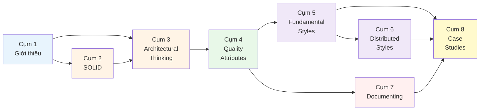

# 1.4 Lộ trình đọc tài liệu

> **Tóm tắt một dòng**: Có ba lộ trình tuỳ vào mục đích (chuyên sâu 30-40h, ôn thi 5-8h, tra cứu nhanh on-demand), và 4 shortcut paths cho ai chỉ quan tâm một focus area (microservices, documenting, design principles, hoặc preparation for senior interview).

## Sơ đồ phụ thuộc giữa các cụm

Trước khi chọn lộ trình, hãy nhìn xem các cụm phụ thuộc nhau ra sao:

Quy ước màu:

- **Xanh nhạt**: warm-up (đọc nhẹ).
- **Vàng cam**: design level (SOLID + thinking).
- **Xanh lá**: characteristics (NFR + ATAM).
- **Tím**: structural styles.
- **Hồng**: communication (documenting).
- **Vàng**: application (case studies).

## Ba lộ trình chính

### Lộ trình A: Chuyên sâu (chuẩn, 30-50 giờ)

Đối tượng: học viên cao học cần điểm cao, lập trình viên chuẩn bị thăng tiến lên Tech Lead/Architect.

| Tuần | Cụm | Thời gian | Mục tiêu |
|---|---|---|---|
| 1 | Cụm 1 | 1-2h | Set up framework tư duy |
| 1-2 | Cụm 2 | 6-10h | Master SOLID, refactor 5-10 đoạn code thật |
| 3 | Cụm 3 | 4-6h | Trade-off thinking, distinguish arch vs design |
| 4 | Cụm 4 | 4-6h | Identify QA cho 2-3 hệ thực tế bạn đang dùng |
| 5 | Cụm 5 | 5-7h | Vẽ topology 4 fundamental styles |
| 6 | Cụm 6 | 5-7h | Vẽ topology 4 distributed styles, so sánh |
| 7 | Cụm 7 | 4-6h | Vẽ 3 view cho hệ bạn đang làm, viết 2 ADR |
| 8 | Cụm 8 | 6-10h | Làm cả 2 case study + bộ exercise |
| 9 | Course Summary | 1-2h | Tổng hợp, ôn lại weak spots |

Tổng: ~35-55 giờ trong 8-9 tuần (4-7h/tuần). Khuyến khích đi cùng một dự án thật để áp dụng từng cụm.

### Lộ trình B: Ôn thi (nhanh, 5-8 giờ)

Đối tượng: đã có background SA, cần ôn nhanh cho thi cử hoặc phỏng vấn.

| Thứ tự | Tài liệu | Thời gian |
|---|---|---|
| 1 | [Course Summary](../resources/course-summary.md) | 1-2h |
| 2 | [Exam Checklist](../resources/exam-checklist.md) | 30 phút |
| 3 | Cụm 2 (SOLID) — chỉ overview + 5 SOLID files | 1.5h |
| 4 | Cụm 5+6 — chỉ overview + 1-2 style chính | 1.5h |
| 5 | Cụm 7 — chỉ overview + 4+1 model nhanh | 30 phút |
| 6 | [Glossary](../resources/glossary.md) — scan để spot weak terms | 1h |

Tổng: ~5-8 giờ. Hiệu quả nếu bạn đã quen với khái niệm và chỉ cần refresh.

### Lộ trình C: Tra cứu (on-demand)

Đối tượng: đã làm SA, vào tra cứu nhanh khi cần.

- Vào [Glossary](../resources/glossary.md) để tìm thuật ngữ → click vào link bài chi tiết.
- Vào [Cross-reference](../resources/cross-reference.md) để xem bản đồ chủ đề.
- Vào bài cụ thể bất kỳ — mỗi bài được viết tự-độc-lập với prerequisites được nhắc lại ngắn gọn.

Không có thời gian cố định. Phù hợp khi cần check một concept hoặc compare 2-3 styles.

## Bốn shortcut paths theo focus area

Nếu bạn chỉ quan tâm một focus area cụ thể, đây là sequence tối ưu:

### Shortcut 1: "Tôi chỉ muốn hiểu microservices" (8-12 giờ)

1. [Cụm 1.2: SA là gì?](02-what-is-software-architecture.md) — 30 phút.
2. [Cụm 3: Architectural Thinking](../03-architectural-thinking/01-overview.md) — 4-6h.
3. [Cụm 4: Quality Attributes](../04-quality-attributes/01-overview.md) — chỉ overview + identifying. 2h.
4. [Cụm 5.2: Monolithic vs Distributed](../05-fundamental-styles/02-monolithic-vs-distributed.md) — 1h.
5. [Cụm 6.3: Microservices](../06-distributed-styles/03-microservices.md) + 6.4 Event-Driven — 2-3h.

### Shortcut 2: "Tôi muốn dạy team cách document architecture" (4-6 giờ)

1. [Cụm 1.2: SA là gì?](02-what-is-software-architecture.md) — 30 phút.
2. [Cụm 4.3: Identifying characteristics](../04-quality-attributes/03-identifying-characteristics.md) — 1h.
3. Cả [Cụm 7: Documenting](../07-documenting/01-overview.md) — 4-6h.
4. Practice viết ADR cho 1 quyết định gần nhất trong team — 1h.

### Shortcut 3: "Tôi muốn master SOLID và improve code quality team" (10-15 giờ)

1. [Cụm 1.2: SA là gì?](02-what-is-software-architecture.md) — 30 phút.
2. Cả [Cụm 2: Design Principles](../02-design-principles/01-overview.md) — 6-10h.
3. [Cụm 3.4: Modularity](../03-architectural-thinking/04-modularity.md) — 1.5h.
4. Practice refactor 5-10 đoạn code thật vi phạm SOLID — 3-5h.

### Shortcut 4: "Tôi chuẩn bị interview Senior/Staff Engineer" (15-20 giờ)

1. Cụm 1 đầy đủ — 1-2h.
2. Cụm 2 SOLID — 4-6h.
3. Cụm 3 + 4 — 6-8h (quan trọng cho behavior-level questions).
4. Cụm 5 + 6 — 4-6h (system design questions thường hỏi style trade-off).
5. Cụm 7.1 + 7.2 — 1.5h.
6. [Course Summary](../resources/course-summary.md) — 1-2h.

## Lưu ý khi học

### Đừng "cày" lý thuyết một mình

SA là kỹ năng *applied*. Đọc lý thuyết suông sẽ quên rất nhanh. Mỗi cụm hãy:

- Áp dụng vào ít nhất một dự án bạn đang làm hoặc đã làm.
- Vẽ topology trên giấy (không gõ vào tool).
- Giải thích lại cho đồng nghiệp/bạn cùng học — nếu giải thích không trôi nghĩa là bạn chưa hiểu.

### Đừng ngại quay lại

Đọc lần đầu xong Cụm 6 mà chưa hiểu thật sự là chuyện bình thường. Quay lại Cụm 4 (quality attributes) thường giúp click. SA có nhiều khái niệm circular — phải đi qua vài lần để thấm.

### Đừng bị quyến rũ bởi trends

Trong 5 năm gần đây, microservices, event-driven, serverless được hype rất nhiều. Khoá này dạy bạn để *phản biện* được trends, không phải để follow chúng. Một monolith được thiết kế tốt có thể serve 80% dự án tốt hơn microservices được thiết kế sai.

### Code thực sự là phần thiết yếu

Bài 3.3 (Balancing Architecture and Hands-On Coding) sẽ nói rõ vì sao architect cần vẫn code. Tuyệt đối đừng coi SA là "thoát code lên design". Quan điểm đó dẫn tới kiến trúc bị disconnect với thực tế.

## Tiếp theo

Hết Cụm 1. Bạn nên bắt đầu Cụm 2 với [Tổng quan Design Principles](../02-design-principles/01-overview.md).

Nếu muốn xem bản đồ toàn khoá ở mức gọn hơn, vào [Course Summary](../resources/course-summary.md). Nếu cần check thuật ngữ, vào [Glossary](../resources/glossary.md).
