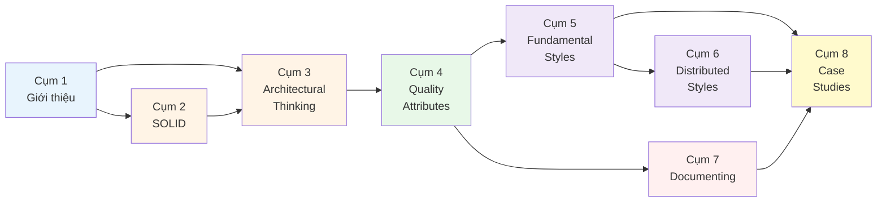

# 1.4 Lộ trình đọc tài liệu

> **Tóm tắt một dòng**: Không phải ai cũng nên đọc khoá theo cùng một thứ tự. Nếu bạn là Data Scientist, hãy ưu tiên Quality Attributes, Pipeline Architecture, Event-Driven Architecture và Documenting trước khi đi sâu vào microservices.

## Trước khi chọn lộ trình

Software Architecture là một môn học có tính mạng lưới. Bạn không học một khái niệm rồi đóng lại, mà liên tục quay lại khái niệm đó ở mức sâu hơn. Ví dụ, ban đầu bạn học **cohesion/coupling** ở cấp class. Sang Cụm 3, bạn gặp lại nó ở cấp module. Sang Cụm 6, bạn gặp lại ở cấp service. Sang Cụm 7, bạn phải vẽ được nó thành diagram.

Vì vậy, lộ trình đọc không chỉ là thứ tự file. Nó là cách giảm tải nhận thức. Người đã quen backend có thể đọc thẳng từ Cụm 1 tới Cụm 8. Người đến từ Data Science nên đi qua một số điểm cầu trước, vì các khái niệm như interface, bounded context, deployment view hoặc distributed transaction không phải vocabulary thường ngày của DS.

## Sơ đồ phụ thuộc giữa các cụm

Quy ước màu:

- **Xanh nhạt**: warm-up, đọc nhẹ để dựng khung.
- **Vàng cam**: design level, từ code tốt tới tư duy kiến trúc.
- **Xanh lá**: characteristics, tức cái hệ thống cần tối ưu.
- **Tím**: structural styles, tức cách tổ chức hệ thống.
- **Hồng**: communication, tức cách truyền đạt kiến trúc.
- **Vàng**: application, tức case study và bài tập.

## Lộ trình A: Chuyên sâu đầy đủ

Đối tượng: người muốn học nền tảng Software Architecture một cách nghiêm túc, có thể là developer, Tech Lead tương lai, ML Engineer muốn chuyển sang platform, hoặc học viên cao học.

| Tuần | Cụm | Thời gian | Mục tiêu |
|---|---|---:|---|
| 1 | Cụm 1 | 1-2h | Set up vocabulary và framework tư duy |
| 1-2 | Cụm 2 | 6-10h | Từ code khó sửa sang code có boundary rõ |
| 3 | Cụm 3 | 4-6h | Biết phân biệt architecture decision và design decision |
| 4 | Cụm 4 | 4-6h | Biết chọn và đo Quality Attributes |
| 5 | Cụm 5 | 5-7h | Nắm monolith, layered, pipeline, microkernel |
| 6 | Cụm 6 | 5-7h | Nắm service-based, microservices, event-driven, space-based |
| 7 | Cụm 7 | 4-6h | Vẽ 3 view và viết ADR |
| 8 | Cụm 8 | 6-10h | Áp toàn bộ vào case study |
| 9 | Resources | 1-2h | Ôn lại bằng summary, glossary, checklist |

Tổng: khoảng 35-55 giờ. Đừng cố đọc hết trong một cuối tuần. Tốt nhất là đọc mỗi cụm rồi áp vào một hệ thống bạn biết: một web app, một data pipeline, một model serving system, hoặc một project công ty.

## Lộ trình B: Data Scientist to Software Architecture

Đối tượng: Data Scientist, ML Engineer, Data Engineer muốn hiểu architecture để đưa model và data pipeline vào production.

### Vì sao path này khác?

Nếu bạn đến từ DS, bạn đã quen với pipeline, data quality, metric, experiment, model artifact. Nhưng bạn có thể chưa quen với cách software team nghĩ về deployment, interface contract, module boundary, availability, rollback, observability. Path này tận dụng cái bạn đã biết trước, rồi nối sang khái niệm mới.

| Thứ tự | Bài | Thời gian | Bạn học được gì |
|---|---|---:|---|
| 1 | [1.2 Software Architecture là gì?](02-what-is-software-architecture.md) | 45m | Vì sao batch vs online inference là decision kiến trúc |
| 2 | [3.3 Trade-off Analysis](../03-architectural-thinking/03-tradeoffs-analysis.md) | 1.5h | Cân accuracy, latency, freshness, cost, explainability |
| 3 | [4.1 Quality Attributes](../04-quality-attributes/01-overview.md) | 1h | Chuyển từ model metric sang system metric |
| 4 | [4.2 FR vs NFR](../04-quality-attributes/02-functional-vs-nfr.md) | 1h | Phân biệt "predict được" với "predict ổn trong production" |
| 5 | [5.4 Pipeline Architecture](../05-fundamental-styles/04-pipeline-architecture.md) | 2h | Map ETL/ML pipeline sang filter-and-pipe architecture |
| 6 | [6.4 Event-Driven Architecture](../06-distributed-styles/04-event-driven.md) | 2h | Hiểu streaming features, Kafka, async workflows |
| 7 | [6.2 Service-based Architecture](../06-distributed-styles/02-service-based.md) | 1.5h | Tổ chức feature service, training service, serving service |
| 8 | [7.3 C&C Views](../07-documenting/03-component-connector-views.md) | 1h | Vẽ runtime flow của online inference |
| 9 | [8.3 Smart City Traffic](../08-case-studies/03-smart-city-traffic.md) | 2h | Case real-time data/ML system end-to-end |
| 10 | [Lộ trình cho Data Scientist](../resources/data-scientist-learning-path.md) | 30m | Checklist và bài tập riêng cho DS |

Tổng: khoảng 13-16 giờ. Sau path này, bạn nên tự tin hơn khi bàn với backend/platform team về feature store, inference latency, model monitoring, hoặc batch vs online architecture.

## Lộ trình C: Refresh nhanh

Đối tượng: đã biết software architecture hoặc system design, muốn refresh nhanh để dùng trong công việc.

| Thứ tự | Tài liệu | Thời gian |
|---|---|---:|
| 1 | [Course Summary](../resources/course-summary.md) | 1-2h |
| 2 | [Cross-reference](../resources/cross-reference.md) | 30m |
| 3 | Cụm 4 overview + Cụm 5/6 overview | 1-2h |
| 4 | Bài cụ thể đang cần | tuỳ nhu cầu |
| 5 | [Glossary](../resources/glossary.md) | 30m |

Path này không phù hợp nếu bạn mới hoàn toàn. Nó giống dùng bản đồ khi bạn đã biết thành phố, không phải tour guide cho lần đầu.

## Lộ trình D: Tra cứu on-demand

Đối tượng: người đã làm dự án thật và chỉ muốn check nhanh một concept.

- Cần thuật ngữ: mở [Glossary](../resources/glossary.md).
- Cần xem concept liên quan nhau: mở [Cross-reference](../resources/cross-reference.md).
- Cần DS-specific path: mở [Lộ trình cho Data Scientist](../resources/data-scientist-learning-path.md).
- Cần review chất lượng nội dung theo góc DS: mở [Review nội dung cho Data Scientist](../resources/content-review-ds.md).

## Shortcut paths theo focus area

### Shortcut 1: Tôi muốn hiểu microservices

1. [1.2 Software Architecture là gì?](02-what-is-software-architecture.md), 30 phút.
2. [3.3 Trade-off Analysis](../03-architectural-thinking/03-tradeoffs-analysis.md), 1.5h.
3. [4.1 Quality Attributes](../04-quality-attributes/01-overview.md), 1h.
4. [5.2 Monolithic vs Distributed](../05-fundamental-styles/02-monolithic-vs-distributed.md), 1h.
5. [6.2 Service-based](../06-distributed-styles/02-service-based.md), 1h.
6. [6.3 Microservices](../06-distributed-styles/03-microservices.md), 2h.
7. [6.4 Event-Driven](../06-distributed-styles/04-event-driven.md), 2h.

Điểm quan trọng: hãy đọc service-based trước microservices. Nếu bỏ qua bước này, bạn rất dễ nghĩ chỉ có hai cực: monolith hoặc microservices. Thực tế nhiều hệ tốt nằm ở giữa.

### Shortcut 2: Tôi muốn document architecture cho team

1. [1.2 Software Architecture là gì?](02-what-is-software-architecture.md), 30 phút.
2. [4.3 Identifying characteristics](../04-quality-attributes/03-identifying-characteristics.md), 1h.
3. [7.1 Documenting overview](../07-documenting/01-overview.md), 1h.
4. [7.2 Module Views](../07-documenting/02-module-views.md), 1.5h.
5. [7.3 C&C Views](../07-documenting/03-component-connector-views.md), 1.5h.
6. [7.4 Allocation Views](../07-documenting/04-allocation-views.md), 1.5h.

Nếu bạn làm ML/data platform, hãy practice bằng một flow cụ thể: online prediction request đi qua API, feature lookup, model inference, logging, monitoring như thế nào.

### Shortcut 3: Tôi muốn refactor code DS/ML cho dễ maintain

1. [2.2 Cohesion và Coupling](../02-design-principles/02-cohesion-and-coupling.md), 1.5h.
2. [2.3 SRP](../02-design-principles/03-srp.md), 1h.
3. [2.4 OCP](../02-design-principles/04-ocp.md), 1h.
4. [2.7 DIP](../02-design-principles/07-dip.md), 1h.
5. [3.4 Modularity](../03-architectural-thinking/04-modularity.md), 1.5h.
6. Practice: tách một notebook training thành package có `data`, `features`, `training`, `evaluation`, `serving`, 3-5h.

### Shortcut 4: Tôi muốn thiết kế production ML system

1. [4.1 Quality Attributes](../04-quality-attributes/01-overview.md)
2. [5.4 Pipeline Architecture](../05-fundamental-styles/04-pipeline-architecture.md)
3. [6.4 Event-Driven Architecture](../06-distributed-styles/04-event-driven.md)
4. [6.2 Service-based Architecture](../06-distributed-styles/02-service-based.md)
5. [7.3 C&C Views](../07-documenting/03-component-connector-views.md)
6. [8.3 Smart City Traffic](../08-case-studies/03-smart-city-traffic.md)
7. [Lộ trình cho Data Scientist](../resources/data-scientist-learning-path.md)

Mục tiêu cuối path này: bạn vẽ được kiến trúc cho churn prediction, fraud detection, recommendation serving hoặc ML monitoring platform.

## Lưu ý khi học

### Đừng chỉ đọc, hãy vẽ

Software Architecture là kỹ năng applied. Đọc xong một style mà không vẽ topology thì rất dễ tưởng mình hiểu nhưng khi gặp project thật lại bí. Sau mỗi bài ở Cụm 5/6, hãy vẽ lại bằng tay:

- Component nào nhận input?
- Component nào lưu state?
- Data đi qua đâu?
- Failure xảy ra ở đâu?
- Nếu load tăng 10 lần, scale chỗ nào?

Với DS, hãy dùng project quen thuộc của bạn. Ví dụ: một pipeline train churn model hằng ngày. Vẽ data source, feature transformation, training job, model registry, batch scoring, CRM export, monitoring.

### Đừng bị quyến rũ bởi trends

Microservices, event-driven, feature store, vector database, service mesh đều có chỗ dùng đúng. Nhưng không cái nào là thuốc chữa bách bệnh. Một cron job đơn giản có monitoring tốt đôi khi thắng một Kafka pipeline phức tạp nhưng không ai vận hành nổi.

### Quay lại Cụm 4 nhiều lần

Nếu bạn thấy phân vân giữa hai architecture style, thường là vì bạn chưa nói rõ Quality Attributes. Muốn freshness cao hay cost thấp? Muốn latency thấp hay explainability cao? Muốn consistency mạnh hay availability cao? Cụm 4 là nơi giúp bạn biến tranh luận cảm tính thành quyết định có lý do.

## Tiếp theo

Nếu bạn đi theo path chuẩn, bắt đầu với [Cụm 1: Tổng quan](01-overview.md). Nếu bạn đến từ Data Science, mở [Lộ trình cho Data Scientist](../resources/data-scientist-learning-path.md) trước, rồi quay lại các bài trong path B.
