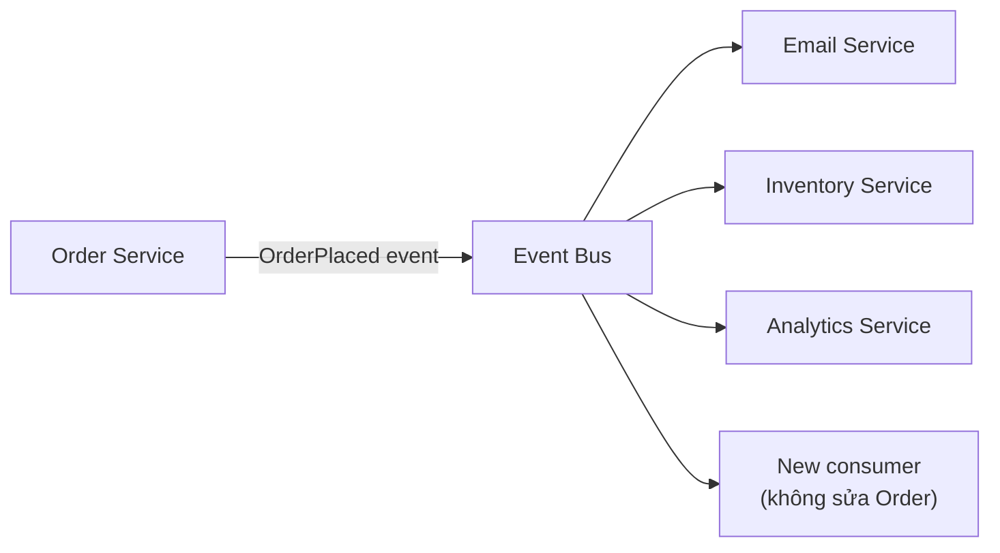

# 2.4 OCP, Open-Closed Principle

> **Tóm tắt một dòng**: OCP nói code đã viết và tested xong không nên phải sửa khi requirement mới đến, chỉ nên *thêm code mới*. Cách phổ biến: thiết kế các điểm extension bằng interface/abstraction, mở rộng qua polymorphism hoặc plug-in.

## Nếu bạn đến từ Data Science

OCP xuất hiện khi bạn muốn thêm model mới mà không sửa toàn bộ pipeline. Hôm nay bạn dùng logistic regression, tuần sau thử XGBoost, tháng sau thử neural network. Nếu mỗi lần thêm model bạn phải sửa evaluator, trainer, registry và serving code, hệ thống chưa closed for modification.

Một thiết kế tốt định nghĩa contract chung, ví dụ `fit`, `predict`, `predict_proba`, `metadata`. Model mới chỉ cần implement contract đó. Pipeline không cần biết bên trong là sklearn, LightGBM hay PyTorch. Đây là OCP ở dạng rất thực tế cho ML.

## Định nghĩa

Bertrand Meyer phát biểu OCP lần đầu năm 1988:

> "Software entities (classes, modules, functions, etc.) should be open for extension, but closed for modification."

Diễn đạt lại:

- **Open for extension**: Module có thể thêm behavior mới (vd: support thêm format, thêm payment method, thêm reporting engine).
- **Closed for modification**: Khi thêm behavior mới, *không* phải sửa code đã có (đã test xong, đã deploy).

Mới đầu OCP nghe có vẻ paradox: làm sao thêm behavior mà không sửa code? Trả lời: dùng *abstraction* để định nghĩa điểm extension trước, sau đó implement nhiều phiên bản. Code dùng abstraction sẽ không phải sửa khi có implementation mới.

## Ví dụ thuyết phục

### Vi phạm OCP

Hãy xét hệ tính chiết khấu cho đơn hàng. Đầu tiên có 2 loại khách hàng:

```python
class DiscountCalculator:
    def calculate(self, order: Order) -> Money:
        if order.customer_type == 'regular':
            return order.total * Decimal('0.05')
        elif order.customer_type == 'vip':
            return order.total * Decimal('0.15')
        else:
            return Money(0)
```

Một tháng sau, sếp yêu cầu thêm loại 'premium' với 10% discount. Code:

```python
def calculate(self, order: Order) -> Money:
    if order.customer_type == 'regular':
        return order.total * Decimal('0.05')
    elif order.customer_type == 'vip':
        return order.total * Decimal('0.15')
    elif order.customer_type == 'premium':
        return order.total * Decimal('0.10')
    else:
        return Money(0)
```

Hai tháng sau, sếp thêm 'corporate' với rule phức tạp (depend vào volume). Bốn tháng sau, sếp thêm 'student' với rule depend vào ngày trong tuần. Cuối năm `calculate()` trở thành 200 dòng if-elif chain với bug khắp nơi.

**Vấn đề**: Mỗi requirement mới đều phải sửa `DiscountCalculator.calculate()`. Code đã test xong cho 'regular' và 'vip' liên tục bị đụng đến, risk regression cao. Đây là OCP violation kinh điển.

### Tuân thủ OCP

Tách bằng abstraction:

```python
from abc import ABC, abstractmethod

class DiscountStrategy(ABC):
    @abstractmethod
    def calculate(self, order: Order) -> Money: ...

class RegularDiscount(DiscountStrategy):
    def calculate(self, order: Order) -> Money:
        return order.total * Decimal('0.05')

class VipDiscount(DiscountStrategy):
    def calculate(self, order: Order) -> Money:
        return order.total * Decimal('0.15')

class DiscountCalculator:
    def __init__(self, strategies: dict[str, DiscountStrategy]):
        self._strategies = strategies
    
    def calculate(self, order: Order) -> Money:
        strategy = self._strategies.get(order.customer_type)
        return strategy.calculate(order) if strategy else Money(0)
```

Bây giờ thêm 'premium':

```python
class PremiumDiscount(DiscountStrategy):
    def calculate(self, order: Order) -> Money:
        return order.total * Decimal('0.10')

# Wire up
calculator = DiscountCalculator({
    'regular': RegularDiscount(),
    'vip': VipDiscount(),
    'premium': PremiumDiscount(),  # chỉ ADD, không MODIFY
})
```

- `RegularDiscount`, `VipDiscount`, `DiscountCalculator` **không bị sửa** dòng nào.
- Thêm 'premium' = thêm 1 file mới + wire up. Code đã test vẫn nguyên.

Đây là OCP: **closed for modification** (3 file gốc), **open for extension** (thêm file mới).

## Cơ chế thường dùng

### 1. Polymorphism qua interface/abstract class

Như ví dụ trên, pattern phổ biến nhất, đặc biệt cho variation theo type.

### 2. Strategy pattern

Khi behavior phụ thuộc context. Vd: `PriceCalculator` có strategy `RegularPricing`, `SeasonalPricing`, `FlashSalePricing`.

### 3. Plugin architecture (Microkernel)

Scale OCP lên architecture level. Vd: VS Code có core nhỏ + hàng nghìn plugin. Adding feature = adding plugin, không sửa core. Bài 5.5 sẽ đi sâu.

### 4. Hook / Callback

Cho framework. Vd: WordPress có hook (action, filter); React có lifecycle hooks. Framework không biết business logic, user code "extend" thông qua hook.

### 5. Configuration

Đôi khi rule phức tạp có thể move ra config:

```python
DISCOUNT_RULES = {
    'regular': {'rate': 0.05},
    'vip': {'rate': 0.15, 'min_order': 1_000_000},
    'corporate': {'rate': 0.10, 'volume_breaks': [...]},
}
```

Thêm customer type mới = sửa config (không sửa Python code). Đây là OCP với cost rất thấp khi rule không phức tạp.

## OCP ở mức Architecture

OCP scale up thành các pattern kiến trúc lớn:

### Microkernel (Plug-in) Architecture

Core hệ thống stable, được lock down. Mọi feature mới là plug-in extend qua well-defined interface.

Ví dụ:

- **IDE**: Eclipse, VS Code, IntelliJ, core editor + plug-in ngôn ngữ.
- **Browser**: Chrome, core engine + extension.
- **CMS**: WordPress, core + theme + plug-in.

Bài 5.5 sẽ đi sâu.

### Event-Driven Architecture

Producer emit event không biết ai consume. Adding consumer mới = adding một service mới subscribe vào topic, không sửa producer.



Bài 6.4 sẽ đi sâu.

### API Versioning

Khi API cần evolve nhưng không thể break existing clients. Pattern: hỗ trợ song song `/v1/...` và `/v2/...`. Adding feature = thêm `/v2/`, không sửa `/v1/`. OCP at API level.

### Configuration-driven systems

Hệ thống nơi behavior được điều khiển bởi config. Adding feature = ship config mới mà không deploy lại app. Feature flag là một dạng đơn giản của pattern này.

## Khi nào OCP là over-engineering

OCP đắt. Mỗi điểm extension cần:

- Một abstraction (interface, abstract class).
- Một registry / factory để wire concrete vào.
- Documentation về contract của abstraction.
- Test cho both abstraction và concrete.

Cost này chỉ đáng khi:

1. **Predict được variation point**. Bạn biết "tương lai sẽ thêm nhiều loại discount" → OCP cho discount.
2. **Variation đã xảy ra ≥ 2 lần**. "Rule of three" của Martin Fowler: lần đầu hardcode, lần thứ 2 vẫn hardcode (nhưng để ý), lần thứ 3 mới refactor sang OCP.
3. **Cost-of-modification cao**. Code legacy sửa nguy hiểm → đầu tư OCP để future change không sửa.

Đừng OCP "phòng ngừa". Hệ quả tiêu cực:

- Code phức tạp hơn cần thiết (abstraction không có nhiều implementation).
- Developer mới khó đọc (phải jump qua abstraction).
- Performance kém hơn (virtual call, indirection).

YAGNI (You Aren't Gonna Need It) là counter-principle quan trọng. Cân bằng OCP với YAGNI theo context.

## Sai lầm thường gặp

### Sai lầm 1: Coi mọi if-elif là OCP violation

Sai. If-elif vẫn ổn nếu:

- Số nhánh ít và ổn định (vd: 3 trạng thái của state machine không bao giờ đổi).
- Logic ngắn, không depend external.
- Không phát triển thêm trong foreseeable future.

OCP fix khi: nhánh nhiều, hay thêm, mỗi nhánh logic phức tạp.

### Sai lầm 2: Abstract mọi class

"Phòng ngừa": tạo interface cho mọi class kể cả class chỉ có 1 implementation. Hệ quả: code đầy `IFooImpl` mà nội dung interface = nội dung class.

Quy tắc: chỉ tạo interface khi cần ≥ 2 implementation hoặc cần mock cho test.

### Sai lầm 3: Quên invariant của abstraction

Khi định nghĩa abstraction, không nói rõ contract:

```python
class PaymentStrategy(ABC):
    @abstractmethod
    def charge(self, amount: Money) -> PaymentResult: ...
```

Question: `charge` có throw exception không? Có retry tự động không? Có idempotent không? Nếu không nói rõ, mỗi implementation có thể có behavior khác → vi phạm LSP (xem Bài 2.5).

### Sai lầm 4: OCP làm hỏng cohesion

Khi tách quá nhiều abstraction, code rời rạc đến mức không hiểu flow. Đọc một use case phải jump qua 5 file. Đây là dấu hiệu over-OCP, cohesion giảm để cố tăng extensibility.

## Tóm tắt

- OCP: **open for extension, closed for modification**.
- Đạt qua: polymorphism, strategy, plug-in, event, config-driven.
- Scale lên architecture: Microkernel, Event-Driven, API versioning.
- Cẩn thận: OCP đắt, áp dụng khi có variation thực tế.
- Cân bằng với YAGNI: rule of three.

Bài tiếp: [LSP, Liskov Substitution Principle](05-lsp.md), về cách inheritance phải tuân thủ contract.
