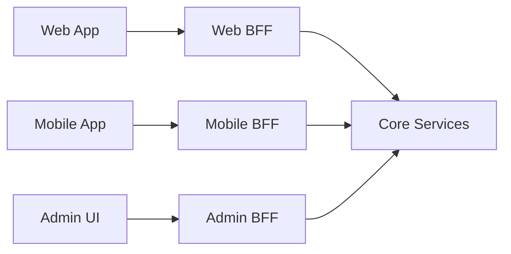

# 2.6 ISP, Interface Segregation Principle

> **Tóm tắt một dòng**: Đừng force client phụ thuộc vào method nó không dùng. Tách interface lớn thành nhiều interface nhỏ và focused, mỗi cái phục vụ một role/use case cụ thể.

## Nếu bạn đến từ Data Science

ISP giúp tránh một interface quá to cho mọi loại model. Không phải model nào cũng train online được. Không phải model nào cũng explain được. Không phải model nào cũng support `partial_fit`. Nếu bạn ép mọi model implement một interface khổng lồ, nhiều method sẽ raise `NotImplementedError`, và client code phải check lung tung.

Tách interface nhỏ hơn sẽ tự nhiên hơn: `Predictor`, `Trainer`, `Explainer`, `OnlineLearner`, `BatchScorer`. Client nào cần predict chỉ phụ thuộc `Predictor`. Client nào cần explain mới phụ thuộc `Explainer`.

## Định nghĩa

Robert C. Martin, *Agile Software Development* (2002):

> "Clients should not be forced to depend upon interfaces that they do not use."

Diễn đạt lại: nếu interface `IUser` có 20 method nhưng client chỉ dùng 3, client vẫn bị couple với 17 method còn lại. Sửa 17 method đó → ảnh hưởng client. Đó là coupling không cần thiết.

## Ví dụ cổ điển

### Vi phạm ISP

```python
class Worker:
    def work(self): ...
    def eat(self): ...
    def sleep(self): ...

class HumanWorker(Worker):
    def work(self): print("Working")
    def eat(self): print("Eating")
    def sleep(self): print("Sleeping")

class RobotWorker(Worker):
    def work(self): print("Working")
    def eat(self): raise NotImplementedError  # robot không ăn
    def sleep(self): raise NotImplementedError  # robot không ngủ
```

Robot bị force implement `eat`, `sleep` dù không cần. Khi `Worker` thêm method (vd: `take_break`), Robot phải sửa nữa.

Client xài `Worker.eat()` không biết Robot sẽ throw → LSP violation cũng xảy ra (ISP violations thường đi kèm LSP violations).

### Tuân thủ ISP

Tách thành interface focused:

```python
class Workable:
    def work(self): ...

class Feedable:
    def eat(self): ...

class Sleepable:
    def sleep(self): ...

class HumanWorker(Workable, Feedable, Sleepable):
    def work(self): ...
    def eat(self): ...
    def sleep(self): ...

class RobotWorker(Workable):  # chỉ implement cái cần
    def work(self): ...
```

Client cần làm việc → require `Workable`. Client cần feed → require `Feedable`. Không có hai bên bị force.

## ISP ở mức code

### Pattern 1: Role-based interfaces

Đặt tên interface theo *role* (vai trò) chứ không phải theo *type*. Vd:

- Sai: `class IUser` chứa mọi method liên quan user.
- Đúng: `class IAuthenticatable`, `class IBillable`, `class INotifiable`, mỗi role một interface.

### Pattern 2: Capability interfaces

Đặt tên theo *capability* (khả năng):

```python
class Readable:
    def read(self) -> bytes: ...

class Writable:
    def write(self, data: bytes) -> None: ...

class Seekable:
    def seek(self, pos: int) -> None: ...

class File(Readable, Writable, Seekable): ...
class ReadOnlyFile(Readable, Seekable): ...
class StreamWriter(Writable): ...
```

Python `io` module dùng pattern này.

### Pattern 3: Tách theo client

Nếu một class phục vụ 2-3 client khác nhau, tách interface cho mỗi client:

```python
# Trước (vi phạm ISP)
class UserService:
    # Cho UI:
    def get_display_name(self, id): ...
    def get_avatar_url(self, id): ...
    # Cho Analytics:
    def get_signup_date(self, id): ...
    def get_activity_score(self, id): ...
    # Cho Admin:
    def lock_account(self, id): ...
    def reset_password(self, id): ...

# Sau (tuân thủ ISP)
class UserDisplayService:
    def get_display_name(self, id): ...
    def get_avatar_url(self, id): ...

class UserAnalyticsService:
    def get_signup_date(self, id): ...
    def get_activity_score(self, id): ...

class UserAdminService:
    def lock_account(self, id): ...
    def reset_password(self, id): ...
```

UI chỉ depend `UserDisplayService`, không bị couple với admin/analytics logic.

## ISP ở mức Architecture

### BFF, Backend for Frontend pattern

Cùng business logic backend phục vụ nhiều client (web, mobile, admin). Mỗi client có *use case khác nhau*:

- Web cần nhiều info trên trang dashboard.
- Mobile cần ít info (bandwidth), nhưng cần thêm push token.
- Admin cần data ẩn cho regular user.

Nếu cùng một API serve cả 3 → vi phạm ISP ở mức API. Solution: BFF.



Mỗi BFF cung cấp API tailor-made cho client. Core services không cần biết về client.

### API Gateway pattern

Tương tự BFF nhưng ở mức gateway. Gateway có thể aggregate nhiều microservice thành response phù hợp client. Mỗi endpoint của gateway = một role-specific interface.

### CQRS, Command Query Responsibility Segregation

Tách read API (queries) khỏi write API (commands). Mỗi side có interface riêng:

```python
class OrderQueryService:  # read-only
    def get_order(self, id): ...
    def list_user_orders(self, user_id): ...
    def search_orders(self, criteria): ...

class OrderCommandService:  # mutations
    def place_order(self, ...): ...
    def cancel_order(self, id): ...
    def update_shipping(self, id, ...): ...
```

UI hiển thị → chỉ depend `OrderQueryService`. UI submit form → depend `OrderCommandService`. Test, mock, evolve độc lập.

## Khi nào ISP là over-engineering

Như mọi nguyên lý SOLID, ISP có cost: nhiều interface = nhiều file = cognitive load.

Cân nhắc:

- **Áp ISP** khi có ≥ 2 client với nhu cầu khác nhau.
- **Bỏ qua** khi interface chỉ phục vụ 1 client (split không có ích).
- **Bỏ qua** khi method trong interface đều có cohesion cao (vd: `BankAccount` có `deposit`, `withdraw`, `get_balance`, tất cả phục vụ "bank account" role, không tách).

Nguyên tắc: ISP fix khi *client thực sự bị force* depend vào method không dùng. Không "phòng ngừa".

## Sai lầm thường gặp

### Sai lầm 1: Single-method interfaces khắp nơi

Java codebase thường có `IFooReader`, `IFooWriter`, `IFooDeleter`, `IFooUpdater` cho mỗi entity. Đó không phải ISP, đó là over-decomposition. Method có cohesion cao nên gom chung.

### Sai lầm 2: Coi ISP đồng nghĩa với "interface nhỏ"

"Nhỏ" không tự động = ISP-compliant. Một interface 1 method vẫn vi phạm ISP nếu method đó force client depend vào abstraction không cần. Ví dụ: `Comparable` mà object thực sự không có total ordering.

ISP đo theo *client need*, không theo *kích thước interface*.

### Sai lầm 3: Quên client là ai

ISP yêu cầu xác định client trước. Trong code mới, "client" có thể chưa tồn tại → đừng ISP phòng ngừa. Đợi client xuất hiện rồi tách.

### Sai lầm 4: Confused với SRP

SRP về *responsibility* (lý do thay đổi). ISP về *interface* (phương thức client gọi). Một class có thể có 1 responsibility (SRP OK) nhưng expose interface to (ISP fail). Hai principle bổ sung nhau.

## Tóm tắt

- ISP: **client không bị force depend vào method nó không dùng**.
- Tách interface theo *role* hoặc *capability* hoặc *client*.
- Scale lên architecture: BFF, API Gateway, CQRS.
- Cẩn thận: ISP đo theo client need, không theo kích thước.

Bài tiếp (cuối cùng SOLID): [DIP, Dependency Inversion Principle](07-dip.md), nguyên lý quan trọng nhất ở mức architecture.
