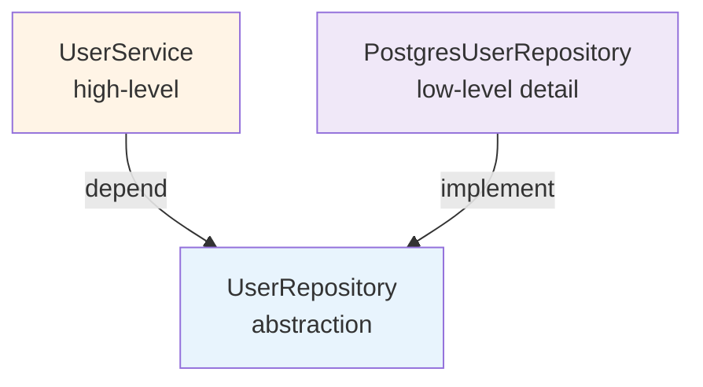
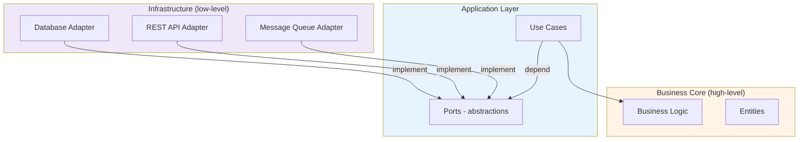

# 2.7 DIP — Dependency Inversion Principle

> **Tóm tắt một dòng**: Đảo ngược direction dependency: thay vì module business logic depend trực tiếp vào module infrastructure (database, network), cả hai depend vào abstraction do business logic định nghĩa. Đây là nền tảng cho hexagonal/clean architecture và mọi DI framework.

## Phát biểu

Robert C. Martin (1996):

> 1. High-level modules should not depend on low-level modules. Both should depend on abstractions.
> 2. Abstractions should not depend on details. Details should depend on abstractions.

Hai vế bổ sung nhau. Vế 1 nói *direction* của dependency. Vế 2 nói *abstraction là first-class*.

## Direction tự nhiên (sai) vs Inverted (đúng)

### Direction tự nhiên: top-down

Programmer mới thường viết:

```python
# Module business logic
from infrastructure.postgres import PostgresUserRepository  # depend low-level

class UserService:
    def __init__(self):
        self._repo = PostgresUserRepository()  # cố định
    
    def register(self, email, password):
        user = User(email, password)
        self._repo.save(user)  # gọi trực tiếp
```

`UserService` (high-level, business logic) depend `PostgresUserRepository` (low-level, infrastructure). Vấn đề:

1. **Test phức tạp**: muốn test `UserService` không cần DB → phải mock toàn bộ Postgres connection, transaction.
2. **Đổi DB khó**: muốn migrate sang MongoDB → sửa `UserService`.
3. **Coupling cao**: 100 service depend vào Postgres → đổi DB = đổi 100 service.

### Direction đúng: inverted

```python
# abstractions/user_repository.py (BUSINESS layer định nghĩa)
from abc import ABC, abstractmethod

class UserRepository(ABC):
    @abstractmethod
    def save(self, user: User) -> None: ...
    @abstractmethod
    def find_by_email(self, email: str) -> User | None: ...

# domain/user_service.py (BUSINESS, không biết DB)
class UserService:
    def __init__(self, repo: UserRepository):  # depend abstraction
        self._repo = repo
    
    def register(self, email, password):
        user = User(email, password)
        self._repo.save(user)

# infrastructure/postgres_user_repository.py (DETAIL implement abstraction)
class PostgresUserRepository(UserRepository):
    def save(self, user): ...
    def find_by_email(self, email): ...

# Wire up trong main / DI container
service = UserService(repo=PostgresUserRepository())
```

Direction sau:

- `UserService` depend `UserRepository` (abstraction).
- `PostgresUserRepository` cũng depend `UserRepository` (implement).
- **Cả hai depend abstraction**. Abstraction định nghĩa bởi business layer.

Diagram:



So với direction tự nhiên (A → C), bây giờ C → B ← A. Dependency của high-level đã "đảo" về abstraction.

## Vì sao gọi là "Dependency Inversion"?

"Inversion" so với traditional layered architecture, nơi dependency luôn flow từ trên xuống dưới (UI → business → DB). DIP đảo ngược một phần: low-level detail (DB) bây giờ depend abstraction (do business layer định nghĩa), không phải ngược lại.

Visual:

```
Trước (traditional):
  UI → Business → DB
                  ↑ depend trực tiếp

Sau (DIP):
  UI → Business → IRepository ← DB
            ↑       ↑
       định nghĩa  implement
```

Mũi tên dependency của DB giờ đảo lên trên.

## Lợi ích cụ thể

### 1. Test nhanh, isolated

```python
class FakeUserRepository(UserRepository):
    def __init__(self):
        self._users = {}
    def save(self, user): self._users[user.email] = user
    def find_by_email(self, email): return self._users.get(email)

# Test
def test_register_creates_user():
    repo = FakeUserRepository()
    service = UserService(repo=repo)
    service.register("a@b.com", "pass")
    assert repo.find_by_email("a@b.com") is not None
```

Không DB, không network, test chạy < 1ms.

### 2. Đổi infrastructure dễ

Migrate Postgres → MongoDB chỉ cần viết `MongoUserRepository(UserRepository)`. Business layer không sửa.

### 3. Plug-in architecture

Hệ thống có thể support nhiều backend qua config:

```python
def make_repository(backend: str) -> UserRepository:
    if backend == 'postgres': return PostgresUserRepository()
    if backend == 'mongo': return MongoUserRepository()
    if backend == 'memory': return InMemoryUserRepository()
```

### 4. Parallel development

Team A code business logic + interface. Team B code Postgres impl. Hai team work parallel, ghép qua interface. Không block lẫn nhau.

## DIP và Dependency Injection (DI)

Dễ confused. Phân biệt:

- **DIP** = principle (lý thuyết): direction của dependency phải đảo.
- **DI** = technique (thực hành): cung cấp dependency từ ngoài, không tự tạo bên trong class.

DI là *một cách* để đạt DIP, không phải cái duy nhất. Bạn có thể có DI mà không có DIP (vd: inject concrete class), và có DIP mà không có DI (vd: use service locator).

### Ba kiểu DI

#### Constructor injection (tốt nhất)

```python
class UserService:
    def __init__(self, repo: UserRepository, mailer: Mailer):
        self._repo = repo
        self._mailer = mailer
```

Dependencies rõ ràng trong constructor signature.

#### Setter injection (cho optional dependencies)

```python
class UserService:
    def __init__(self, repo): self._repo = repo
    def set_audit_logger(self, logger): self._logger = logger  # optional
```

#### Method injection (cho rare-used dependencies)

```python
class ReportGenerator:
    def generate(self, data, formatter: Formatter):
        # formatter chỉ dùng ở method này
        return formatter.format(data)
```

### DI Container / IoC Container

Framework quản lý wiring tự động. Vd: Spring (Java), .NET Core DI, FastAPI Depends, Angular providers.

```python
# FastAPI example
from fastapi import Depends, FastAPI

def get_repo() -> UserRepository:
    return PostgresUserRepository()

@app.post("/users")
def register(req: RegisterRequest, repo: UserRepository = Depends(get_repo)):
    return UserService(repo).register(req.email, req.password)
```

Lưu ý: DI container không bắt buộc cho DIP. App nhỏ có thể wire manually trong `main()`.

## DIP ở mức Architecture

### Hexagonal / Clean / Onion Architecture

Tất cả ba kiến trúc này đều là DIP scaled up. Idea cốt lõi:



Business core ở giữa (high-level), infrastructure ở ngoài (detail). Direction: detail depend abstraction (port). Business core không biết về infrastructure.

Lợi ích:

- Test business core không cần infrastructure.
- Swap infrastructure dễ (đổi REST → gRPC, đổi Postgres → MongoDB).
- Business logic là *stable core*, infrastructure là *volatile shell*.

### Microservices boundary

Khi A gọi B qua HTTP/gRPC, A nên define interface (DTO + method signature) mà nó cần. B implement interface đó. Đảo: A không depend trực tiếp implementation của B.

Trong microservices, "abstraction" có thể là OpenAPI spec, Protobuf definition, hoặc message schema. B publish spec, A code theo spec.

### Plug-in System

Kiến trúc Microkernel (Cụm 5.5) chính là DIP: core định nghĩa plug-in interface, plug-in implement interface. Core không biết về cụ thể plug-in.

### Event-driven systems

Producer định nghĩa event schema. Consumer implement handler tuân thủ schema. Producer không biết consumer là ai. Đảo dependency hoàn toàn.

## Sai lầm thường gặp

### Sai lầm 1: Tạo interface "phòng ngừa" cho mọi class

```python
class IUserService: ...
class UserService(IUserService): ...

class IOrderService: ...
class OrderService(IOrderService): ...
```

Mỗi class 1 interface, dù chỉ có 1 implementation. Đó là cargo cult — không lợi ích, chỉ tăng cognitive load.

Quy tắc: interface chỉ tạo khi:

- Có thật ≥ 2 implementation (hoặc rất likely có).
- Cần mock cho test.
- Boundary giữa layer (vd: business vs infrastructure).

### Sai lầm 2: Service Locator anti-pattern

```python
class UserService:
    def __init__(self):
        self._repo = ServiceLocator.get(UserRepository)  # giấu dependency
```

Dependency bị giấu trong implementation, không xuất hiện ở constructor. Test khó (phải setup ServiceLocator). Đọc code khó (không biết class này depend gì).

Constructor injection tốt hơn.

### Sai lầm 3: Lạm dụng abstract base class

Trong Python/TypeScript, nhiều khi không cần ABC — duck typing đủ. Tạo ABC chỉ thêm boilerplate.

```python
# Quá tay
class UserRepository(ABC):
    @abstractmethod
    def save(self, user): ...

# Vừa đủ (duck typing)
class UserService:
    def __init__(self, repo):  # repo: anything with .save method
        self._repo = repo
```

Tradeoff: explicit interface tốt cho large team, duck typing tốt cho code ngắn gọn.

### Sai lầm 4: DIP nhưng abstraction leak detail

```python
class UserRepository(ABC):
    @abstractmethod
    def execute_sql(self, sql: str): ...  # leak SQL
```

`execute_sql` là detail của Postgres, không phải khái niệm business. Repository pattern đúng phải expose business-level method (`save_user`, `find_by_email`), không phải SQL.

Khi abstraction leak detail, swap implementation thành impossible — `MongoUserRepository.execute_sql(sql)` không make sense.

## Tóm tắt

- DIP: **high-level và low-level đều depend abstraction**, abstraction do business layer định nghĩa.
- Đạt qua: interface + constructor injection.
- Lợi ích: test dễ, swap infrastructure dễ, plug-in capability.
- Scale lên architecture: Hexagonal/Clean Architecture, plug-in system, event-driven.
- Cẩn thận: không tạo interface phòng ngừa, không service locator, không leak detail qua abstraction.

## Tổng kết Cụm 2

Hết Cụm 2 — bạn đã có toàn bộ design principles foundation. Tóm tắt:

| Principle | Tóm tắt | Scale up |
|---|---|---|
| Cohesion-Coupling | High cohesion, low coupling | Module/service boundary |
| SRP | Mỗi module một actor | Microservice = một bounded context |
| OCP | Open extension, closed modification | Plug-in/microkernel architecture |
| LSP | Subtype substitutable | API versioning, schema migration |
| ISP | Client không depend method không dùng | BFF, API Gateway, CQRS |
| DIP | Đảo dependency qua abstraction | Hexagonal/Clean architecture |

Tất cả 5 SOLID đều quy về cohesion cao + coupling thấp ở các góc khác nhau. Master 5 cái này, code và architecture của bạn sẽ thay đổi vĩnh viễn.

Cụm tiếp theo: [Cụm 3: Architectural Thinking](../03-architectural-thinking/01-overview.md) — mở rộng tư duy từ class lên hệ thống.
