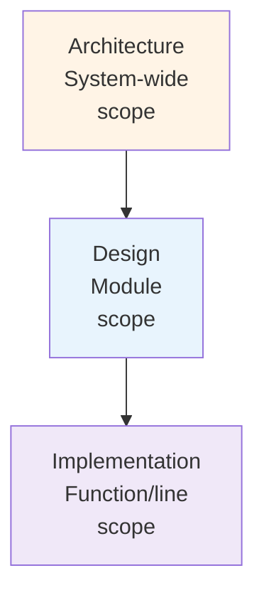
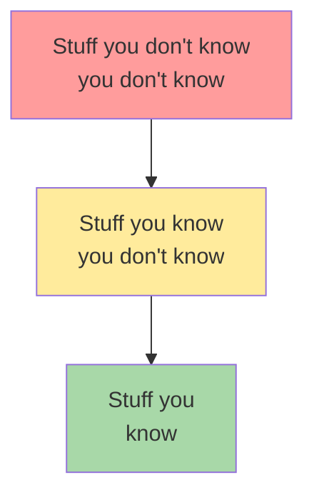

# 3.2 Architecture vs Design

> **Tóm tắt một dòng**: Không có ranh giới cứng giữa architecture và design, ranh giới phụ thuộc context. Heuristic thực hành: hỏi 3 câu (bao trùm? ảnh hưởng QA? đắt khi sửa?) cho mỗi quyết định để biết nó deserve cấp attention nào.

## Nếu bạn đến từ Data Science

Trong ML, không phải mọi quyết định đều là kiến trúc. Chọn learning rate, số epoch hoặc threshold ban đầu thường là design/experiment decision. Nhưng chọn batch inference hay online inference, chọn feature store hay query trực tiếp warehouse, chọn lưu model artifact ở registry nào, chọn Kafka hay REST cho prediction events, đó là architectural decision vì ảnh hưởng toàn hệ thống và khó đổi sau này.

## Câu hỏi mở đầu

Hãy xét 5 quyết định sau và đoán xem cái nào là architectural:

1. Dùng React hay Vue cho frontend của một SaaS B2B.
2. Đặt tên endpoint là `/api/users` hay `/api/v1/users`.
3. Lưu password bằng bcrypt hay Argon2.
4. Đặt timeout cho HTTP client là 5s hay 10s.
5. Chia order processing thành 1 service hay 3 service.

Suy nghĩ trước khi đọc tiếp.

...

Câu trả lời theo framework 3 tiêu chí (từ Bài 1.2: bao trùm toàn hệ, ảnh hưởng QA, đắt khi sửa):

1. **React vs Vue**: Architectural. Cả 3 tiêu chí thoả mãn (bao trùm frontend, ảnh hưởng productivity/performance, đổi sau 2 năm tốn 6-12 tháng).
2. **`/users` vs `/v1/users`**: Borderline architectural. Tiêu chí 1 và 3 thoả (mọi client phải tuân, đổi sau khó), tiêu chí 2 thì không mạnh. Vẫn cần thảo luận team trước khi chốt.
3. **bcrypt vs Argon2**: Design decision. Bao trùm (đúng) nhưng đổi sau dễ (migrate hashing có pattern chuẩn), ảnh hưởng QA không lớn (cả hai đều secure đủ).
4. **Timeout 5s vs 10s**: Implementation detail. Đổi runtime qua config.
5. **1 vs 3 services**: Architectural (mạnh). Cả 3 tiêu chí mạnh.

Phân loại đúng giúp bạn:

- Dành thời gian thảo luận đúng chỗ (architectural cần meeting; implementation detail không).
- Document đúng nơi (architectural vào ADR; design vào code comment).
- Empower team đúng cách (architectural cần consensus; implementation detail để dev tự quyết).

## Ba góc nhìn về architecture vs design

### Góc nhìn 1: Theo scope

- **Architecture**: structure của toàn hệ, services, communication, data flow.
- **Design**: structure bên trong một module, class, interface, pattern.
- **Implementation**: cấu trúc bên trong một function, algorithm, naming, control flow.

Mỗi cấp depend cấp trên. Architecture định nghĩa boundary; design điền vào chi tiết bên trong; implementation realise.

### Góc nhìn 2: Theo cost-of-change

| Cấp | Time-to-change | Example |
|---|---|---|
| Implementation | Minutes | Rename variable, fix typo |
| Design | Hours | Refactor class hierarchy trong module |
| Architecture | Months | Migrate database, split service |

Cost-of-change tăng theo cấp. Architectural decisions đáng deserve thời gian cân nhắc tỷ lệ với cost.

### Góc nhìn 3: Theo reversibility (Bezos)

Jeff Bezos chia decisions thành 2 loại:

- **Type 1 (one-way doors)**: khó/không reverse. Phải cân nhắc kỹ.
- **Type 2 (two-way doors)**: dễ reverse. Quyết nhanh, thử, sửa.

Architecture thường là Type 1. Design và implementation thường là Type 2.

Heuristic mạnh: **Type 1 decisions cần meeting + ADR. Type 2 decisions cho 1 người quyết và move on**.

## Ranh giới mềm theo context

Quan trọng: cùng quyết định có thể là architectural trong context A nhưng design trong context B.

### Ví dụ: Chọn ORM

- **Startup 3 người, MVP 6 tháng**: Implementation choice. Đổi sau dễ vì code base nhỏ.
- **Enterprise 50 services dùng cùng ORM 5 năm**: Architectural. Đổi = dự án 12 tháng.

### Ví dụ: Class hierarchy của domain Order

- **App đơn giản với 1 loại Order**: Design.
- **Marketplace với 10 loại Order khác nhau (digital, physical, subscription, ...)**: Có thể leak lên architectural nếu mỗi loại có service riêng.

Hệ quả: bạn không thể học một danh sách "10 quyết định luôn là architectural". Phải apply framework 3 tiêu chí trong context của mình.

## Levels of Knowledge (Knowledge Triangle)

Concept quan trọng cho mọi technologist, đặc biệt architect. Tam giác kiến thức:

Ba mức:

### 1. Stuff you know (Bạn biết)

Kiến thức bạn đã master: ngôn ngữ, framework, tool, pattern bạn dùng hàng ngày. Vd: developer Java biết Spring, JPA, biết viết unit test.

Đây là cái dùng hàng ngày. Mức này dễ measure (qua certification, code output).

### 2. Stuff you know you don't know (Bạn biết là bạn chưa biết)

Kiến thức bạn aware về sự tồn tại nhưng chưa master. Vd: bạn nghe nói về Kafka, biết nó dùng để stream events, nhưng chưa set up production.

Đây là vùng "I can Google this when I need". Quan trọng: bạn biết tên gọi, biết khi nào nên cân nhắc, biết hỏi ai/đọc gì.

### 3. Stuff you don't know you don't know (Bạn không biết là mình không biết)

Kiến thức bạn *chưa bao giờ nghe đến*. Vd: junior developer chưa biết về CAP theorem, không biết về retry storm, không biết về thundering herd. Khi gặp vấn đề, không biết tên gọi để Google.

Đây là vùng nguy hiểm nhất. Bạn ra quyết định ngây thơ vì không biết có pattern/anti-pattern liên quan.

### Vì sao quan trọng cho architect

Đặc thù của architect: **breadth > depth**. Architect không cần master 20 framework, nhưng cần biết tên gọi và high-level ý của 200 concept để:

- Khi vấn đề xảy ra, biết tên gọi để Google sâu hơn.
- Khi thảo luận với expert (vd: DBA, security engineer), hiểu họ nói gì.
- Khi thiết kế hệ mới, biết options thay vì rerolling solution đã có.

→ **Architect cần đầu tư vào vùng 2 (stuff you know you don't know)**, không cần đào sâu mọi thứ thành vùng 1.

### Cách mở rộng vùng 2

- Đọc rộng: 1-2 sách kiến trúc/năm, blog posts hàng tuần (vd: Martin Fowler blog, Microsoft Architecture Center).
- Đi conference / nghe podcast: nghe các architect khác nói về vấn đề họ gặp.
- Pair với expert ở mỗi domain (DBA, security, performance) ít nhất 1 lần để hiểu vocabulary.
- Survey paper / SoK: đọc paper systematization-of-knowledge để biết "ngành đang giải vấn đề gì".

## "Architecture is the stuff that's hard to Google"

Quote nổi tiếng. Implication: với kiến thức đã có pattern Google được (vd: cách implement REST API, cách viết unit test), không cần architect. Architect cần thiết khi vấn đề *chưa có một câu trả lời chuẩn*, phải lập luận trade-off cho context cụ thể.

Ví dụ:

- "Cách parse JSON trong Python" → Google được, không cần architect.
- "Có nên tách microservice User và Auth ra hay gộp" → không Google được câu trả lời đúng, phải cân nhắc context. Đây là việc architect.

Hệ quả thực hành: architect dành thời gian giải các vấn đề *unique to context*. Đừng waste effort optimize những thứ có pattern chuẩn.

## Architect cũng phải code

Một xu hướng tai hại: architect "thăng tiến" khỏi việc code, chỉ vẽ diagram và họp. Hậu quả:

- Diagram không khớp với thực tế. Architect không biết constraint hiện tại của codebase.
- Đề xuất giải pháp lý thuyết, không thực dụng.
- Mất uy tín với team: "ông này chỉ nói lý thuyết, có làm bao giờ đâu".

Bài 3.3 sẽ nói chi tiết hơn. Quy tắc thực hành: architect nên code 20-40% thời gian. Đủ để:

- Hiểu pain hiện tại của codebase.
- Test prototype của đề xuất mới trước khi rollout.
- Pair với developer để mentor và học từ họ.

## Sai lầm thường gặp

### Sai lầm 1: Coi mọi diagram là architecture

Vẽ một diagram không tự động làm nó "architecture". Architecture là *các quyết định khó sửa*, diagram chỉ là cách hiển thị một số quyết định.

Một sequence diagram cho một use case là design, không phải architecture. Một deployment diagram cho cluster là architecture vì nó capture quyết định về tổ chức service.

### Sai lầm 2: Tranh cãi mọi quyết định ở level architectural

Hiệu quả nghịch. Team mất thời gian tranh cãi việc nhỏ. Heuristic: chỉ escalate lên architectural khi có lý do (3 tiêu chí).

### Sai lầm 3: Bỏ qua context khi học pattern

Đọc một bài blog "microservices best practice" rồi áp dụng máy móc cho startup MVP. Pattern luôn có context. Hãy hỏi: "Pattern này được tạo ra cho context nào? Context của tôi có giống không?".

### Sai lầm 4: Quá xa rời code

Đã nói. Architect xa code → ra quyết định lý thuyết.

## Tóm tắt

- **Architecture vs Design**: ranh giới mềm, phụ thuộc context. Dùng framework 3 tiêu chí (bao trùm, ảnh hưởng QA, đắt khi sửa) để phân loại.
- **Cost-of-change** scale theo cấp: implementation (phút), design (giờ), architecture (tháng).
- **Levels of Knowledge**: architect cần mở rộng vùng "know you don't know" (breadth > depth).
- **"Architecture is the stuff you can't Google"**: architect giải các vấn đề unique to context.
- **Architect phải code**: 20-40% thời gian, để stay grounded.

Bài tiếp: [Phân tích Trade-off](03-tradeoffs-analysis.md), cách lập luận có hệ thống khi mọi quyết định có cost.
