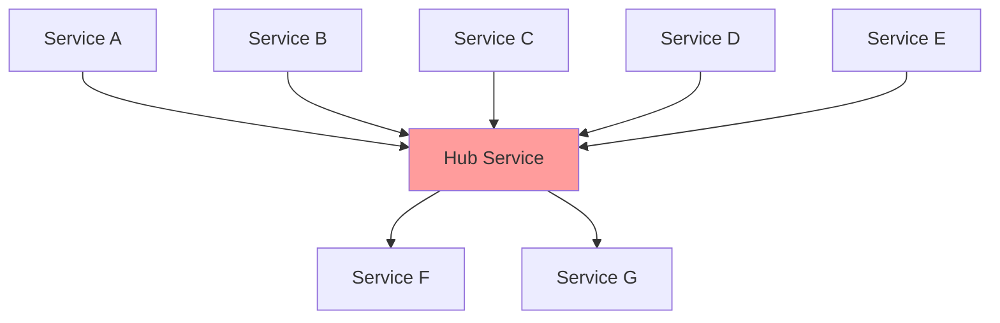

# 3.4 Modularity

> **Tóm tắt một dòng**: Modularity ở mức kiến trúc là chia hệ thống thành các đơn vị có high cohesion + low coupling. Chia *vertical* (theo feature/domain) thường tốt hơn *horizontal* (theo layer), và sai modularity dẫn tới các anti-pattern tệ nhất ngành: big ball of mud và distributed monolith.

## Vì sao quan trọng

Trong Cụm 2.2, bạn đã học cohesion-coupling ở mức class/module. Cụm này áp dụng cùng concept ở quy mô lớn hơn: chia hệ thống thành sub-system, service, hoặc bounded context.

Modularity sai ở mức hệ thống dẫn tới hai anti-pattern tệ nhất:

### Big Ball of Mud

Codebase không có structure rõ ràng. Mọi class depend mọi class. Sửa A có thể vỡ B, C, D ở nơi không lường được. Mỗi feature mới mất nhiều ngày. Onboarding new dev mất nhiều tháng.

Đây là kết quả của *thiếu modularity*: không có module boundary rõ.

### Distributed Monolith

Có vẻ là microservices (mỗi service deploy riêng), nhưng services depend chặt chẽ vào nhau. Đổi 1 service phải đổi 5 services khác. Deploy phải coordinate. Cuối cùng có *cost* của microservices (network, complexity) mà không có *lợi ích* (independent scale + deploy).

Đây là kết quả của *modularity sai chỗ*: tách service theo layer thay vì theo domain.

Cả hai anti-pattern này phòng được nếu hiểu modularity đúng.

## Nguyên tắc: High cohesion at module boundary

Khi chia hệ, mỗi module nên thoả:

1. **Internal high cohesion**: mọi thứ trong module cùng phục vụ một mục đích.
2. **External low coupling**: module giao tiếp với module khác qua minimal, well-defined interface.
3. **Domain alignment**: module map vào một "thing" có ý nghĩa với business — không phải vào technical concern.

Tiêu chí 3 là cốt lõi của khái niệm **bounded context** trong Domain-Driven Design. Module nên reflect business — không reflect tech stack.

## Vertical vs Horizontal Slicing

Một quyết định lớn khi modularize: chia theo *layer technical* hay theo *feature business*.

### Horizontal Slicing (theo layer)

Chia hệ thành tầng:

```
┌─────────────────────────────────┐
│ Presentation Layer (UI/API)    │
├─────────────────────────────────┤
│ Business Logic Layer            │
├─────────────────────────────────┤
│ Data Access Layer               │
├─────────────────────────────────┤
│ Database                        │
└─────────────────────────────────┘
```

Mỗi tầng "own" by một team:

- UI team own Presentation.
- Backend team own Business.
- Data team own DAL.

Nghe có vẻ hợp lý. Nhưng có vấn đề:

#### Vấn đề 1: Feature đụng mọi tầng

Một feature "đặt hàng" cần thay đổi UI (form), Business (validate, calculate), DAL (save order). Mỗi feature = coordinate 3 team. Delay rất nhiều.

#### Vấn đề 2: Conway's law xung đột

Org chart (theo team) khớp với layer. Nhưng business value flow *xuyên qua* tầng. Conflict.

#### Vấn đề 3: Low cohesion mức module

UI module chứa code của 100 feature khác nhau (vì UI cho mọi feature). Cohesion thấp.

### Vertical Slicing (theo feature/domain)

Chia hệ thành "domain":

```
┌────────────┬────────────┬────────────┐
│   Orders   │  Payments  │   Users    │
├────────────┼────────────┼────────────┤
│  UI logic  │  UI logic  │  UI logic  │
│  Business  │  Business  │  Business  │
│  Data      │  Data      │  Data      │
└────────────┴────────────┴────────────┘
```

Mỗi domain "own" by một team. Team Orders own toàn bộ UI + Business + Data của Orders.

Lợi ích:

- **Feature đụng 1 domain**: team Orders thêm feature mới chỉ touch code Orders. Fast.
- **High cohesion**: code trong Orders tập trung vào orders.
- **Conway's law align**: org chart ánh xạ business domain.
- **Independent deploy**: thay đổi Orders không ảnh hưởng Payments.

### Khi nào dùng cái nào

| Aspect | Horizontal | Vertical |
|---|---|---|
| Team org | Theo skill (frontend, backend) | Theo domain |
| Best for | Small team, MVP, có technical specialty cao | Lớn, đa team, complex domain |
| Anti-pattern | Big ball of mud horizontal | Big ball of mud vertical |
| Mở rộng | Khó (mỗi layer scale riêng không help feature) | Dễ (mỗi domain scale riêng) |

Heuristic: **vertical slicing là default tốt cho hệ trung-lớn**. Horizontal slicing chỉ tốt khi team < 10 và domain đơn giản.

## Bounded Context (từ DDD)

Khái niệm cốt lõi của DDD, áp dụng được mà không cần học full DDD. Bounded context = phạm vi mà một model có nghĩa nhất quán.

Ví dụ: từ "Customer" có nghĩa khác trong các context khác nhau:

- **Sales context**: Customer = potential buyer, có lead score, sales rep assigned.
- **Billing context**: Customer = entity được charge, có payment method, billing address.
- **Support context**: Customer = user có ticket history, satisfaction score.

Sai lầm: tạo một class `Customer` god class chứa mọi attribute từ mọi context. Class này phình ra 50+ field, ai cũng phải hiểu cả 50 attribute để chạm vào.

Đúng: mỗi bounded context có Customer model riêng. Mapping (translation) qua boundary khi cần.

Mỗi bounded context = một module/service. Đây là cách phổ biến nhất để identify boundary trong vertical slicing.

## Anti-patterns chi tiết

### Anti-pattern 1: Big Ball of Mud (BBoM)

Code không có structure. Mọi class import mọi class. Module name không phản ánh content.

Triệu chứng:

- Mở random file, không đoán được nó làm gì từ tên.
- Sửa một method có thể vỡ ở vài chục nơi không lường trước.
- Test coverage thấp vì không thể test isolated.
- Onboarding mất nhiều tháng.

Nguyên nhân: tích luỹ tech debt mà không refactor; thiếu architectural guidance; team turnover cao mà không document.

Cách thoát: lựa chọn vài bounded context rõ ràng nhất → refactor một-một thành module rõ. Đừng cố fix toàn bộ một lần.

### Anti-pattern 2: Distributed Monolith

Tách thành nhiều service nhưng services depend chặt vào nhau.

Triệu chứng:

- Deploy phải coordinate (deploy A xong mới được deploy B).
- Database shared giữa các service.
- Service A gọi B gọi C gọi A (cyclic dependency).
- Một service down → toàn hệ thống vỡ.

Nguyên nhân: tách service theo *layer* thay vì *domain* (horizontal slicing nhưng deploy riêng); shared database; lack of bounded context.

Cách thoát: đảo về monolith well-organized (modular monolith), sau đó tách lại theo bounded context đúng.

### Anti-pattern 3: Death Star

Service hub central depend vào (hoặc bị depend bởi) hầu hết các service khác.



Hub trở thành single point of failure và bottleneck. Đổi hub đau cả hệ.

Cách thoát: phân tích phụ thuộc, tách hub thành nhiều service nhỏ hơn theo bounded context.

## Modularity ở các context khác nhau

### Trong monolith

Tách thành **modules / packages**. Mỗi module có boundary rõ qua interface công khai.

Ví dụ Java/Spring:

```
com.company.app/
├── orders/           # Module Orders
│   ├── api/          # Public API (exposed)
│   ├── domain/       # Internal models
│   ├── infrastructure/  # DB, etc.
│   └── OrdersFacade.java  # External entry point
├── payments/         # Module Payments
└── users/            # Module Users
```

Quy tắc: code trong `orders/` không import trực tiếp từ `payments/domain/*` — chỉ từ `payments/api/*`. Build tool có thể enforce qua module-info.java (Java 9+).

### Trong microservices

Mỗi service = một module. Boundary = network call. Quy tắc same:

- Service Orders không truy cập database của Payments.
- Service Orders không gọi internal API của Payments — chỉ gọi public API/event.
- Mỗi service có own database (database-per-service pattern).

### Trong mobile apps

Chia thành **feature modules**. Vd Android Gradle modules:

```
:app                    # entry point
:feature:orders         # Orders feature
:feature:payments       # Payments feature
:core:network           # Shared infrastructure
:core:ui                # Shared UI components
```

Build tool prevent feature modules depend lẫn nhau. Shared code go vào `:core:*`.

### Trong frontend SPA

Module federation, micro-frontends. Mỗi vertical slice = một bundle riêng. Vd Module Federation của Webpack 5.

## Heuristic identify module boundary

Khi nhìn vào hệ phức tạp, làm sao biết chia ở đâu? Vài heuristic:

### Heuristic 1: Theo "Two-Pizza Team" của Amazon

Một module/service nên đủ nhỏ để 2 pizza (6-8 người) own end-to-end. Lớn hơn = cần tách. Nhỏ hơn = có thể gộp.

### Heuristic 2: Theo change rate

Code thay đổi cùng nhau nên ở cùng module. Code thay đổi độc lập nên tách module.

Đo: phân tích git log. Files được commit cùng nhau thường xuyên (>40% commits) → cohesion cao → cùng module. Files hiếm khi cùng commit → coupling thấp → có thể tách.

Tool: codescene.com tự động hoá analysis này.

### Heuristic 3: Theo data ownership

Nếu hai concept share data heavily (cùng đọc/ghi cùng tables) → có thể ở cùng module.

Nếu hai concept chỉ trao đổi data qua event/API rời rạc → có thể tách module.

### Heuristic 4: Theo bounded context

Map từ DDD. Identify ubiquitous language của mỗi business domain. Cùng từ vựng → cùng bounded context → cùng module.

## Cẩn thận: Modularity có cost

Tách module thêm:

- Boilerplate (interface, facade).
- Build complexity.
- Cross-module testing.
- Runtime overhead (nếu cross-network).

Nguyên tắc: tách khi pain xuất hiện. Đừng modularize prophylactically.

Counter-example: startup MVP với 3 developer chia thành 8 modules — over-engineering. 1 monolith file 5000 dòng OK cho MVP, tách khi grow.

## Tóm tắt

- **Modularity ở mức hệ thống**: cohesion-coupling scale lên.
- **Vertical (theo domain) thường tốt hơn horizontal (theo layer)** cho team trung-lớn.
- **Bounded context (DDD)** là cách identify domain boundary đúng.
- **Anti-pattern**: Big Ball of Mud, Distributed Monolith, Death Star.
- **Heuristics**: two-pizza team, change rate, data ownership, bounded context.
- **Cẩn thận**: tách khi pain xuất hiện, không phòng ngừa.

## Tổng kết Cụm 3

Hết Cụm 3. Tóm tắt:

| Bài | Insight chính |
|---|---|
| 3.2 Architecture vs Design | Ranh giới mềm theo context; framework 3 tiêu chí; Levels of Knowledge |
| 3.3 Trade-off | Mọi quyết định có cost; ATAM-lite; tránh tối ưu một chiều |
| 3.4 Modularity | Vertical > Horizontal; bounded context; tránh BBoM/distributed monolith |

Tư duy architect đã được set up. Cụm tiếp [Quality Attributes](../04-quality-attributes/01-overview.md) sẽ bổ sung *cái cần tối ưu* cho trade-off analysis.
