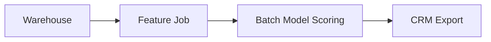
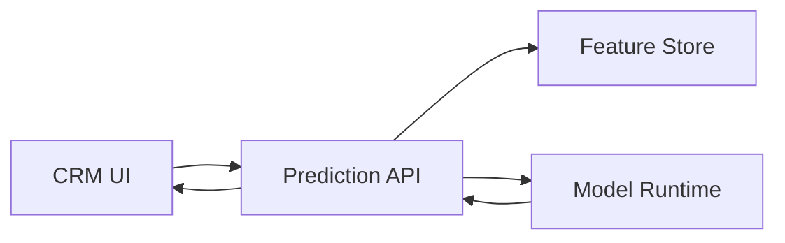

# 4.1 Tổng quan Phần 4: Quality Attributes

> **Tóm tắt một dòng**: Functional requirement nói hệ thống phải làm gì, còn Quality Attribute nói hệ thống phải làm việc đó tốt đến mức nào. Với production ML, accuracy chỉ là một phần nhỏ. Bạn còn phải quan tâm latency, freshness, reliability, reproducibility, observability, privacy và cost.

## Câu hỏi mở đầu

Hãy tưởng tượng bạn train được một churn prediction model có AUC rất cao. Trong notebook, mọi thứ trông tuyệt vời: data clean, validation split đúng, metric đẹp, biểu đồ rõ ràng. Bạn demo cho business, mọi người hài lòng. Sau đó team đưa model vào production.

Một tuần sau, hệ thống bắt đầu có vấn đề:

- Prediction trả về quá chậm, CRM page bị lag.
- Feature `last_7d_purchase_count` đôi khi trễ 24 giờ.
- Data schema thay đổi, pipeline vẫn chạy nhưng feature bị null nhiều hơn trước.
- Model mới tốt trên validation nhưng tệ hơn trong production, rollback mất cả ngày.
- Không ai biết prediction của user A được tạo bởi model version nào.
- Log có đủ thông tin để debug, nhưng lại chứa dữ liệu cá nhân.

Điều đáng chú ý là model không hề "sai" theo nghĩa Data Science truyền thống. Accuracy vẫn có thể tốt. Nhưng **hệ thống dùng model đó không đạt quality attributes cần thiết**.

Đây là lý do Phần 4 quan trọng. Software Architecture không chỉ hỏi "hệ thống có chức năng predict không?". Nó hỏi: predict có nhanh không, ổn định không, quan sát được không, giải thích được không, rollback được không, chi phí có chịu được không, và có an toàn dữ liệu không.

## Quality Attribute là gì?

Một **Quality Attribute** (QA), còn gọi là **Architecture Characteristic** hoặc **Non-functional Requirement**, là một thuộc tính mô tả *cách* hệ thống phải hoạt động, được xây dựng hoặc được vận hành.

So sánh đơn giản:

| Loại requirement | Câu hỏi | Ví dụ web app | Ví dụ ML/data system |
|---|---|---|---|
| Functional Requirement | Hệ làm gì? | User đặt được order | Hệ predict churn score |
| Quality Attribute | Hệ làm tốt đến mức nào? | p95 checkout < 500ms | p95 inference < 100ms, feature freshness < 1h |

Một sai lầm rất phổ biến là coi QA như phần phụ, kiểu "xong feature rồi tối ưu sau". Trong kiến trúc, QA thường quyết định hình dạng hệ thống ngay từ đầu. Nếu bạn cần batch score mỗi đêm, kiến trúc khác. Nếu bạn cần online fraud detection dưới 100ms, kiến trúc khác hoàn toàn. Nếu bạn cần audit từng prediction vì có rủi ro pháp lý, kiến trúc lại khác nữa.

## Nếu bạn đến từ Data Science

Trong Data Science, bạn đã quen với metric. Vì vậy hãy nghĩ Quality Attribute như **metric của hệ thống production**, không phải metric của model offline.

| Model metric quen thuộc | System metric tương ứng |
|---|---|
| Accuracy, F1, AUC | Business correctness và model quality |
| Training time | Pipeline duration, resource cost |
| Data split reproducibility | End-to-end reproducibility |
| Feature importance | Explainability, auditability |
| Validation score | Online performance monitoring |
| Dataset freshness | Data freshness SLA |
| Experiment tracking | Traceability, lineage, rollback |

Điểm khác biệt là system metric thường liên quan tới nhiều component, không nằm trong một file training. Ví dụ p95 inference latency phụ thuộc vào API gateway, feature lookup, model runtime, CPU/GPU allocation, network, serialization và logging. Vì vậy QA là cầu nối giữa Data Science và Software Architecture.

## Phần 4 sẽ dạy gì?

### Bài 4.2: Functional vs Non-functional Requirements

Bài này giúp bạn phân biệt "hệ thống phải làm gì" với "hệ thống phải làm như thế nào". Với ML system, functional requirement có thể là "trả về churn score cho mỗi customer". Non-functional requirement mới là phần làm kiến trúc khó: score phải cập nhật mỗi ngày hay mỗi giây, response time bao nhiêu, có cần explainability không, có cần lưu lại prediction để audit không.

### Bài 4.3: Identifying Architecture Characteristics

Bài này dạy cách tìm QA từ requirement document, stakeholder interview và business context. Với DS, stakeholder không phải lúc nào cũng nói "tôi cần feature freshness dưới 15 phút". Họ có thể nói "đừng dùng thông tin cũ để chặn giao dịch gian lận". Nhiệm vụ của architect là dịch câu đó thành QA đo được.

### Bài 4.4: Component-Based Thinking

Sau khi biết QA cần tối ưu, bạn phải map chúng xuống component. Ví dụ nếu freshness quan trọng, feature pipeline và feature store trở thành component trung tâm. Nếu rollback quan trọng, model registry và deployment strategy phải được thiết kế rõ. Nếu privacy quan trọng, logging và data retention không thể để tuỳ hứng.

## Bảng QA phổ biến

### Operational QA: xảy ra khi hệ thống chạy

| QA | Nghĩa ngắn | Ví dụ ML/data system |
|---|---|---|
| Performance | Response time, throughput | p95 inference < 100ms, score 1M records trong 30 phút |
| Scalability | Load tăng vẫn chạy tốt | Tăng từ 1k lên 100k prediction/phút |
| Availability | Hệ sẵn sàng phục vụ | Serving endpoint uptime 99.9% |
| Reliability | Kết quả đúng, không corrupt | Không score thiếu user, không dùng feature sai schema |
| Recoverability | Phục hồi sau lỗi | Rollback model trong 10 phút |
| Observability | Nhìn được state hệ thống | Dashboard latency, drift, error rate, feature null rate |
| Security | Bảo vệ dữ liệu và quyền truy cập | Chỉ service được phép mới đọc feature chứa PII |

### Structural QA: ảnh hưởng cách code và team phát triển

| QA | Nghĩa ngắn | Ví dụ ML/data system |
|---|---|---|
| Maintainability | Dễ sửa, dễ thêm feature | Thêm model mới không phải sửa toàn pipeline |
| Modularity | Boundary rõ | Tách ingestion, feature, training, serving, monitoring |
| Testability | Dễ test tự động | Test data validation, feature transform, inference contract |
| Deployability | Dễ release | Deploy model version mới không downtime |
| Reusability | Dùng lại được | Feature transform dùng chung training và serving |
| Evolvability | Dễ thay đổi theo thời gian | Thay model framework từ sklearn sang PyTorch ít ảnh hưởng |

### Cross-cutting QA: cắt ngang nhiều phần

| QA | Nghĩa ngắn | Ví dụ ML/data system |
|---|---|---|
| Cost | Tiền cloud, GPU, storage, con người | GPU serving có đáng so với CPU không |
| Privacy | Bảo vệ dữ liệu cá nhân | Mask PII trong logs và training data |
| Auditability | Trace ai làm gì, khi nào | Prediction được tạo bởi model/data version nào |
| Reproducibility | Chạy lại ra cùng kết quả | Rebuild model từ data snapshot và code version |
| Data lineage | Biết data đi từ đâu tới đâu | Feature X đến từ bảng nào, job nào, version nào |
| Freshness | Data mới tới mức nào | Feature trong online store không cũ quá 5 phút |
| Explainability | Giải thích được quyết định | Lý do transaction bị flag fraud |

## Vì sao không thể chọn tất cả?

Nếu chỉ nhìn danh sách trên, ta dễ muốn tất cả: latency thấp, cost thấp, freshness cao, explainability cao, privacy tốt, scale vô hạn, deploy dễ. Nhưng architecture là trade-off. Tối ưu một thứ thường làm thứ khác tệ đi.

### Accuracy vs Latency

Một deep model lớn có thể accuracy tốt hơn, nhưng inference chậm và cần GPU. Một logistic regression có thể accuracy thấp hơn một chút nhưng chạy nhanh, explainable và rẻ. Nếu use case là fraud detection real-time, latency có thể quan trọng hơn 0.5% AUC.

### Freshness vs Cost

Update feature mỗi phút giúp model phản ứng nhanh hơn. Nhưng compute, orchestration và monitoring đắt hơn. Nếu churn prediction chỉ dùng cho campaign mỗi sáng, feature freshness 24 giờ có thể đủ. Nếu fraud detection, 24 giờ là không chấp nhận được.

### Privacy vs Observability

Log đầy đủ request, feature vector và prediction giúp debug rất tốt. Nhưng nếu log chứa PII, bạn tạo rủi ro security và compliance. Architecture phải quyết định log cái gì, mask cái gì, retention bao lâu, ai được xem.

### Simplicity vs Scalability

Một cron job batch scoring có thể đơn giản và dễ maintain. Kafka streaming pipeline scale tốt hơn và realtime hơn, nhưng vận hành khó hơn nhiều. Nếu business không cần realtime, chọn streaming chỉ vì nghe hiện đại là over-engineering.

### Explainability vs Performance

Một model explainable giúp stakeholder tin tưởng và compliance dễ hơn. Nhưng model đó có thể kém performance hơn. Ngược lại, model phức tạp có thể tốt hơn về metric nhưng khó giải thích. Câu trả lời phụ thuộc domain: recommendation có thể chấp nhận ít explainability hơn, credit scoring thì không.

## Cách operationalize QA

Một QA chưa đo được thì chưa đủ dùng để ra quyết định. "Hệ phải nhanh" là mơ hồ. "p95 inference latency dưới 100ms ở 500 requests/second" mới đủ rõ.

| QA mơ hồ | Viết lại đo được |
|---|---|
| Model phải nhanh | p95 inference latency < 100ms, p99 < 250ms |
| Data phải mới | Feature freshness < 15 phút cho 99% records |
| Pipeline phải ổn | Daily training pipeline success rate > 99% |
| Dễ rollback | Rollback model version trong < 10 phút |
| Dễ debug | 100% predictions trace được model version + feature snapshot |
| Chi phí hợp lý | Serving cost < $0.10 / 1000 predictions |
| Không leak dữ liệu | 0 PII trong application logs, scan hằng ngày |

Operationalize là bước biến cuộc tranh luận cảm tính thành engineering. Nếu stakeholder nói "cần realtime", hãy hỏi realtime nghĩa là 50ms, 5 giây, 5 phút hay 1 giờ. Bốn con số này dẫn tới bốn kiến trúc rất khác nhau.

## Ví dụ: chọn architecture cho churn prediction

Giả sử business cần churn score để đội CRM gọi khách hàng có nguy cơ rời bỏ.

### Option 1: Batch inference mỗi đêm

QA đạt tốt:

- Cost thấp.
- Đơn giản.
- Reproducibility tốt.
- Dễ audit.

QA hy sinh:

- Freshness không cao.
- Không phù hợp nếu cần phản ứng theo hành vi realtime.

### Option 2: Online inference khi CRM mở profile

QA đạt tốt:

- Prediction fresh hơn.
- Có thể personalize theo request hiện tại.
- Dễ tích hợp vào nhiều channel.

QA hy sinh:

- Latency cần quản lý.
- Availability của API trở nên quan trọng.
- Cost và operational complexity cao hơn.

Không có option nào "đúng tuyệt đối". Nếu CRM gọi khách mỗi sáng theo batch list, Option 1 đủ tốt. Nếu app cần hiển thị offer realtime khi user đang tương tác, Option 2 hợp lý hơn. Quyết định phụ thuộc QA ưu tiên.

## Architect's responsibility

Một quyết định kiến trúc tốt nên làm ba việc:

1. **Nói rõ QA ưu tiên**. Ví dụ freshness < 15 phút quan trọng hơn cost.
2. **Nói rõ trade-off**. Ví dụ dùng streaming tăng freshness nhưng tăng operational cost.
3. **Ghi lại quyết định**. Ví dụ viết ADR: "Chọn batch inference cho churn scoring vì business action theo daily campaign".

Nếu architect ra quyết định mà không nói QA, quyết định đó rất dễ thành tranh luận sở thích: người thích Kafka, người thích cron, người thích microservices, người thích monolith. QA giúp team quay về câu hỏi đúng: hệ thống này cần tối ưu điều gì?

## Self-check

Trước khi sang bài tiếp theo, hãy tự trả lời:

1. Với một model bạn từng làm, 5 QA production quan trọng nhất là gì?
2. Metric offline của model có mâu thuẫn với system metric nào không?
3. Nếu business nói "cần realtime", bạn sẽ hỏi lại những câu nào để operationalize?
4. Nếu phải giảm cloud cost 50%, QA nào có thể bị ảnh hưởng?
5. Bạn có trace được prediction từ model version, data version và code version không?

## Cách đọc phần này

Đọc tuần tự 4.2 → 4.3 → 4.4. Nếu bạn đến từ Data Science, hãy đọc Phần 4 trước khi đi quá sâu vào microservices. Nhiều quyết định distributed chỉ có ý nghĩa sau khi bạn biết rõ QA cần tối ưu.

Mục tiêu thực hành sau phần:

- List 5-7 QA ưu tiên cho một hệ bạn biết.
- Viết mỗi QA thành metric đo được.
- Vẽ component diagram thể hiện QA đó nằm ở component nào.
- Viết một ADR ngắn cho quyết định batch vs online, hoặc REST vs Kafka.

Bài tiếp: [Functional vs Non-functional Requirements](02-functional-vs-nfr.md).
