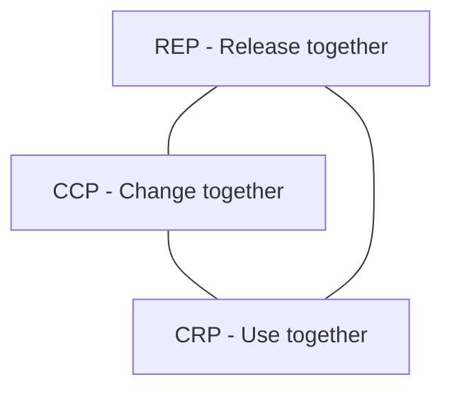

# 4.4 Component-Based Thinking

> **Tóm tắt một dòng**: Component là building block của architecture (lớn hơn class, có boundary rõ, có thể deploy/test độc lập). Identify component bằng entity-based hoặc workflow-based; tổ chức theo 3 cohesion + 3 coupling principles của Robert C. Martin.

## Nếu bạn đến từ Data Science

Component trong ML/data system thường là ingestion, validation, feature store, trainer, evaluator, model registry, serving API, monitoring. Mỗi component nên có trách nhiệm rõ và owner rõ. Nếu feature transformation vừa nằm trong training notebook vừa copy sang serving code, bạn đã tạo coupling nguy hiểm giữa training và serving.

Component thinking giúp bạn hỏi đúng: feature definition sống ở đâu? Ai own schema? Model registry lưu những metadata nào? Serving API đọc feature online hay tự tính? Monitoring nhận prediction log từ đâu? Những câu hỏi này quyết định architecture nhiều hơn việc chọn model algorithm.

## Component là gì?

Robert C. Martin định nghĩa trong *Clean Architecture*:

> "Components are the units of deployment. They are the smallest entities that can be deployed as part of a system."

Examples cụ thể:

- Trong Java: JAR file.
- Trong .NET: DLL file.
- Trong Ruby: Gem.
- Trong JavaScript: npm package.
- Trong Python: wheel / module.
- Trong microservices: deployed service.

Key property: **independently deployable**. Component có boundary rõ, vào ra qua interface công khai. Bên trong là chi tiết.

Component khác:

- **Class**: nhỏ hơn. Một component thường chứa nhiều class.
- **Module** (theo nghĩa code organization): tương đương component ở một số ngữ cảnh, nhưng "module" thường mức code, "component" thường mức deployment.

## Component vs Module, phân biệt

Nuance:

- **Module**: package code organization. Mục đích: navigation + namespace. Vd: Python package `myapp.orders`.
- **Component**: deployable unit. Mục đích: deployment + versioning. Vd: `orders-service.jar`.

Trong monolith, có nhiều module nhưng 1 component (1 deployable). Trong microservices, mỗi service là 1 component.

Phần 5 (Architecture Styles) sẽ trở lại: mỗi style có cách khác nhau để compose component.

## Identify Component

Hai phương pháp phổ biến:

### 1. Entity-based (theo domain entity)

Mỗi entity quan trọng → component own entity đó.

Vd e-commerce:

- `CustomerService` component own `Customer` entity.
- `OrderService` component own `Order` entity.
- `ProductService` component own `Product` entity.
- `PaymentService` component own `Payment` entity.

Lợi ích: bounded context rõ. Mỗi component có data ownership.

Hạn chế: nếu một workflow đụng nhiều entity (vd: "place order" đụng Customer + Order + Product + Inventory + Payment), workflow phải cross 5 component → coupling cao.

### 2. Workflow-based (theo use case)

Mỗi workflow quan trọng → component own workflow đó.

Vd:

- `OrderPlacementService` cover toàn bộ flow "place order" (orchestrate Customer + Inventory + Payment internally).
- `CustomerOnboardingService` cover flow "đăng ký + verify email + setup profile".

Lợi ích: workflow stay coherent, ít cross-component call.

Hạn chế: data ownership phức tạp (Customer entity bị edit bởi cả OrderService và OnboardingService).

### Combined approach

Thực tế thường mix:

- **Aggregate entities** thành Bounded Context (DDD): `OrderManagement` context own Order, OrderItem, OrderStatus entities.
- **Workflow** dùng cross-context: `CheckoutFlow` orchestrate OrderManagement + Payment + Shipping.

Mỗi approach có pros/cons. Quyết định theo: số workflow cross-entity, frequency thay đổi, team structure.

## Component Cohesion Principles (Robert C. Martin)

Ba nguyên tắc cho việc *cái gì nên ở cùng component*:

### REP, Reuse/Release Equivalence Principle

> "The granule of reuse is the granule of release."

Diễn đạt: bất cứ thứ gì bạn release together (cùng version) phải reusable together. Người dùng component không thể chọn release một phần của component, họ get tất cả hoặc không gì.

Hệ quả: classes trong component nên có *common purpose*. Vd: `react-router` package chỉ chứa routing-related code, không lẫn `react-i18n`.

### CCP, Common Closure Principle

> "Gather into components those classes that change for the same reasons and at the same times."

Diễn đạt: class thay đổi cùng nhau nên ở cùng component. Khi requirement thay đổi, ideally chỉ 1 component bị touch.

Hệ quả: chia component theo *axis of change*. Vd: nếu UI hay thay đổi separately từ business logic, tách thành 2 component.

Note: CCP scale up SRP từ class lên component.

### CRP, Common Reuse Principle

> "Don't force users of a component to depend on things they don't need."

Diễn đạt: nếu user dùng class X từ component C, user shouldn't be forced to depend trên class Y trong C mà user không dùng.

Hệ quả: classes có usage pattern khác nhau nên ở component khác nhau. Vd: `Database` và `Cache` thường được dùng cùng nhau → cùng component OK. Nhưng `EmailSender` không được dùng cùng → tách component.

Note: CRP scale up ISP lên component.

### Tension giữa 3 principles

Trade-off:

- REP + CCP push toward larger components (more in 1 component).
- CRP push toward smaller components (less in 1 component).

Triangle:



3 cạnh không thể đều đạt 100%, phải balance. Nguyên tắc:

- Early stage: prioritize CCP + REP (tooling/team focus on flexibility).
- Mature stage: shift to CRP (tooling/team focus on stability).

## Component Coupling Principles

Ba nguyên tắc cho *cách component depend lẫn nhau*:

### ADP, Acyclic Dependencies Principle

> "Allow no cycles in the component dependency graph."

Nếu A → B → C → A → cycle → cả 3 phải release cùng nhau, mất ý nghĩa tách component.

Detect: tool như `jdepend` (Java), `madge` (JS), `pydeps` (Python) visualize dependency graph + báo cycles.

Fix: 
- **Move dependency**: tách class gây cycle ra component khác.
- **Dependency Inversion**: introduce abstraction để break cycle (DIP từ Bài 2.7).

### SDP, Stable Dependencies Principle

> "Depend in the direction of stability."

Component thay đổi nhiều (volatile) nên depend vào component thay đổi ít (stable). Không ngược lại.

Lý do: nếu stable component depend volatile, mỗi lần volatile thay đổi → stable phải re-release → stable hết stable.

Đo stability: ratio `I = Ce / (Ca + Ce)` với:

- `Ca` (afferent coupling): số component depend *vào* component này.
- `Ce` (efferent coupling): số component component này depend *vào*.
- `I = 0`: maximally stable (chỉ bị depend, không depend ai).
- `I = 1`: maximally unstable.

### SAP, Stable Abstractions Principle

> "A component should be as abstract as it is stable."

Component stable nên abstract (interface), component volatile có thể concrete.

Lý do: stable component không nên chứa code chi tiết (vì khó thay đổi). Nó nên chứa abstraction, để concrete implementation ở volatile components.

Đo abstractness: ratio `A = abstract_classes / total_classes`.

### Main Sequence

SDP + SAP cho relationship I vs A:

- Pain zone: `I = 0, A = 0`, stable concrete (rigid, khó thay đổi).
- Useless zone: `I = 1, A = 1`, unstable abstract (no purpose).
- Main sequence: `I + A = 1`, ideal line.

```
A
1 ┤   Useless         Pain
  │                    
  │                    
  │     Main           
  │   sequence         
  │                    
  │                    
0 ┤    Pain          Useless
  └────────────────────────
   0                       1
                            I
```

Component nên gần Main Sequence. Far from it = warning sign.

## Sai lầm thường gặp

### Sai lầm 1: Component quá nhỏ

Tách thành 100 component cho project medium. Build time chậm. Dependency hell. Coordination cost cao.

Quy tắc: component count khoảng = team count * 2-5. Vd: team 5 → 10-25 components.

### Sai lầm 2: Component quá lớn

Tách quá lưới. Component to → khó test, khó deploy parts riêng, vi phạm CCP.

Quy tắc: component khoảng 5-50 class (cho mediocre complexity).

### Sai lầm 3: Cyclic dependencies tolerated

"Tạm thời" cycle tồn tại nhiều năm. Refactor khó hơn theo thời gian. Mỗi build slow vì cycle force rebuild widely.

Quy tắc: zero tolerance cho cycle ở component level. Detect + fix immediately.

### Sai lầm 4: Component theo layer (horizontal slicing)

Đã nói ở 3.4. Component-by-layer = distributed monolith. Component nên by domain (vertical).

## Tóm tắt

- **Component** = independently deployable unit, lớn hơn class.
- **Identify**: entity-based hoặc workflow-based (thường mix).
- **Cohesion principles**: REP (release together), CCP (change together), CRP (use together), trade-off.
- **Coupling principles**: ADP (no cycle), SDP (depend toward stable), SAP (stable = abstract).
- **Main Sequence**: balance I + A = 1.

## Tổng kết Phần 4

Hết Phần 4. Tóm tắt:

| Bài | Insight chính |
|---|---|
| 4.2 FR vs NFR | Architecture driven bởi NFR, không FR |
| 4.3 Identifying | Top 5-7 QA, measurable, prioritize qua workshop |
| 4.4 Component thinking | REP/CCP/CRP cohesion + ADP/SDP/SAP coupling, Main Sequence |

Phần 5-6 (Architecture Styles) sẽ áp dụng tất cả: mỗi style là một cách compose component để tối ưu một bộ QA cụ thể.

Bài tiếp: [Tổng quan Phần 5 - Fundamental Architecture Styles](../05-fundamental-styles/01-overview.md).
