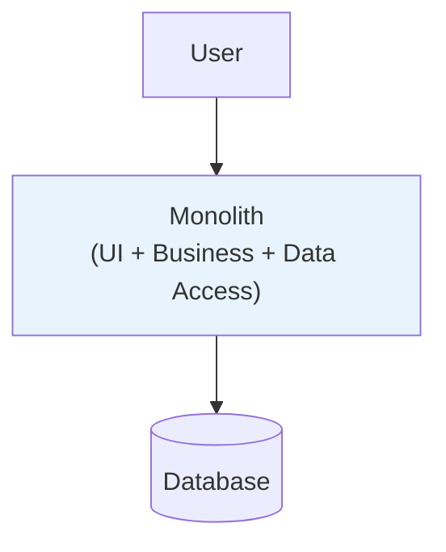
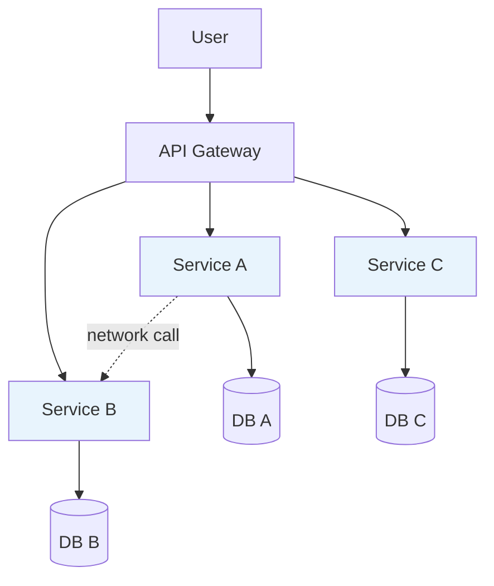

# 5.2 Monolithic vs Distributed

> **Tóm tắt một dòng**: Monolithic = toàn hệ chạy 1 process; Distributed = nhiều process qua network. Monolithic luôn nên là default. Distributed *chỉ* khi có lý do mạnh, vì nó thêm 5x complexity và 5x operational cost.

## Định nghĩa

### Monolithic Architecture

Toàn bộ application code chạy trong 1 process duy nhất (hoặc 1 container/server, replicate cho HA).

Communication giữa các module = function call trong process. Fast (nanoseconds), reliable (no network).

### Distributed Architecture

Application chia thành nhiều process độc lập, giao tiếp qua network.

Communication = HTTP/gRPC/message. Slow (milliseconds), unreliable (network failures).

## Monolithic là default

**Quy tắc thực hành**: nếu bạn chưa có lý do *cực mạnh* để distributed, hãy monolithic.

### Lợi ích monolithic

1. **Đơn giản phát triển**. 1 codebase, 1 deploy, 1 database. Onboard dev nhanh.
2. **Performance cao**. Function call < 1 microsecond. Distributed call > 1ms.
3. **Transaction dễ**. ACID trong 1 database. Distributed transaction (saga, 2PC) phức tạp.
4. **Debug dễ**. Stack trace đầy đủ. Distributed: distributed tracing required (Jaeger, Zipkin).
5. **Cost thấp**. 1 server + 1 DB = $50/tháng. Distributed setup minimum = $500/tháng.

### Khi nào monolithic không đủ

Tín hiệu phải lên distributed:

- **Team scale**: > 50 engineers, tuần nào cũng merge conflict trên monolith.
- **Different scaling**: 1 module ăn 90% traffic, không thể scale riêng.
- **Different tech stack**: ML team cần Python, web team cần Node, blockchain cần Rust.
- **Independent deploy**: cần ship 10 lần/ngày từ team này mà không block team kia.
- **Fault isolation**: 1 module down không được vỡ toàn hệ.

Nếu *không* match ≥ 2 điểm trên → monolithic vẫn ổn.

## 8 Distributed Computing Fallacies

Peter Deutsch + James Gosling (Sun Microsystems, 1994) liệt kê 8 sai lầm developer mới hay tin về distributed system:

1. **The network is reliable**, Sai. Packet drops, switches fail, cable bị đào lên.
2. **Latency is zero**, Sai. Network call 1-100ms vs local call < 1us.
3. **Bandwidth is infinite**, Sai. Có limit, có cost.
4. **The network is secure**, Sai. MITM, sniffing nếu không TLS.
5. **Topology doesn't change**, Sai. Nodes lên xuống, IPs thay đổi.
6. **There is one administrator**, Sai. Multiple teams config, có conflict.
7. **Transport cost is zero**, Sai. Network cost cao, đặc biệt cross-region.
8. **The network is homogeneous**, Sai. Heterogeneous protocol, latency, OS.

Mỗi fallacy = một class bug trong production. Distributed system architect phải handle cả 8.

## Hidden costs của Distributed

Khi quyết định distributed, ngoài lợi ích visible, có cost ẩn:

### Cost 1: Latency và bandwidth

Local call = nanoseconds. HTTP/gRPC call = 1-10ms in best case, 100ms+ across regions. Chain 5 services = 50ms+ latency added.

### Cost 2: Partial failure

Monolith: hoặc tất cả lên, hoặc tất cả down. Distributed: service A down, B up, phải handle gracefully (circuit breaker, fallback).

### Cost 3: Eventual consistency

Distributed transaction phức tạp. Đa số case dùng eventual consistency (saga, event-driven). Business team phải hiểu data có thể stale.

### Cost 4: Distributed tracing

Bug trong distributed → phải trace request qua N services. Cần Jaeger/Zipkin + correlation ID. Setup phức tạp.

### Cost 5: Operational complexity

- 1 monolith: monitor 1 service, 1 deploy pipeline.
- 20 microservices: monitor 20 services, 20 pipelines, service mesh, secrets management...

Operational cost (DevOps, SRE) tăng 5-10x.

### Cost 6: Testing

End-to-end test cần spin up multiple services. Slow, flaky. Cần test pyramid khác (more contract testing, less E2E).

### Cost 7: Network security

Mỗi inter-service call cần TLS, auth (mTLS hoặc JWT). Cert rotation, secret management.

## Trade-off table

| QA | Monolithic | Distributed |
|---|---|---|
| Performance | High (in-process) | Medium-Low (network) |
| Scalability (uniform) | Vertical scale only | Horizontal scale per service |
| Scalability (varied) | Cannot scale parts | Excellent, scale only hot parts |
| Availability | All or nothing | Partial, fault isolated |
| Maintainability | Easy when small, hard when large | Harder per service but easier across team |
| Deployability | 1 deploy = all changes | Independent deploys |
| Testability | Easy (in-process) | Hard (E2E + contract test) |
| Observability | Easy (1 log stream) | Hard (distributed tracing required) |
| Time-to-market (early) | Fast | Slow (setup overhead) |
| Time-to-market (mature, large team) | Slow (merge hell) | Fast (parallel team work) |
| Cost (small) | Low ($50-500/mo) | High ($500-5000/mo) |
| Cost (large) | High (1 huge server) | Optimized (scale only needed parts) |

Insight: trade-off đảo theo scale. Monolithic tốt ở scale nhỏ, distributed tốt ở scale lớn, crossover khoảng 20-50 engineers + 100k+ users.

## Modular Monolith, middle ground

Trước khi nhảy lên distributed, considermodular monolith:

- 1 deployment (1 process, 1 DB).
- *Nhưng* code organized thành strict modules với boundary cứng (mỗi module có interface công khai, không import internal lẫn nhau).
- Build tool enforce: module A không import từ `module_b.internal.*`.

Lợi ích:

- Có lợi ích của monolithic (simple deploy, in-process call).
- Có lợi ích của modularity (vertical slicing, team ownership).
- Migrate sang microservices dễ sau này (mỗi module → service).

Tools: Java module-info.java, Spring Modulith, .NET assemblies, Python package structure with strict imports.

Heuristic: hầu hết "we need microservices" thực sự "we need modular monolith". Cố modular monolith trước, distributed khi pain thực sự.

## Strangler Fig pattern

Khi đã có monolith và cần lên distributed, đừng rewrite from scratch (high risk). Dùng Strangler Fig:

1. Build API gateway/proxy in front of monolith.
2. Cứ feature mới, build microservice mới, route traffic qua gateway.
3. Dần "strangle" monolith, chuyển features hiện có thành microservice từng phần.
4. Sau N năm, monolith biến mất.

Pattern này safe, gradual, không big-bang rewrite.

## Sai lầm thường gặp

### Sai lầm 1: Microservices vì hype

Đã nói nhiều. Resume-driven architecture.

### Sai lầm 2: Distributed monolith

Tách thành microservices mà coupling chặt. Đã nói ở Bài 3.4.

### Sai lầm 3: Quên 8 fallacies

Code distributed như local. Result: bug bí ẩn trong production.

### Sai lầm 4: Không có observability từ ngày 1

Build distributed mà không có distributed tracing/centralized logging. Debug trở thành mò mẫm.

### Sai lầm 5: Premature optimization

"We'll need microservices in 5 years, let's start now." Sai. 80% project chết trước khi cần microservices. Start monolith, migrate when needed.

## Tóm tắt

- **Monolithic default**. Distributed chỉ khi có lý do mạnh.
- **Cost của distributed**: latency, partial failure, consistency, ops, testing, security.
- **8 fallacies** của distributed computing, đọc kỹ.
- **Modular monolith** là middle ground tốt.
- **Strangler Fig** để migrate monolith → distributed an toàn.

Bài tiếp: [Layered Architecture](03-layered-architecture.md), style phổ biến nhất historical.
