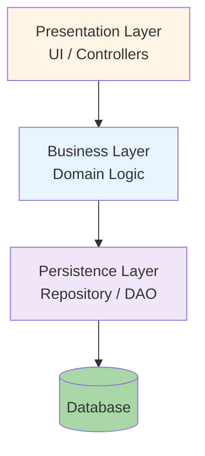

# 5.3 Layered Architecture

> **Tóm tắt một dòng**: Hệ chia thành tầng theo technical concern (UI, Business, Data). Đơn giản, được hiểu rộng, nhưng dễ rơi vào "sinkhole anti-pattern" và khó scale theo domain.

## Topology



Quy tắc cốt lõi: **dependency flow downward**. Tầng trên gọi tầng dưới, không bao giờ ngược lại.

## Closed vs Open layers

### Closed layer (default)

Request phải đi qua *mọi* tầng. Presentation không skip Business để gọi Persistence trực tiếp.

Pros: enforce layering, encapsulation.

Cons: boilerplate khi tầng giữa chỉ "pass-through".

### Open layer

Một layer có thể be "open", tầng trên có thể skip nó.

Vd: introduce Shared Services layer mà Presentation có thể skip:

```mermaid
graph TD
    P[Presentation]
    SS[Shared Services<br/>(OPEN)]
    B[Business]
    PS[Persistence]
    
    P --> B
    P -.skip if simple.-> SS
    B --> SS
    B --> PS
```

Pros: avoid pass-through for simple ops.

Cons: phá thuần khiết. Phải document rõ layer nào open.

Heuristic: default closed. Open layer chỉ khi pass-through pain rõ.

## Sinkhole Anti-pattern

Khi 80%+ requests chỉ "pass through" các layer mà không có logic:

```python
# Controller
def get_user(id):
    return user_service.get_user(id)

# Service
class UserService:
    def get_user(self, id):
        return self.repo.find_by_id(id)

# Repo
class UserRepo:
    def find_by_id(self, id):
        return db.query("SELECT * FROM users WHERE id=?", id)
```

3 tầng nhưng không tầng nào thực sự *thêm logic*. Đây là sinkhole, wasted abstraction.

Fix:

- **Option A**: Allow open layers cho pass-through cases.
- **Option B**: Drop layering cho read-heavy cases, use CQRS, write qua layered, read direct query.
- **Option C**: Reconsider style. Có thể layered không fit; xem service-based hoặc microkernel.

## Khi dùng Layered

✅ **Phù hợp khi**:

- Hệ nhỏ-trung (< 50k LOC).
- Team < 15 people.
- Domain đơn giản (CRUD nặng).
- Cần onboard nhanh, layered được dạy phổ biến.
- Cần consistency với codebase legacy.

❌ **Không phù hợp khi**:

- Hệ phức tạp với nhiều domain (vertical slicing tốt hơn).
- Cần high scalability per-domain.
- Cần tách team theo domain (Conway's law conflict).
- Performance critical với many sinkholes.

## Trade-off với QA

| QA | Score | Note |
|---|---|---|
| Simplicity | ★★★★★ | Cấu trúc dễ hiểu nhất |
| Cost | ★★★★★ | 1 deploy, 1 DB |
| Testability | ★★★ | OK nếu mỗi layer test với mock |
| Modularity (technical) | ★★★ | Layered theo tech concern |
| Modularity (domain) | ★ | Tệ, feature đụng mọi layer |
| Scalability | ★ | Cannot scale parts separately |
| Deployability | ★★ | 1 deploy = mọi thay đổi |
| Performance | ★★★★ | In-process call fast |
| Fault tolerance | ★★ | Single point of failure |

Layered tối ưu cho **simplicity + cost**, hy sinh **scalability + modularity domain**.

## Implementation trong code

### Java/Spring example

```java
// presentation/UserController.java
@RestController
@RequestMapping("/users")
public class UserController {
    private final UserService service;
    
    @GetMapping("/{id}")
    public UserDto get(@PathVariable Long id) {
        return service.getUser(id);
    }
}

// business/UserService.java
@Service
public class UserService {
    private final UserRepository repo;
    
    public UserDto getUser(Long id) {
        User user = repo.findById(id).orElseThrow();
        return UserDto.from(user);  // mapping
    }
    
    public UserDto createUser(CreateUserRequest req) {
        // validation, business rule
        User user = new User(req.email(), req.name());
        user.validate();
        return UserDto.from(repo.save(user));
    }
}

// persistence/UserRepository.java
@Repository
public interface UserRepository extends JpaRepository<User, Long> {}
```

Mỗi layer in own package. Spring auto-wire dependencies.

### Python/Flask example

```python
# presentation/user_blueprint.py
@app.route("/users/<int:id>")
def get_user(id):
    return jsonify(user_service.get(id))

# business/user_service.py
class UserService:
    def __init__(self, repo): self._repo = repo
    def get(self, id): return UserDto.from_entity(self._repo.find(id))

# persistence/user_repository.py
class UserRepository:
    def find(self, id):
        return User.query.filter_by(id=id).first()
```

## Variants

### Layered + Hexagonal

Combine layered với hexagonal (Cụm 2.7 DIP). Business layer định nghĩa abstraction; Persistence layer implement. Decouple business khỏi infrastructure.

### Onion / Clean Architecture

Layered hơi twist: domain ở center, infrastructure ở ngoài. Dependency direction *vào trong* (DIP applied). Effectively layered with DIP enforced.

Cụm này không đi sâu, đọc *Clean Architecture* (Robert Martin) sau khoá.

## Sai lầm thường gặp

### Sai lầm 1: Skip layers ad-hoc

Code nhanh, controller gọi thẳng repository. Vài tháng sau, business layer chỉ là half-empty shell, không reliable để add logic.

Fix: discipline. Default closed; document open layer rõ ràng.

### Sai lầm 2: Layered cho complex domain

Hệ có 20 sub-domain. Layered chỉ có 3 tầng, không match domain complexity. Mỗi feature touch nhiều file.

Fix: vertical slice (theo domain) + layered bên trong mỗi domain.

### Sai lầm 3: Database-first design

Bắt đầu thiết kế từ database schema, work upward. Result: business layer là CRUD wrapper, không thực sự reflect domain.

Fix: design domain model first (business layer), DB schema follow. Hexagonal/Clean approach.

### Sai lầm 4: Repository pattern abuse

Repository làm everything: SQL, caching, validation, business logic. Vi phạm SRP.

Fix: repository chỉ persistence. Cache trong service layer. Validation trong domain.

## Tóm tắt

- **Layered**: tầng UI / Business / Persistence theo technical concern.
- **Closed default**, open chỉ khi pain rõ.
- **Sinkhole** = anti-pattern: pass-through layers.
- **Phù hợp**: hệ nhỏ-trung, domain đơn giản, team < 15.
- **Trade-off**: simplicity + cost tối ưu; scalability + domain modularity hy sinh.

Bài tiếp: [Pipeline Architecture](04-pipeline-architecture.md), sequential transformation, Unix philosophy.
