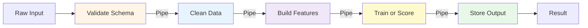
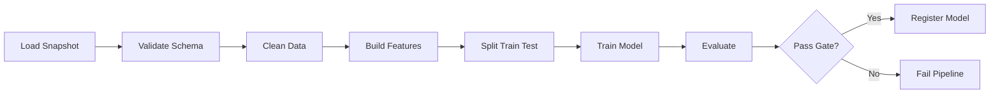
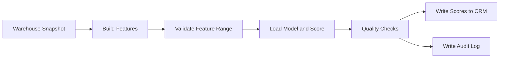
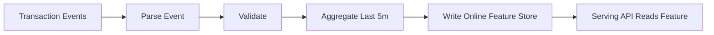
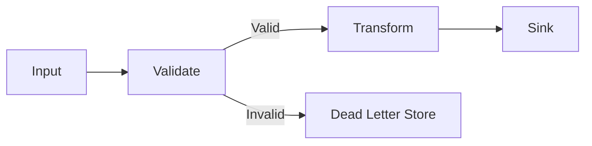

# 5.4 Pipeline Architecture

> **Tóm tắt một dòng**: Pipeline Architecture tổ chức hệ thống như một dây chuyền xử lý: dữ liệu đi qua nhiều bước nhỏ, mỗi bước làm một việc rõ ràng, rồi chuyển output cho bước tiếp theo. Với Data Scientist, đây là cách nhìn kiến trúc hoá cho ETL, feature engineering, training pipeline, batch scoring và streaming inference.

## Câu hỏi mở đầu

Hãy nhớ lại một notebook machine learning quen thuộc. Ban đầu notebook có thể rất gọn:

1. Load CSV.
2. Clean data.
3. Create features.
4. Train model.
5. Evaluate.
6. Save result.

Nhưng sau vài tuần, notebook bắt đầu dài ra: thêm xử lý missing value, thêm join với bảng mới, thêm encoding, thêm feature selection, thêm log metric, thêm save artifact, thêm export report. Cuối cùng bạn có một file rất dài, chạy được nhưng khó test, khó reuse và rất sợ sửa.

Pipeline Architecture là cách tách luồng xử lý đó thành nhiều bước nhỏ có boundary rõ. Thay vì một notebook làm tất cả, ta có nhiều filter, mỗi filter nhận input, xử lý đúng một trách nhiệm, rồi đưa output sang filter tiếp theo.

## Topology cốt lõi



Hai thành phần quan trọng:

- **Filter**: đơn vị xử lý. Nó nhận input, biến đổi hoặc kiểm tra, rồi xuất output. Filter tốt nên nhỏ, dễ test và không cần biết filter trước/sau là ai.
- **Pipe**: kênh chuyển dữ liệu giữa filters. Pipe có thể là object trong memory, file, table, queue, Kafka topic, hoặc stream.

Một pipeline tốt giống dây chuyền sản xuất trong nhà máy. Mỗi công đoạn có nhiệm vụ rõ. Nếu sản phẩm lỗi ở công đoạn nào, bạn biết nên debug ở đâu. Nếu muốn thay công đoạn đóng gói, bạn không phải viết lại toàn bộ nhà máy.

## Nếu bạn đến từ Data Science

Pipeline Architecture có lẽ là style tự nhiên nhất với bạn, vì phần lớn công việc DS vốn đã là pipeline. Điểm khác biệt là trong notebook, pipeline thường nằm ẩn trong thứ tự các cell. Trong production, pipeline cần được explicit hoá thành component, contract, schedule, monitoring và error handling.

| Trong notebook | Trong architecture |
|---|---|
| Cell load data | Producer filter |
| Cell clean data | Transformer filter |
| Cell drop invalid rows | Tester filter |
| Cell feature engineering | Transformer filter |
| Cell train model | Consumer hoặc transformer đặc biệt |
| Cell save pickle | Sink filter |
| Biến dataframe truyền giữa cell | Pipe |
| Cell chạy lỗi | Pipeline failure cần retry/alert |

Khi bạn biến notebook thành pipeline production, câu hỏi không chỉ là "code chạy không?". Câu hỏi là:

- Mỗi step có input/output schema rõ không?
- Step nào có thể chạy lại an toàn nếu fail?
- Step nào mất nhiều thời gian nhất?
- Step nào chứa business logic quan trọng?
- Nếu data schema đổi, step nào detect được?
- Output của step này có thể reuse cho pipeline khác không?

Đó chính là tư duy kiến trúc.

## Bốn loại filter

### 1. Producer

Producer tạo dữ liệu đầu vào cho pipeline. Nó có thể đọc từ file, API, database, data warehouse, Kafka topic, object storage hoặc sensor.

Ví dụ DS:

```python
import pandas as pd

def load_transactions(path: str) -> pd.DataFrame:
    return pd.read_parquet(path)
```

Filter này không nên clean data, train model hoặc ghi output. Nó chỉ chịu trách nhiệm lấy dữ liệu vào pipeline.

### 2. Transformer

Transformer biến input thành output mới. Đây là loại filter phổ biến nhất trong data pipeline.

```python
def add_recency_feature(df):
    df = df.copy()
    df["days_since_last_purchase"] = (
        df["snapshot_date"] - df["last_purchase_date"]
    ).dt.days
    return df
```

Transformer tốt nên deterministic: cùng input thì cho cùng output. Điều này giúp test và reproducibility dễ hơn.

### 3. Tester

Tester lọc hoặc validate input. Nó có thể drop records không hợp lệ, hoặc fail pipeline nếu schema sai.

```python
def require_columns(df, required):
    missing = set(required) - set(df.columns)
    if missing:
        raise ValueError(f"Missing columns: {missing}")
    return df
```

Trong production ML, tester filter cực kỳ quan trọng. Nhiều model không fail khi data sai, chúng chỉ silently predict sai. Schema validation giúp lỗi xuất hiện sớm hơn.

### 4. Consumer hoặc sink

Consumer ghi kết quả ra đích cuối: database, warehouse, model registry, API response, dashboard, file, hoặc message topic.

```python
def write_scores(df, table_name, warehouse_client):
    warehouse_client.write_table(df, table_name)
```

Sink là nơi pipeline tạo side effect. Vì vậy sink cần idempotency: nếu chạy lại cùng input, không được tạo duplicate hoặc corrupt data.

## Unix Philosophy và vì sao nó vẫn đúng

Pipeline Architecture cụ thể hoá Unix Philosophy:

> Write programs that do one thing and do it well. Write programs to work together. Write programs to handle text streams, because that is a universal interface.

Ví dụ Unix pipeline:

```bash
cat access.log | grep "404" | awk '{print $7}' | sort | uniq -c | sort -rn | head -10
```

Pipeline này có vẻ đơn giản, nhưng chứa một bài học kiến trúc rất sâu:

- `cat` không biết `grep` sẽ làm gì.
- `grep` không biết `awk` sẽ làm gì.
- `awk` không biết kết quả cuối dùng để debug hay report.
- Các bước kết nối được vì chúng thống nhất format stream.

Trong ML/data system, "text stream" có thể được thay bằng DataFrame schema, Parquet schema, Avro schema, protobuf message hoặc table contract. Ý tưởng vẫn giống nhau: **filter độc lập, pipe có contract rõ**.

## Ví dụ 1: Training pipeline

Một training pipeline production thường không nên là một notebook duy nhất. Nó có thể được tách như sau:



Điểm đáng chú ý là `Evaluate` không chỉ tính AUC. Nó có thể là quality gate:

- AUC không thấp hơn model hiện tại quá 1%.
- Bias metric không vượt threshold.
- Latency benchmark không vượt 100ms.
- Model artifact size không quá lớn.

Khi evaluate trở thành filter độc lập, bạn có thể test, version và thay đổi nó mà không sửa training code.

## Ví dụ 2: Batch inference pipeline

Batch inference phù hợp khi business không cần phản hồi realtime. Ví dụ: mỗi đêm score churn cho toàn bộ customer rồi đẩy sang CRM.



Ưu điểm:

- Đơn giản hơn online inference.
- Dễ kiểm soát cost.
- Dễ audit vì mọi score được tạo theo batch version.
- Dễ replay nếu cần rebuild.

Nhược điểm:

- Score có thể stale.
- Không phù hợp use case cần phản ứng ngay, như fraud detection.

## Ví dụ 3: Streaming feature pipeline

Khi freshness quan trọng, pipeline có thể chạy liên tục trên stream.



Ở đây pipe thường là Kafka topic hoặc stream internal của Flink/Spark Streaming. Trade-off bắt đầu phức tạp hơn:

- Throughput cao hơn batch.
- Freshness tốt hơn.
- Debug khó hơn.
- Operational cost cao hơn.
- Exactly-once hoặc at-least-once semantics cần được hiểu rõ.

Đừng chọn streaming chỉ vì nghe hiện đại. Hãy quay lại Phần 4: business có thật sự cần freshness theo giây/phút không?

## Cách implement pipeline

### In-process pipeline

Dùng khi pipeline nhỏ, chạy trong một process, phù hợp notebook chuyển thành script hoặc batch job đơn giản.

```python
from functools import reduce


def validate_schema(df):
    # validate columns and types
    return df


def clean_data(df):
    return df.dropna(subset=["customer_id"])


def build_features(df):
    df = df.copy()
    df["log_amount"] = (df["amount"] + 1).apply(np.log)
    return df


def score(df):
    df = df.copy()
    df["score"] = model.predict_proba(df[feature_cols])[:, 1]
    return df


filters = [validate_schema, clean_data, build_features, score]
result = reduce(lambda data, f: f(data), filters, input_df)
```

Ưu điểm: đơn giản, dễ hiểu, ít infrastructure. Nhược điểm: khó scale, monitoring hạn chế, failure recovery phải tự làm.

### Orchestrated batch pipeline

Dùng Airflow, Dagster, Prefect, Luigi hoặc workflow engine tương tự.

```python
extract >> validate >> build_features >> train >> evaluate >> register_model
```

Ở mức architecture, orchestrator không phải business logic. Nó điều phối dependency, schedule, retry, logging và visibility. Business logic vẫn nên nằm trong filter code riêng, để có thể test ngoài orchestrator.

### Distributed streaming pipeline

Dùng Kafka Streams, Flink, Spark Structured Streaming hoặc cloud service tương tự.

```text
Kafka topic raw-events
  -> parser job
  -> topic parsed-events
  -> feature aggregation job
  -> topic online-features
  -> feature store sink
```

Dùng khi throughput hoặc freshness thật sự yêu cầu. Cái giá là bạn phải hiểu partitioning, event time, late events, retry, duplicate, schema evolution, monitoring lag.

## Trade-off với Quality Attributes

| QA | Pipeline hỗ trợ tốt? | Lý do |
|---|---|---|
| Modularity | Rất tốt | Mỗi filter có trách nhiệm rõ |
| Testability | Rất tốt | Test từng filter độc lập |
| Reusability | Tốt | Filter có thể dùng lại ở pipeline khác |
| Observability | Tốt nếu instrument đúng | Có thể đo latency/failure từng step |
| Throughput | Tốt | Có thể parallelize filter hoặc partition data |
| Latency | Trung bình | Latency tổng bằng tổng nhiều step |
| Simplicity | Tốt với pipeline nhỏ | Nhưng giảm khi branching/state nhiều |
| Consistency | Tuỳ implementation | Distributed pipeline dễ gặp duplicate/out-of-order |
| Debuggability | Tốt nếu có checkpoint | Khó nếu pipe không lưu intermediate output |

## Khi nào dùng Pipeline Architecture?

### Phù hợp

- ETL/ELT pipeline.
- Feature engineering pipeline.
- Training pipeline.
- Batch inference.
- Log processing.
- Image/video processing.
- Compiler/build system.
- Streaming aggregation khi data flow rõ.

### Không phù hợp

- Workflow có business transaction phức tạp.
- User-facing interaction cần nhiều decision branch.
- Domain logic cần shared state dày đặc.
- Flow mà step sau cần gọi ngược step trước liên tục.
- Hệ cần orchestration phức tạp kiểu saga, compensation, approval.

Một dấu hiệu sai style: bạn phải nhét quá nhiều `if/else`, loop, rollback, shared database update vào từng filter. Khi đó có thể bạn đang cố ép một business workflow thành data pipeline.

## Design rules cho pipeline tốt

### Rule 1: Contract giữa filters phải rõ

Filter A output gì, Filter B expect gì? Trong DS, đây thường là DataFrame schema hoặc table schema. Nếu contract mơ hồ, pipeline sẽ lỗi ở runtime.

Nên có:

- Required columns.
- Data types.
- Nullability.
- Value ranges.
- Time window.
- Semantic meaning.

### Rule 2: Filter càng stateless càng tốt

Stateless filter dễ parallel, replay và test. Nếu cần state, hãy đặt state ở nơi rõ ràng như feature store, database, checkpoint store hoặc model registry.

### Rule 3: Side effect phải nằm ở sink rõ ràng

Một filter vừa transform data vừa ghi database vừa gửi email là filter nguy hiểm. Nó khó retry và khó test. Hãy cố giữ transform thuần, side effect ở sink.

### Rule 4: Error path cũng là một pipeline

Production pipeline không chỉ có happy path. Cần thiết kế error path:



Dead letter store giúp bạn inspect record lỗi, sửa data hoặc replay sau.

### Rule 5: Mỗi step cần metric riêng

Đừng chỉ monitor pipeline success/failure. Hãy monitor từng filter:

- Input count.
- Output count.
- Error count.
- Processing latency.
- Data quality metric.
- Feature null rate.
- Schema drift.

Với ML, nhiều lỗi không làm pipeline fail. Chúng làm model âm thầm tệ đi. Monitoring từng step giúp phát hiện sớm.

## Sai lầm thường gặp

### Sai lầm 1: Notebook là pipeline production

Notebook tốt cho exploration, không tốt làm production boundary. Cell order có thể không rõ, state ẩn nhiều, khó test tự động, khó schedule và khó review.

Fix: tách logic thành module Python, dùng notebook cho exploration/report, dùng orchestrator cho production.

### Sai lầm 2: God filter

Một function `process_data()` làm validate, clean, join, feature, train, save. Tên nghe như pipeline, nhưng thật ra là monolith trong một function.

Fix: tách theo trách nhiệm và đặt tên filter cụ thể: `validate_schema`, `remove_outliers`, `build_recency_features`, `train_xgboost`, `register_model`.

### Sai lầm 3: Không lưu intermediate output

Pipeline fail ở cuối, nhưng bạn không biết input của step cuối là gì. Debug phải chạy lại từ đầu rất tốn thời gian.

Fix: checkpoint ở boundary quan trọng. Với batch pipeline, có thể lưu Parquet sau validation/feature. Với streaming, có topic trung gian hoặc state store.

### Sai lầm 4: Không version schema và model

Feature pipeline thay đổi nhưng model serving vẫn expect schema cũ. Kết quả là runtime error hoặc prediction sai.

Fix: version data contract, feature schema, model artifact. Model registry nên lưu cả feature schema và dependency version.

### Sai lầm 5: Chọn streaming khi batch đủ

Streaming pipeline rất hấp dẫn, nhưng khó vận hành hơn batch nhiều. Nếu business chỉ cần report mỗi sáng, Airflow batch có thể tốt hơn Kafka/Flink.

Fix: bắt đầu từ QA. Nếu freshness target là 24 giờ, batch là ứng viên mạnh. Nếu target là 5 giây, streaming mới đáng cân nhắc.

## Self-check

1. Một notebook ML gần đây của bạn có thể tách thành những filters nào?
2. Pipe giữa các filters là gì: DataFrame, file, table, queue hay topic?
3. Filter nào có side effect? Side effect đó có idempotent không?
4. Nếu schema input đổi, pipeline phát hiện ở step nào?
5. Nếu step scoring fail, bạn có replay được từ feature checkpoint không?

## Tóm tắt

- **Pipeline Architecture** tổ chức hệ thành filters và pipes.
- Với Data Scientist, đây là cách production hoá ETL, feature engineering, training và scoring.
- Filter tốt nên nhỏ, stateless, testable, có input/output contract rõ.
- Pipe có thể là memory object, file, table, queue, Kafka topic hoặc stream.
- Pipeline tối ưu modularity, testability, reusability và throughput.
- Pipeline không phù hợp cho workflow business phức tạp, nhiều transaction, nhiều rollback.
- Đừng chọn streaming nếu batch đã đủ đáp ứng Quality Attributes.

Bài tiếp: [Microkernel Architecture](05-microkernel-architecture.md), cách thiết kế core + plug-in, rất hữu ích khi bạn muốn thêm model algorithm, metric hoặc feature transformation mà không sửa core.
