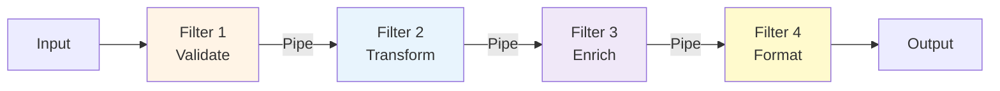
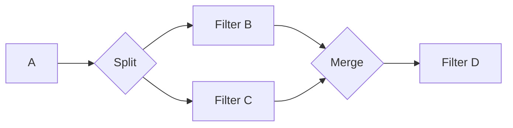

# 5.4 Pipeline Architecture

> **Tóm tắt một dòng**: Hệ thống như một dây chuyền lắp ráp: data đi vào filter đầu tiên, được transform, đi qua filter tiếp, và cứ thế. Style này tối ưu cho composability và là backbone của Unix tools, compiler, ETL pipeline.

## Topology cốt lõi



Hai thành phần:

- **Filter**: đơn vị xử lý. Nhận input, biến đổi, xuất output. Self-contained, không biết về filter trước hay sau.
- **Pipe**: kênh chuyển data giữa filter. Có thể là in-memory queue, file, network stream.

Quy tắc cốt lõi: **filter không lưu state giữa các message**. Mỗi message processed độc lập (stateless filter).

## Bốn loại filter

### 1. Producer (source)

Generate data từ nguồn ngoài (file, DB, API). Không có input. Vd: `cat file.txt` đọc file vào pipeline.

### 2. Transformer

Map 1 input → 1 output. Vd: `grep "ERROR" logs.txt`.

### 3. Tester

Filter input theo predicate. Vd: chỉ pass record có `status="success"`.

### 4. Consumer (sink)

Ghi output đến đích cuối. Không có output downstream. Vd: `> output.txt`.

## Unix Philosophy

Pipeline architecture là cụ thể hoá Unix Philosophy của Doug McIlroy:

> "Write programs that do one thing and do it well. Write programs to work together. Write programs to handle text streams, because that is a universal interface."

Vd Unix pipeline:

```bash
cat access.log | grep "404" | awk '{print $7}' | sort | uniq -c | sort -rn | head -10
```

Pipeline này:

1. `cat access.log`, producer.
2. `grep "404"`, tester (only 404 errors).
3. `awk '{print $7}'`, transformer (extract URL).
4. `sort`, transformer (sort).
5. `uniq -c`, transformer (count duplicates).
6. `sort -rn`, transformer (sort by count desc).
7. `head -10`, tester (top 10 only).

Mỗi command đơn giản. Compose thành workflow mạnh. SRP và OCP scaled lên hệ.

## Khi dùng Pipeline

✅ **Phù hợp**:

- **Data processing pipeline**: ETL (Extract-Transform-Load), data warehouse, ML feature pipeline.
- **Compiler**: source → tokenize → parse → AST → optimize → codegen.
- **Image/video processing**: load → resize → filter → encode.
- **Log/event processing**: ingest → parse → enrich → store/route.
- **Build system**: compile → link → package → deploy.

❌ **Không phù hợp**:

- Workflow có business logic phức tạp (loop, branch, retry).
- Cần state shared giữa các step.
- User-facing interactive system.

## Cách implement

### Synchronous (in-process)

```python
def pipeline(data):
    return format_output(
        enrich(
            transform(
                validate(data)
            )
        )
    )

# Hoặc functional
from functools import reduce
filters = [validate, transform, enrich, format_output]
result = reduce(lambda d, f: f(d), filters, input_data)
```

Đơn giản. Mọi filter chạy trong cùng process.

### Async với queue (in-process)

```python
import queue
import threading

q1 = queue.Queue()
q2 = queue.Queue()
q3 = queue.Queue()

def filter1():
    for item in source:
        q1.put(transform1(item))

def filter2():
    while True:
        item = q1.get()
        q2.put(transform2(item))

# ... spawn thread mỗi filter
```

Mỗi filter chạy thread riêng. Throughput cao hơn (parallel work).

### Distributed (network)

Stream processing framework: Kafka Streams, Apache Flink, Spark Streaming.

```
Source (Kafka topic A)
  → Filter 1 (Flink job)
    → Topic B
      → Filter 2 (Flink job)
        → Topic C
          → Sink (Kafka topic D)
```

Mỗi filter là một service/job. Pipe = message topic. Scale horizontally.

## Trade-off với QA

| QA | Score | Note |
|---|---|---|
| Composability | ★★★★★ | Add filter mới rất dễ |
| Reusability | ★★★★★ | Filter dùng được ở nhiều pipeline |
| Modularity | ★★★★ | Mỗi filter SRP cao |
| Performance (throughput) | ★★★★ | Pipeline parallel tốt |
| Performance (latency) | ★★★ | Latency = sum của filter latencies |
| Testability | ★★★★★ | Mỗi filter test isolated |
| Maintainability | ★★★★ | Thêm/đổi filter localized |
| Complexity (stateful workflow) | ★★ | Tệ khi cần state hoặc branch |

Pipeline tối ưu cho **composability + reusability + testability**.

## Ví dụ thực tế

### Compiler (GCC, LLVM)

```
Source code → Lexer → Parser → AST → Type Checker → 
  IR Generator → Optimizer (multiple passes) → 
  Code Generator → Assembler → Linker → Binary
```

Mỗi pass là một filter. Output của filter này là input cho filter sau. LLVM nổi tiếng vì design pipeline cực kỳ modular, viết optimizer mới = drop in một filter.

### ETL Pipeline (Airflow, Luigi)

```python
# Airflow DAG (pseudo-code)
extract_users = PythonOperator(task_id='extract', python_callable=extract_from_db)
clean_users = PythonOperator(task_id='clean', python_callable=remove_pii)
enrich_users = PythonOperator(task_id='enrich', python_callable=join_with_segments)
load_users = PythonOperator(task_id='load', python_callable=load_to_warehouse)

extract_users >> clean_users >> enrich_users >> load_users
```

Mỗi task là một filter. Airflow schedule và monitor.

### Image Processing (PIL, OpenCV)

```python
from PIL import Image

img = Image.open("input.jpg")
img = img.resize((800, 600))
img = img.convert("L")  # grayscale
img = img.filter(ImageFilter.BLUR)
img.save("output.png")
```

Mỗi method là một filter. Chain qua method call.

### CI/CD Pipeline

```
git push → Trigger CI → 
  Filter 1: Install dependencies
  Filter 2: Lint
  Filter 3: Unit test
  Filter 4: Build artifact
  Filter 5: Security scan
  Filter 6: Deploy staging
  Filter 7: Smoke test
  Filter 8: Deploy prod
```

Mỗi step có thể fail → pipeline halt. Pure pipeline architecture.

## Variants

### Linear pipeline

Filter A → B → C → D. Đơn giản nhất.

### Branching pipeline

Filter A → split into B and C parallel → merge into D.



Use case: validate cho cả format A và format B song song, merge result.

### DAG pipeline (Directed Acyclic Graph)

Pipeline phức tạp với multiple producers, transformers, consumers, dependencies giữa nhau.

Airflow là example. Build system (Make, Bazel) cũng là DAG pipeline.

## Sai lầm thường gặp

### Sai lầm 1: Stateful filter

Filter share state qua global variable hoặc DB. Phá lợi ích chính của pipeline (parallel, replay, debug).

Fix: stateless filter. State chỉ ở pipe (queue/topic) hoặc external store (Redis, DB).

### Sai lầm 2: Tightly coupled filters

Filter A biết Filter B sẽ nhận output → format theo expectation của B. Phá composability.

Fix: filter chỉ produce data theo well-defined schema. Filter sau adapt nếu cần.

### Sai lầm 3: God filter

Filter làm quá nhiều việc (validate + transform + enrich + log + alert). Vi phạm SRP.

Fix: tách thành nhiều filter nhỏ. Pipeline architecture *expect* nhiều filter.

### Sai lầm 4: No error handling

Filter throw → pipeline halt cả batch. Phải có dead-letter queue / error sink.

Fix: mỗi filter có error handling. Failed message route vào dead-letter pipe cho retry/inspect.

### Sai lầm 5: Pipeline cho non-pipeline workload

User registration flow: validate input → check duplicate → save DB → send welcome email. *Có thể* model như pipeline nhưng:

- Step 3 (save DB) có business logic phức tạp (transaction, rollback).
- Step 4 (email) là side effect, không phải data transformation.

Style này phù hợp với layered hoặc service-based hơn. Pipeline phù hợp với pure data flow.

## Tóm tắt

- **Pipeline**: filter (stateless) + pipe (channel).
- **4 loại filter**: producer, transformer, tester, consumer.
- **Unix philosophy**: do one thing well, work together via text stream.
- **Use cases**: ETL, compiler, image processing, CI/CD, log processing.
- **Trade-off**: composability + reusability tối ưu; phức tạp khi cần state hoặc branch logic.

Bài tiếp: [Microkernel Architecture](05-microkernel-architecture.md), OCP ở scale lớn, core + plug-in.
