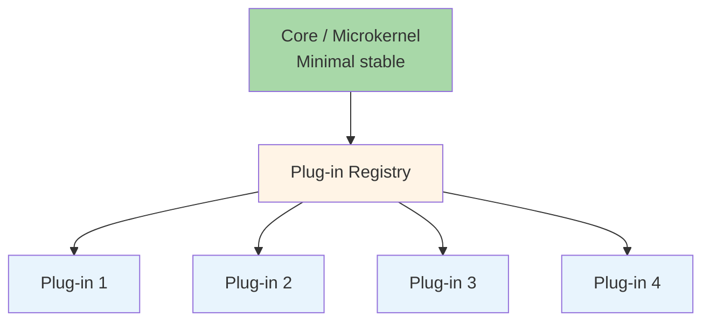

# 5.5 Microkernel Architecture

> **Tóm tắt một dòng**: Hệ thống chia thành một core stable nhỏ + nhiều plug-in mở rộng tính năng. OCP ở scale lớn. Phù hợp cho product cần third-party extension hoặc customization mạnh.

## Topology cốt lõi



Ba thành phần:

- **Core (kernel)**: minimal, stable. Chứa logic *chung nhất* (vd: window management, plug-in lifecycle, common utilities).
- **Plug-in**: standalone module. Implement một feature cụ thể. Communicate với core qua well-defined contract.
- **Registry**: nơi core biết về plug-in nào available. Discovery cơ chế: file system scan, manifest config, hoặc remote registry.

Quy tắc cốt lõi: **core không biết về plug-in cụ thể**. Plug-in implement interface mà core defined. Add/remove plug-in không touch core code.

## Lợi ích vs Layered

So với layered:

- **Extensibility**: layered cần modify code để add feature. Microkernel chỉ cần drop in plug-in.
- **Customization**: user/admin có thể enable/disable plug-in. Layered có toàn bộ feature on-or-off.
- **Third-party ecosystem**: plug-in API mở cho dev khác. Eg: VS Code extension marketplace.
- **Independent versioning**: core và plug-in version độc lập.

Trade-off với layered:

- **Complexity**: phải design plug-in API cẩn thận, manage lifecycle (load, init, dispose).
- **Performance**: cross-plug-in call có overhead (interface dispatch, marshal data).
- **Security**: plug-in third-party có thể malicious, cần sandboxing.

## Examples thực tế

### VS Code

- **Core**: window manager, file system access, editor core, plug-in lifecycle.
- **Plug-in**: hàng ngàn extension cho language, theme, debugging, AI assistance, source control.
- **API**: TypeScript SDK với contracts (commands, providers, language services).

### Eclipse IDE

Tiền bối của VS Code. Core (Equinox OSGi container) + bundles (plug-ins). Mọi feature kể cả Java editor là plug-in.

### Chrome / Firefox

- **Core**: Chromium / Gecko engine.
- **Plug-in**: extension cho ad-blocker, password manager, dev tools.

### WordPress

- **Core**: post system, user management, admin UI, plug-in lifecycle.
- **Plug-in**: SEO, e-commerce (WooCommerce), gallery, forms, ... > 50,000 plug-in.

### CMS / E-commerce platforms

Magento, Shopify, Drupal đều microkernel. Merchant install plug-in để add feature mà không cần touch core.

### DAW (Digital Audio Workstation)

Pro Tools, Ableton: core audio engine + plug-in synthesizer/effect (VST3, AU).

## Plug-in Contract Design

Đây là phần khó nhất. Contract = interface mà mọi plug-in phải implement. Thiết kế kém → plug-in ecosystem chết.

### Loại 1: Event/Hook system

Core emit event. Plug-in subscribe.

```python
# Core
class EventBus:
    def emit(self, event_name, payload):
        for handler in self._handlers.get(event_name, []):
            handler(payload)

# Plug-in
def on_user_login(payload):
    log.info(f"User {payload.user_id} logged in")

core.event_bus.subscribe("user.login", on_user_login)
```

Vd: WordPress hooks (`add_action`, `add_filter`).

Pros: loose coupling. Plug-in không block core.

Cons: hard to reason about order; debugging khó.

### Loại 2: Service registration

Plug-in register service vào registry. Core query.

```python
# Plug-in
class MyAuthProvider(AuthProvider):
    def authenticate(self, creds): ...

core.registry.register("auth", "oauth", MyAuthProvider())

# Core
auth = core.registry.get("auth", "oauth")
user = auth.authenticate(creds)
```

Vd: Spring beans, Java ServiceLoader, .NET DI container.

Pros: explicit, type-safe.

Cons: plug-in phải khai báo trước khi dùng.

### Loại 3: Command pattern

Core có command registry. Plug-in register commands.

```typescript
// VS Code extension
context.subscriptions.push(
  vscode.commands.registerCommand('myExt.helloWorld', () => {
    vscode.window.showInformationMessage('Hello!');
  })
);
```

Pros: discoverability (user thấy commands trong palette).

Cons: chỉ cho command-style interaction, không cho data flow phức tạp.

### Loại 4: Contribution points (Eclipse model)

Core declare contribution point. Plug-in declare what it contributes.

```xml
<!-- Plug-in's plugin.xml -->
<extension point="org.eclipse.ui.editors">
  <editor id="my.editor" class="my.EditorImpl"/>
</extension>
```

Core scan all plug-ins for contributions, wire up.

Pros: declarative, lazy loading.

Cons: XML configuration verbose; learning curve cao.

## Plug-in Lifecycle

Plug-in cần được manage:

1. **Discovery**: core scan plug-in folder, registry, hoặc remote source.
2. **Load**: load code (DLL, JAR, JS bundle) vào process.
3. **Initialize**: gọi plug-in's `init()`; plug-in register services/commands.
4. **Activate**: plug-in start using core services. Lazy activation = activate khi user thật sự dùng.
5. **Deactivate**: clean up resources, unsubscribe events.
6. **Unload**: remove code khỏi memory.

Mỗi step có error handling. Bad plug-in không được crash core.

## Sandboxing (cho third-party plug-ins)

Plug-in third-party có thể malicious hoặc bug. Cần isolation:

### Process isolation

Plug-in run trong child process. Crash plug-in không vỡ core. IPC qua pipe/socket.

Vd: Chrome render extension trong child process.

Cost: IPC slow hơn in-process call (~100x).

### Sandboxed runtime

Plug-in run trong VM với limited permission. Vd: V8 isolate, Wasm sandbox.

Cost: limited capability (no syscalls, limited memory).

### Permission system

Plug-in declare permission cần (network, file system, mic, camera). User approve khi install.

Vd: Browser extension permissions, Android app permissions.

## Trade-off với QA

| QA | Score | Note |
|---|---|---|
| Extensibility | ★★★★★ | Best in class |
| Modularity | ★★★★ | Core + plug-in boundary cứng |
| Performance | ★★★ | Plug-in call có overhead |
| Maintainability (core) | ★★★★ | Core nhỏ, stable, dễ maintain |
| Maintainability (plug-in) | ★★ | Plug-in compatibility issue khi core update |
| Testability | ★★★ | Test plug-in dễ; test core+plug-in interactions khó |
| Deployability | ★★★★ | Plug-in deploy/update độc lập |
| Complexity | ★★ | Plug-in API design + lifecycle phức tạp |

Microkernel tối ưu cho **extensibility**, sacrificing performance + simplicity.

## Khi dùng Microkernel

✅ **Phù hợp**:

- Product cần customization mạnh (CMS, e-commerce, IDE).
- Có ecosystem third-party (extension marketplace).
- Core feature ổn định, variation ở edge cases.
- Cần independent versioning core vs feature.

❌ **Không phù hợp**:

- App nội bộ với fixed feature set.
- Performance critical (real-time, low-latency).
- Team không có resource để maintain plug-in API.

## Variants

### Microkernel + Distributed plug-ins

Plug-in chạy ở remote service. Core gọi qua HTTP/gRPC.

Vd: cloud services with extension hooks (Salesforce, Zendesk).

Cost: thêm distributed cost (Bài 5.2).

### Microkernel + Module Federation (Frontend)

Webpack 5 Module Federation: frontend microkernel với React modules từ multiple repos.

```javascript
// host (microkernel)
import('plugin/Feature').then(module => {
  module.default.mount('#container');
});
```

Plug-in code loaded lazily từ CDN. Independent deployment cho frontend teams.

## Sai lầm thường gặp

### Sai lầm 1: Core quá lớn

Core "nhỏ" theo plan nhưng dần phình ra với utilities, common features. Plug-in API không thực sự minimal.

Fix: discipline. Mọi feature mới hỏi "đây có phải core không?". Default: not core, làm plug-in.

### Sai lầm 2: API không backward compatible

Core release mới phá plug-in cũ. Ecosystem chết.

Fix: SemVer cho plug-in API. Major version chỉ khi *force* break. Deprecate API trước khi remove.

### Sai lầm 3: Plug-in coupling lẫn nhau

Plug-in A depend Plug-in B. Khi cài A không có B → vỡ.

Fix: plug-in chỉ depend Core API. Coordination giữa plug-in qua event bus của core, không direct call.

### Sai lầm 4: Performance overhead bị bỏ qua

Plug-in call qua reflection/dispatcher. Slow trong hot path.

Fix: profile hot path. Cache plug-in instance. Pre-compile plug-in dispatch.

### Sai lầm 5: Security model yếu

Plug-in có full access vào core internal. Một bad plug-in crash hoặc data theft.

Fix: define permission model. Sandbox plug-in. Code-review marketplace.

## Tóm tắt

- **Microkernel**: core stable + plug-ins extensible.
- **OCP ở scale lớn**: core closed for modification, open for extension via plug-in.
- **Plug-in contract**: event/hook, service registration, command, contribution point.
- **Lifecycle + sandboxing** quan trọng cho production.
- **Use cases**: IDE, browser, CMS, e-commerce, DAW.
- **Trade-off**: extensibility tối ưu, sacrificing performance + complexity.

## Tổng kết Cụm 5

Hết Cụm 5. Tóm tắt 3 styles:

| Style | Tối ưu | Sacrificing | Use case điển hình |
|---|---|---|---|
| Layered | Simplicity, cost | Scalability, domain modularity | CRUD app, internal tools |
| Pipeline | Composability, reusability | Stateful logic, branching | ETL, compiler, image processing |
| Microkernel | Extensibility | Performance, complexity | IDE, CMS, browser |

Plus **Monolithic vs Distributed** baseline (Bài 5.2).

Cụm tiếp: [Cụm 6 - Distributed Styles](../06-distributed-styles/01-overview.md), bốn style phân tán quan trọng nhất.
