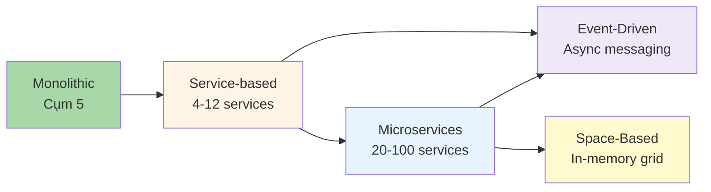

# 6.1 Tổng quan Cụm 6: Distributed Architecture Styles

> **Tóm tắt một dòng**: Cụm này dạy 4 style phân tán phổ biến nhất, từ "nhẹ" (Service-based) tới "phức tạp" (Space-Based). Mỗi style giải quyết một bài toán scale + decoupling cụ thể, với cost distributed khác nhau.

## Distributed style ladder

Đi từ trái sang phải = complexity tăng + capability tăng. Hầu hết hệ stop ở Service-based hoặc Microservices. Event-Driven thường overlay lên Service-based/Microservices, không thay thế.

Space-Based là special case cho extreme load.

## Bài trong cụm

### 6.2: Service-based Architecture

"Macro-services". 4-12 coarse services + shared database (hoặc shared DB per domain). Middle ground giữa monolith và microservices. Pragmatic cho most enterprise.

### 6.3: Microservices

20-100 fine-grained services + database per service. Hype mạnh 2015-2020. Đầu tư operational lớn. Phù hợp cho large team (50+ engineers) + complex domain.

### 6.4: Event-Driven Architecture

Async messaging. Producer emit events, consumer subscribe. Decoupling cực mạnh. Hai topology: Broker (peer-to-peer) và Mediator (orchestration). CAP theorem relevant.

### 6.5: Space-Based Architecture

In-memory data grid + async DB sync. Designed cho extreme load (Black Friday, ticket sales). Cassandra/Hazelcast/Apache Ignite. Niche nhưng powerful.

## Quy tắc chọn style

### Câu hỏi quyết định

1. **Team size**: < 15 → monolith hoặc service-based. 15-50 → service-based. 50+ → microservices.
2. **Domain complexity**: Đơn giản → monolith. Trung → service-based. Phức tạp + nhiều bounded context → microservices.
3. **Scaling requirements**: Uniform → monolith. Per-domain → service-based / microservices.
4. **Async needs**: Many "fire-and-forget" workflows → Event-driven.
5. **Extreme load**: > 1M concurrent users với strict latency → Space-based.

### Default

Most project: **Service-based**. Combine với event-driven cho async parts. Avoid full microservices unless thật sự cần.

## Common challenges của distributed

Cứ là distributed, gặp:

- **Network failure**: 8 fallacies (Bài 5.2).
- **Distributed transaction**: Saga pattern thay 2PC.
- **Consistency**: eventual thay strong (CAP).
- **Distributed tracing**: Jaeger/Zipkin.
- **Service discovery**: Consul, Eureka, Kubernetes Service.
- **Configuration**: centralized config server.
- **Secret management**: Vault, AWS Secrets Manager.
- **Auth & authorization**: JWT, mTLS, OAuth.

Mỗi challenge cần investment. Đây là cost của distributed.

Tools mature: Spring Cloud (Java), Kubernetes ecosystem (cloud-agnostic), AWS App Runner / GCP Cloud Run (managed).

## Trade-off summary table

| Aspect | Service-based | Microservices | Event-Driven | Space-Based |
|---|---|---|---|---|
| Service count | 4-12 | 20-100 | Varies | Varies |
| DB | Shared/per-domain | Per service | Varies | In-memory grid + async |
| Communication | Sync (HTTP/gRPC) | Sync + async | Async events | Memory grid |
| Consistency | Strong (shared DB) | Eventual | Eventual | Eventual (lazy sync) |
| Operational cost | Medium | High | High | Very high |
| Best for | Enterprise medium | Large scale, complex domain | Decoupling, real-time | Extreme load |

Bài tiếp: [Service-based Architecture](02-service-based.md), pragmatic middle ground.
