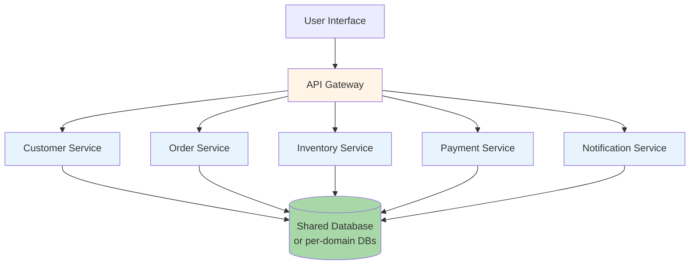

# 6.2 Service-based Architecture

> **Tóm tắt một dòng**: Tách hệ thành 4-12 coarse-grained services chia sẻ database (hoặc shared per-domain). Nhận được lợi ích team independence + scalability per-service nhưng không gặp full cost của microservices. Là "default distributed" cho most enterprise.

## Topology



Đặc điểm:

- **4-12 coarse services**: mỗi service own một domain (Customer, Order, ...) ở mức coarse-grained.
- **Database shared** (hoặc per-domain): không "database per service" như microservices.
- **Sync communication**: HTTP/gRPC giữa services. Có thể overlay async với event.
- **API Gateway** ở front: routing, auth, rate limiting.

## So với Monolith

- Service deploy độc lập (team velocity).
- Mỗi service scale riêng theo load.
- Fault isolation từng phần.
- Tech stack có thể khác (Java cho Customer, Go cho Payment).

## So với Microservices

| Aspect | Service-based | Microservices |
|---|---|---|
| Số service | 4-12 | 20-100+ |
| Granularity | Coarse (1 service = 1 bounded context, ~5-10 entity) | Fine (1 service = 1 entity hoặc 1 capability) |
| Database | Shared / per-domain | Per service strictly |
| Communication | Sync (HTTP/gRPC) | Sync + async heavily |
| Transactions | Có thể dùng DB transaction cross-service nếu shared | Bắt buộc saga / eventual |
| Operational cost | Medium | High |
| Time to first deploy | 1-3 tháng | 6-12 tháng |

Service-based là "microservices lite" — get majority of benefits, pay minority of cost.

## Khi dùng Service-based

✅ **Phù hợp**:

- Enterprise medium: 15-50 engineers.
- Domain có 4-12 bounded context rõ ràng.
- Cần team independence ở deploy nhưng chưa cần full isolation.
- Đã try monolith và pain với merge conflict / deploy bottleneck.
- Không có team SRE/DevOps mature để operate microservices.

❌ **Không phù hợp**:

- Team < 10 (overkill, dùng monolith).
- Team > 100 với complex domain (chưa đủ, dùng microservices).
- Cần extreme independence (vd: regulated industry với separate compliance scope per service).

## Implementation patterns

### Pattern 1: Shared database, separate schema

Tất cả service connect cùng DB instance, mỗi service own schema riêng.

```sql
-- Customer service owns
CREATE SCHEMA customer_svc;
CREATE TABLE customer_svc.customers (...);
CREATE TABLE customer_svc.addresses (...);

-- Order service owns
CREATE SCHEMA order_svc;
CREATE TABLE order_svc.orders (...);
```

Pros: low ops cost (1 DB), can JOIN cross-schema if needed.

Cons: DB là single point of failure, schema migration coordination.

### Pattern 2: Database per domain (group of related services)

Group services theo domain, mỗi group có DB riêng.

```
Customer domain:
  - Customer service
  - Address service
  → Database CustomerDB

Order domain:
  - Order service
  - Inventory service
  - Pricing service
  → Database OrderDB

Payment domain:
  - Payment service
  - Refund service
  → Database PaymentDB
```

Pros: isolation hơn pattern 1, fault tolerance tốt hơn.

Cons: cross-domain query phức tạp (cần API call hoặc data replication).

### Pattern 3: Database per service (gần microservices)

Mỗi service có DB riêng. Khác microservices: vẫn allow sync HTTP call cross-service, không *strict* event-driven.

Pros: full data isolation.

Cons: distributed transaction complexity = microservices.

## Inter-service communication

### Sync HTTP/REST

Common nhất. Service A gọi service B qua HTTP.

```python
# In Order Service
response = requests.get(
    f"{CUSTOMER_SERVICE_URL}/customers/{customer_id}",
    headers={"X-Trace-Id": trace_id},
    timeout=2.0
)
customer = response.json()
```

Cần:

- **Timeout**: tránh hang khi service B chậm.
- **Retry với backoff**: handle transient failure.
- **Circuit breaker**: khi B down, ngừng gọi trong N giây (Hystrix, Resilience4j).
- **Fallback**: nếu B down, có default behavior?

### gRPC

Tốt cho high-throughput internal communication. Protobuf strict contract.

```protobuf
service CustomerService {
  rpc GetCustomer(GetCustomerRequest) returns (Customer);
}
```

Pros: 2-5x faster than REST/JSON, strict typing.

Cons: harder to debug (binary protocol), không native browser-friendly.

### Message queue (async)

Service A enqueue message, service B consume later. Decoupling tốt.

Vd: Order Service push "order.placed" event, Notification Service consume.

Sẽ đi sâu ở Bài 6.4 (Event-Driven).

## Trade-off với QA

| QA | Service-based | Monolith ref | Microservices ref |
|---|---|---|---|
| Simplicity | ★★★ | ★★★★★ | ★ |
| Operational cost | ★★★ | ★★★★★ | ★ |
| Scalability | ★★★★ | ★ | ★★★★★ |
| Team independence | ★★★★ | ★ | ★★★★★ |
| Fault isolation | ★★★ | ★ | ★★★★★ |
| Performance (latency) | ★★★ | ★★★★★ | ★★ |
| Data consistency | ★★★★ (shared DB) | ★★★★★ | ★★ (eventual) |
| Time to first deploy | ★★★ | ★★★★★ | ★ |
| Testability | ★★★ | ★★★★ | ★★ |

Insight: service-based "ổn" trên mọi chiều, không "xuất sắc" ở chiều nào nhưng cũng không "tệ" ở chiều nào. Pragmatic default.

## Migration path

Từ monolith lên service-based:

### Bước 1: Modularize monolith (Cụm 3.4)

Tổ chức monolith thành strict modules. Build tool enforce import boundary.

### Bước 2: Extract first service

Chọn module có pain rõ nhất (vd: scale separately needed) → tách thành service. Dùng Strangler Fig (Cụm 5.2).

### Bước 3: Setup infrastructure

API gateway, service discovery, monitoring, distributed tracing. Setup *trước* khi tách service thứ 2.

### Bước 4: Tách tiếp theo theo bounded context

Mỗi quarter tách 1-2 service. Trong 12-18 tháng có service-based architecture với 5-10 services.

### Bước 5: Stay đây, hoặc tiến lên microservices

Khi nào team > 50 + có pain rõ với coarse services → consider microservices. Đa số dừng ở service-based.

## Sai lầm thường gặp

### Sai lầm 1: Tách service quá nhỏ

5 service cho domain Order: OrderCreator, OrderUpdater, OrderDeleter, OrderReader, OrderValidator. Quá granular cho service-based.

Fix: 1 OrderService duy nhất ở mức coarse. CRUD nội bộ một service.

### Sai lầm 2: Tách service theo layer (horizontal slicing)

UserUIService, UserBusinessService, UserDataService. Distributed monolith.

Fix: tách theo domain (vertical slicing). User là 1 service end-to-end.

### Sai lầm 3: Shared DB không có schema discipline

Mọi service đọc/ghi mọi table. Schema migration phá service khác.

Fix: schema-per-service. Strict ownership. Schema thay đổi via service interface, không direct SQL.

### Sai lầm 4: Không có observability từ ngày 1

Tách service mà không có distributed tracing, centralized logging. Debug = mò mẫm.

Fix: Jaeger + ELK stack từ tuần 1. Trace ID propagate qua mọi service call.

### Sai lầm 5: Quên circuit breaker

Service A gọi B. B down → A hang → A's clients timeout → cascade failure.

Fix: circuit breaker mọi inter-service call. Library: Hystrix, Resilience4j, Polly.

## Real-world examples

- **Shopify** (early stage 2010-2015): service-based với ~10 services trước khi migrate tiếp.
- **GitHub** (long time): service-based với Ruby + Go.
- **Stripe**: nhiều service-based regions, gradual migration to microservices for some domains.
- **Hầu hết enterprise truyền thống** (banking, insurance): service-based với mainframe + Java services overlay.

## Tóm tắt

- **Service-based**: 4-12 coarse services, shared/per-domain DB.
- **Middle ground**: lợi ích team independence + scalability nhưng không cost full microservices.
- **Pragmatic default** cho most enterprise.
- **Migration path**: monolith → modular monolith → extract services gradually.
- **Tránh**: over-fragment, horizontal slicing, schema chaos, no observability, no circuit breaker.

Bài tiếp: [Microservices](03-microservices.md) — next step khi service-based không đủ.
