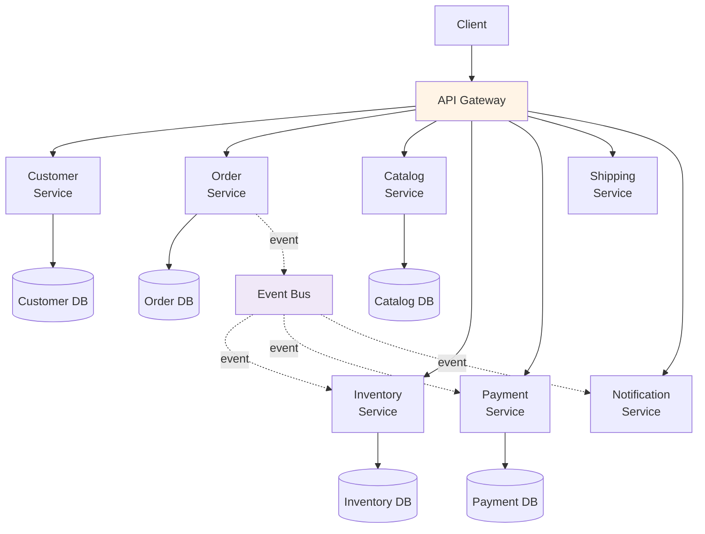
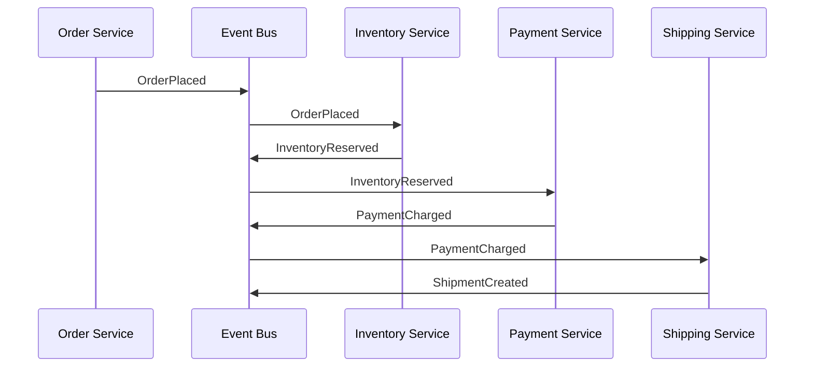

# 6.3 Microservices

> **Tóm tắt một dòng**: Tách hệ thành nhiều service nhỏ, mỗi service own một bounded context và database riêng, communication chủ yếu qua API + event. Lợi ích cực mạnh cho team scale + independent deploy, nhưng cost ops khổng lồ. Chỉ phù hợp khi team ≥ 50 và đã có DevOps mature.

## Topology



Đặc trưng:

- **Fine-grained**: 1 service = 1 bounded context (hoặc 1 capability).
- **Database per service**: strict isolation. Service A không touch DB của B.
- **API + event**: sync HTTP/gRPC cho query; async event cho integration.
- **Independent deploy**: mỗi service own pipeline.
- **Polyglot**: ngôn ngữ/tech stack có thể khác giữa services.

## SRP scale lên service level

Cụm 2.3 nói SRP: "mỗi module một actor". Microservices áp dụng SRP ở service level:

- Mỗi service own một bounded context (ngôn ngữ chung, một team).
- Service thay đổi vì *một lý do* (business rule trong bounded context đó thay đổi).
- Service deploy độc lập = SRP đảm bảo.

Đây là benefit lớn nhất của microservices.

## Khi thực sự cần

Đừng làm microservices "vì cool". Cần:

### Điều kiện 1: Team scale lớn

≥ 50 engineers, ≥ 5 sub-teams. Mỗi team own 2-5 service. Service-based không đủ team independence.

### Điều kiện 2: Complex domain với nhiều bounded context

10+ bounded context rõ ràng (DDD). Service-based 4-12 service không cover đủ.

### Điều kiện 3: Independent scaling per capability

Vd: search heavy (10x load), comment light. Microservices cho phép scale chỉ search.

### Điều kiện 4: DevOps mature

Đã có:

- Container orchestration (Kubernetes hoặc managed equivalent).
- CI/CD per service.
- Service mesh (Istio/Linkerd hoặc lite alternative).
- Centralized logging (ELK/Loki).
- Distributed tracing (Jaeger/Zipkin).
- Monitoring + alerting (Prometheus + Grafana).
- On-call rotation + incident management.

Nếu thiếu ≥ 3 trong list trên, đừng microservices yet.

### Điều kiện 5: Business case justify cost

Microservices tăng infrastructure cost 3-10x, dev cost 1.5-2x (initial). Phải justify bằng business value (faster time-to-market, larger scale).

## Cost operations

Cost ẩn của microservices, mỗi cái phải có ngân sách:

### 1. Infrastructure

- Mỗi service: 2-3 instances cho HA = 100+ instances cho 50 services.
- Service mesh: thêm sidecar (1 sidecar per pod).
- Load balancer per service.
- Database per service (50+ databases).
- Message broker (Kafka cluster) cho async.

Cost: $5,000-$50,000+/month tùy scale, vs $500/month cho monolith equivalent.

### 2. Development overhead

- Mỗi service: own repository, CI/CD, README, on-call runbook.
- Cross-service feature: coordinate 3-5 service changes, contract testing.
- Distributed transaction: saga pattern, compensation logic.

Cost: 1.5-2x dev time cho feature cross-service.

### 3. Operational complexity

- Distributed tracing setup.
- Centralized logging.
- Secret management (Vault).
- Service discovery.
- Authentication propagation (JWT/mTLS).

Cost: 1-2 SRE engineers dedicated minimum.

### 4. Testing complexity

- Unit test: dễ (per service).
- Integration test: medium (per service với mock).
- Contract test: medium-hard (Pact, Spring Cloud Contract).
- End-to-end test: hard (need spin up many services), flaky.

Cost: 2-3x test infrastructure vs monolith.

### 5. Debugging

- Bug cross-service: trace qua N services.
- Performance issue: profile mỗi service.
- Data inconsistency: investigate eventual consistency timing.

Cost: 2-5x debugging time per incident.

## Bounded Context = Service boundary

Câu hỏi nóng: làm sao tách service đúng?

Trả lời: **map service lên bounded context** (DDD).

### Heuristic identify bounded context

1. **Ubiquitous language**: trong context X, từ "Customer" có nghĩa cụ thể. Cross context, nghĩa khác → boundary.

2. **Team ownership**: 1 team thuộc 1 context. Conway's law: team boundary = context boundary.

3. **Change frequency**: code thay đổi cùng nhau ở cùng context. Code rarely cùng change → cross context.

4. **Data ownership**: mỗi entity primary owner ở 1 context. Đọc/ghi từ context khác qua API.

### Ví dụ e-commerce

- **Catalog**: Products, Categories. Owned by Product team.
- **Order**: Orders, OrderItems. Owned by Order team.
- **Customer**: Profiles, Addresses. Owned by Customer team.
- **Inventory**: Stock, Reservations. Owned by Inventory team.
- **Payment**: Transactions, Refunds. Owned by Payment team.
- **Shipping**: Shipments, Tracking. Owned by Logistics team.

6 bounded contexts → 6+ services (mỗi context có thể có sub-service).

## Distributed Transaction: Saga Pattern

Microservices không thể dùng 2PC (two-phase commit). Pattern thay: **Saga**.

### Choreography saga

Mỗi service emit event sau action. Service khác react.



Pros: loose coupling, no central orchestrator.

Cons: hard to visualize flow, debugging khó.

### Orchestration saga

Central orchestrator điều phối flow.

```python
class PlaceOrderSaga:
    def execute(self, order):
        try:
            reservation = inventory_svc.reserve(order)
            payment = payment_svc.charge(order)
            shipment = shipping_svc.create(order)
        except Exception:
            # Compensation
            if shipment: shipping_svc.cancel(shipment)
            if payment: payment_svc.refund(payment)
            if reservation: inventory_svc.release(reservation)
            raise
```

Pros: flow rõ ràng, easier debug.

Cons: orchestrator là single point of complexity.

Choose tuỳ team prefer. Choreography phổ biến hơn trong microservices community.

## Eventual Consistency

Microservices = eventual consistency (most case). Implications:

- "Inventory shows 5, but you ordered, then someone else ordered too" — both succeed, after 100ms one is reverted.
- User experience phải handle stale data ("processing...", optimistic UI).
- Business team phải hiểu data có thể stale 100ms-30s.

Strong consistency khả thi cho 1 bounded context (within service DB) nhưng cross-service thường eventual.

## Trade-off với QA

| QA | Microservices |
|---|---|
| Scalability per service | ★★★★★ |
| Team independence | ★★★★★ |
| Deployability | ★★★★★ |
| Fault isolation | ★★★★★ |
| Polyglot tech stack | ★★★★★ |
| Operational complexity | ★ |
| Simplicity | ★ |
| Distributed transaction | ★★ (saga complexity) |
| Latency | ★★ (network overhead) |
| Testing | ★★ |
| Initial cost | ★ |
| Long-term agility (large team) | ★★★★★ |

Tối ưu cho large team + scale. Sacrificing simplicity + cost.

## Migration path

Từ monolith hoặc service-based lên microservices:

1. **Modular monolith** trước (Cụm 5.2).
2. **Extract first 1-2 services** (Strangler Fig).
3. **Setup full DevOps stack** trước khi extract thứ 3.
4. **Tách dần theo bounded context**.
5. **Monitor cost vs benefit** ở mỗi milestone. Reverse course nếu cost > benefit.

Tránh big-bang rewrite. Risk cao, fail rate ~70%.

## Sai lầm thường gặp

### Sai lầm 1: Premature microservices

Startup 10 người làm 30 services. Operational hell. Pivot lại to modular monolith trong 6 tháng.

### Sai lầm 2: Distributed monolith

Đã nói (Cụm 3.4). Microservices tách sai = distributed monolith.

### Sai lầm 3: Shared database

"Tạm thời" share. Sau 1 năm, schema migration coordinate 10 service. Hết lợi ích isolation.

### Sai lầm 4: Sync everything

Mọi inter-service call sync HTTP. Latency cascade. Bug cross-service blocking.

Fix: dùng async event cho integration. Sync chỉ cho user-facing query.

### Sai lầm 5: Ignore observability

Tách 30 service mà không có distributed tracing. Mỗi bug = 4 giờ debugging.

Fix: distributed tracing từ ngày 1. Correlation ID propagate qua mọi call.

### Sai lầm 6: One developer per service

"Mỗi developer own 5 service" → bus factor = 1. Khi dev nghỉ, service không ai maintain.

Fix: 2-pizza team (5-8 người) own 2-5 service. Knowledge shared.

## Tóm tắt

- **Microservices**: 20+ fine-grained services, DB per service, async event-driven heavily.
- **SRP scale lên service**.
- **Cần điều kiện**: large team, complex domain, DevOps mature, business justify.
- **Cost ops khổng lồ**: infrastructure, dev, ops, testing, debugging.
- **Saga pattern** cho distributed transaction.
- **Eventual consistency** là norm.
- **Trade-off**: extreme team independence + scalability, sacrificing simplicity + cost.

Bài tiếp: [Event-Driven Architecture](04-event-driven.md) — async pattern overlay.
