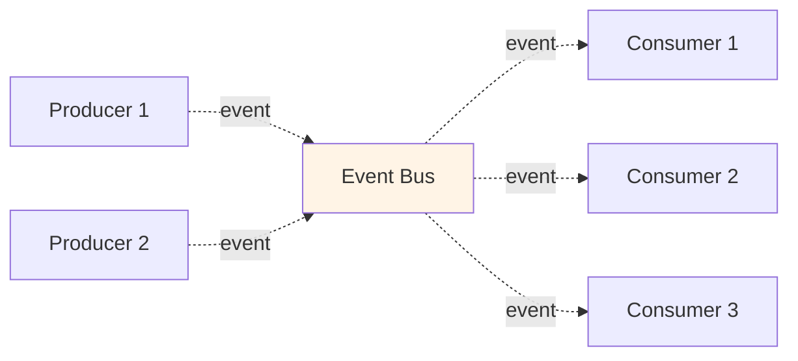
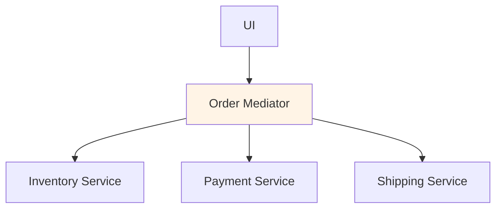
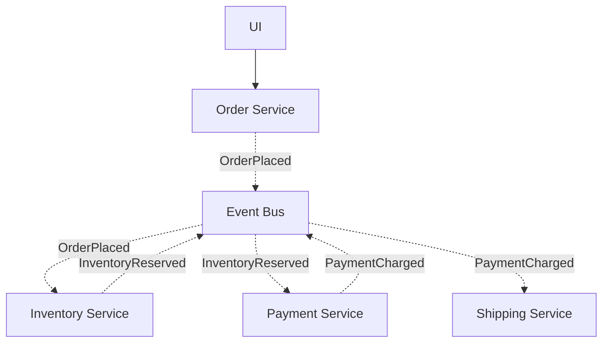
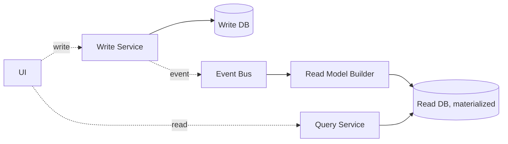

# 6.4 Event-Driven Architecture

> **Tóm tắt một dòng**: Hệ giao tiếp qua event async thay vì call sync. Producer không biết ai consume. Decoupling cực mạnh, throughput cao, scalable. Cost - eventual consistency, debugging hard, message ordering.

## Khái niệm

**Event** = "something happened in the past". Vd: `OrderPlaced`, `PaymentReceived`, `UserSignedUp`.

**Event-Driven Architecture (EDA)** = hệ trong đó hầu hết communication qua event async, không phải request/response sync.



Producer không biết ai consume. Consumer subscribe topic/queue. Decoupling at runtime (knowing who exists).

## Nếu bạn đến từ Data Science

Event-Driven Architecture rất gần với streaming data/ML. Một event không phải là một request hỏi đáp ngay lập tức, mà là một sự kiện đã xảy ra: `TransactionCreated`, `UserClickedProduct`, `FeatureUpdated`, `ModelRegistered`, `PredictionMade`.

Trong fraud detection, transaction event có thể đi qua nhiều consumer song song:

- Feature aggregator cập nhật online features.
- Fraud model scorer tính risk score.
- Audit logger lưu event để điều tra sau này.
- Monitoring service đo drift và error rate.
- Notification service gửi alert nếu score vượt threshold.

Producer của transaction không cần biết tất cả consumer này. Nó chỉ publish event. Đây là lợi ích lớn nhất của EDA: thêm consumer mới không bắt producer sửa code. Nhưng cái giá là debugging khó hơn, consistency thường là eventual, và bạn phải nghĩ nghiêm túc về duplicate, ordering, schema evolution.

## Sync vs Async

| Aspect | Sync (request/response) | Async (event-driven) |
|---|---|---|
| Coupling | Producer biết consumer | Producer không biết |
| Timing | Wait for response | Fire and forget |
| Failure mode | Caller handle immediately | Retry/dead-letter queue |
| Latency | Sum of all calls | Producer latency only |
| Throughput | Limited (sync wait) | Cao (parallel async) |
| Use case | Read query, immediate need | Trigger action, integration |

EDA tốt cho integration; sync vẫn tốt cho user-facing query.

## Hai topology

### Mediator (Orchestration)

Central mediator điều phối flow:



Mediator có logic: "step 1, step 2, step 3, rollback if X".

Pros:

- Flow visible (đọc mediator code biết flow).
- Easy add new step.
- Compensation logic centralized.

Cons:

- Mediator coupling cao.
- Mediator có thể become god service.

Tools: AWS Step Functions, Camunda, Temporal.

### Broker (Choreography)

Không có central điều phối. Service emit event và react event.



Mỗi service: "khi event X xảy ra, làm Y, emit event Z".

Pros:

- Decoupling cực mạnh (no mediator).
- Easy add consumer (subscribe event).
- Scalable.

Cons:

- Flow scattered across services. Hard to visualize.
- Compensation phức tạp (saga choreography).
- Debug khó (tracing qua nhiều service).

Tools: Kafka, RabbitMQ, AWS EventBridge, Google Pub/Sub.

## Event Bus (Message Broker)

Trung tâm của EDA. Lưu và route messages. Phải:

- **Durable**: không mất message khi broker crash.
- **Ordered** (per partition/queue): events delivered in order.
- **Scalable**: handle millions/giây.
- **Replay-able**: consumer có thể re-process từ point cũ.

Brokers phổ biến:

| Broker | Strength | Khi dùng |
|---|---|---|
| **Apache Kafka** | High throughput, replay, partitioning | Stream processing, event sourcing, log aggregation |
| **RabbitMQ** | Routing flexibility, simpler ops | Task queue, RPC, low-medium scale |
| **AWS SQS/SNS** | Managed, simple | AWS-native, low-medium scale |
| **AWS EventBridge** | Schema registry, AWS integration | Cloud-native event bus |
| **Google Pub/Sub** | Managed, global | GCP-native, high scale |
| **Redis Streams** | In-memory speed, simple | Lightweight, lower durability needs |

Kafka là gold standard cho high-scale EDA. Setup phức tạp nhưng capable nhất.

## CAP Theorem

Brewer's theorem (2000): trong distributed system có network partition, chỉ chọn 2 trong 3:

- **Consistency**: mọi node thấy data nhất quán.
- **Availability**: mọi request được serve (có thể stale).
- **Partition tolerance**: hệ vẫn chạy khi network split.

Vì network partition không tránh được trong distributed, *phải chọn* giữa C và A.

### CP systems

Sacrifice availability cho consistency. Khi partition, prefer return error còn hơn return stale data.

Vd: traditional RDBMS với replication strong consistency, ZooKeeper, etcd.

### AP systems

Sacrifice consistency cho availability. Khi partition, return possibly stale data còn hơn 503.

Vd: Cassandra, DynamoDB (eventual consistency mode), most NoSQL.

### EDA thường là AP

Event consumers process events khi available. Khi consumer down, events queue lên. Khi consumer back, catch up. Data eventually consistent.

Trade-off: user có thể thấy stale data short term. Business phải accept eventual consistency.

## Event design

### Event naming

Past tense: `OrderPlaced`, không `PlaceOrder`. Event = something happened.

Command (request to do something): `PlaceOrder`, này là command, không phải event.

### Event content

Hai approach:

**Thin events** (event notification): chỉ ID + key data.

```json
{
  "eventType": "OrderPlaced",
  "orderId": "ord_123",
  "timestamp": "2026-01-15T10:30:00Z"
}
```

Consumer cần thêm data → call API.

Pros: small message, less duplication.

Cons: consumer phải call lại (network round-trip).

**Fat events** (event-carried state): full data trong event.

```json
{
  "eventType": "OrderPlaced",
  "orderId": "ord_123",
  "customerId": "cus_456",
  "items": [{"productId": "p1", "quantity": 2, "price": 100}],
  "total": 200,
  "shippingAddress": {...},
  "timestamp": "2026-01-15T10:30:00Z"
}
```

Consumer không cần call lại.

Pros: self-contained, no extra call.

Cons: large messages, data duplication, schema versioning critical.

Default: fat events cho integration. Thin events cho high-volume internal.

### Schema evolution

Events live forever in broker. Schema phải backward compatible.

Approaches:

- **Schema registry** (Confluent Schema Registry, Apicurio): validate schema before publish, enforce compatibility.
- **Versioning**: `OrderPlacedV1`, `OrderPlacedV2`. Consumer handle multiple versions hoặc upcast.
- **Avro / Protobuf**: schema-driven serialization với backward/forward compat.

Sai lầm: serialize JSON ad-hoc → schema drift → consumer break.

## Patterns trong EDA

### Event Sourcing

Lưu event log thay vì current state. Reconstruct state bằng replay events.

```
events: [
  AccountOpened(id=1, owner="Alice"),
  Deposited(id=1, amount=100),
  Deposited(id=1, amount=50),
  Withdrew(id=1, amount=30),
]
→ Current balance = 100 + 50 - 30 = 120
```

Pros: full audit trail, time-travel debugging, can replay với new logic.

Cons: complexity, query "current state" slow nếu replay mỗi lần.

Mitigate: snapshot periodic.

### CQRS (Command Query Responsibility Segregation)

Tách write side (command) khỏi read side (query). Write side emit events; read side materialize views.



Pros: read/write scale độc lập, optimize read model cho query.

Cons: complexity, eventual consistency between sides.

Use khi: read >> write, complex query, multiple view of data.

### Saga (đã nhắc Bài 6.3)

Long-running transaction với compensation. Choreography hoặc orchestration.

## Trade-off với QA

| QA | EDA |
|---|---|
| Decoupling | ★★★★★ |
| Scalability | ★★★★★ |
| Throughput | ★★★★★ |
| Resilience (consumer down) | ★★★★ (queue holds) |
| Real-time | ★★★★ |
| Audit trail | ★★★★ (event log) |
| Eventual consistency | ★★ |
| Debugging | ★★ |
| Operational complexity | ★ (broker ops) |
| Sync user query | ★ (not designed for) |

EDA tốt cho integration + async workflow + scale. Không thay sync for user-facing query.

## Use cases mạnh

- **Microservices integration**: thay sync HTTP between services bằng events.
- **Real-time data pipeline**: stock prices, IoT sensor readings, social feed.
- **Audit logs**: tự nhiên (events là log).
- **Notification system**: user signs up → trigger email + SMS + analytics.
- **Decoupled saga**: orchestrate long workflows.

## Anti-patterns

### Anti-pattern 1: Event = remote procedure call

Producer emit "GetUser" event, expect single consumer reply. Đó là RPC, không phải event. Dùng HTTP/gRPC.

Event là *notification* về thứ đã xảy ra, không phải request.

### Anti-pattern 2: Tightly-coupled events

Producer emit event riêng cho mỗi consumer. Mỗi consumer mới → emit event mới.

Sai. Event nên describe "what happened" (`OrderPlaced`), không "what should X do" (`SendEmailToCustomer`).

### Anti-pattern 3: No ordering guarantee

Events arrive out of order, consumer break. Vd: `OrderShipped` before `OrderPlaced`.

Fix: partition by key (vd: orderId). Within partition, ordering guaranteed.

### Anti-pattern 4: No replay capability

Bug in consumer logic. Cần re-process last 24h events. Broker không support → can't fix.

Fix: dùng Kafka hoặc broker với log-based storage.

### Anti-pattern 5: At-least-once delivery, idempotency missing

Broker delivers same event twice (network retry). Consumer side effect twice.

Fix: idempotent consumer. Track processed event IDs. Vd: insert row only if ID not exists.

## Tóm tắt

- **EDA**: async event communication, producer-consumer decoupled.
- **Two topologies**: Mediator (orchestration) vs Broker (choreography).
- **Brokers**: Kafka (gold standard), RabbitMQ, cloud-managed.
- **CAP theorem**: EDA thường AP.
- **Event design**: past tense, thin vs fat, schema registry.
- **Patterns**: Event Sourcing, CQRS, Saga.
- **Mạnh cho**: integration, real-time, scale, audit.
- **Tránh**: dùng cho sync query, tightly-coupled events, no ordering, no idempotency.

Bài tiếp: [Space-Based Architecture](05-space-based.md), extreme load architecture.
