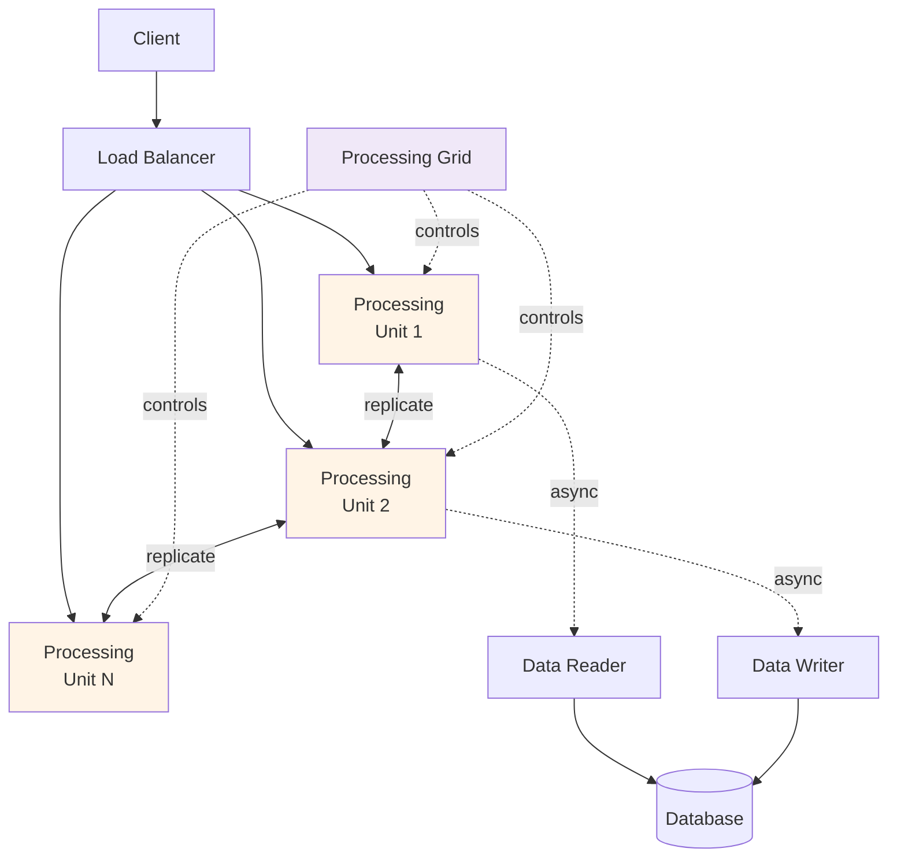
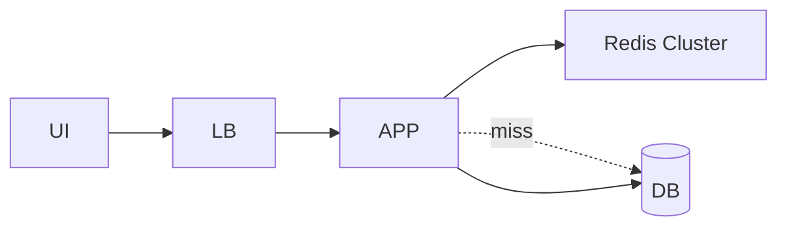

# 6.5 Space-Based Architecture

> **Tóm tắt một dòng**: Style đặc thù cho extreme load - mọi data nằm in-memory được replicate qua nodes, DB chỉ sync background. Loại bỏ DB bottleneck nhưng cost cao và niche. Phù hợp Black Friday, ticket sales, real-time auction.

## Nếu bạn đến từ Data Science

Space-Based Architecture là niche, nhưng bạn có thể hiểu nó qua online feature serving ở scale rất lớn. Nếu mỗi prediction phải lookup nhiều feature trong vài mili-giây, team có thể đặt feature hot trong memory grid/cache thay vì query database trực tiếp. Application đọc từ memory space, còn database sync phía sau.

Đổi lại, consistency khó hơn. Feature trong memory có thể trễ so với source of truth. Vì vậy style này chỉ hợp khi latency/throughput cực kỳ quan trọng và business chấp nhận eventual consistency.

## Vấn đề mà Space-Based giải

Hầu hết web app gặp bottleneck ở database khi load tăng. Even với connection pool, read replica, sharding, DB vẫn là điểm yếu khi load thực sự cao.

Vd: ticket master vài giây trước khi mở bán concert nổi tiếng. 1 triệu user đồng thời. DB connection pool exhausted. App crash.

Space-Based architecture (SBA) giải bằng cách: **loại bỏ DB khỏi hot path**. Mọi data nằm in-memory data grid được replicate qua nhiều processing unit. DB chỉ sync background.

## Topology

5 thành phần:

- **Processing Unit (PU)**: instance app với in-memory data grid (Hazelcast, Apache Ignite, GigaSpaces). Chứa subset data + business logic.
- **Virtualized Middleware**: cluster manager. Manages PUs, replicates data, routes requests.
- **Data Reader**: async load data từ DB vào grid khi PU start.
- **Data Writer**: async write changes từ grid → DB.
- **Data pump**: async stream của events từ grid → DB.

## Tên gọi "space-based"

"Space" = "tuple space", distributed shared memory concept từ 1980s (Linda language). PUs share một "space" of data qua replication. Mọi PU thấy cùng data như nếu chúng truy cập shared memory.

## Cách hoạt động

### Đọc

User request → LB route đến PU → PU đọc data từ grid in-memory (nanoseconds). Không touch DB.

### Ghi

User request → LB route → PU update grid in-memory → grid replicate update đến PUs khác (milliseconds) → background, Data Writer flush update đến DB (seconds-minutes).

### Scale

Thêm PU → joins grid → automatically gets data subset từ existing PUs. Linear scaling.

### Failover

PU crash → grid detect → data trên crashed PU đã replicate ở PUs khác → no data loss. New PU spin up → join → re-balance.

## Khi dùng

✅ **Phù hợp**:

- **Extreme load spike**: Black Friday, ticket sales, flash sale.
- **Real-time auction/trading**: stock market, betting, ad bidding.
- **Online gaming**: massively multiplayer real-time.
- **Streaming analytics**: real-time aggregation.

Common: load không predictable, scaling cần instant, latency phải sub-100ms.

❌ **Không phù hợp**:

- App load steady (use service-based hoặc microservices).
- App với complex query joins (in-memory grid không tốt cho ad-hoc query).
- App với strict consistency requirements (in-memory grid là eventual).
- Team không có experience với Hazelcast/Ignite/GigaSpaces.

## Trade-off

| QA | Space-Based |
|---|---|
| Throughput (extreme load) | ★★★★★ |
| Latency (read) | ★★★★★ (nanoseconds) |
| Scalability (elastic) | ★★★★★ |
| Availability | ★★★★ |
| Consistency | ★★ (eventual) |
| Operational complexity | ★ |
| Cost | ★ (expensive infrastructure) |
| Suitable workloads | Narrow |
| Learning curve | ★ |

Niche style. 90%+ projects không cần.

## Vendors

- **Hazelcast IMDG** (open source + enterprise).
- **Apache Ignite** (open source).
- **GigaSpaces** (commercial, pioneered SBA term).
- **Oracle Coherence** (enterprise).
- **Redis Enterprise** (gần SBA, in-memory grid).

Setup phức tạp. Cần team với deep distributed systems experience.

## Variant: Distributed Cache + DB

Variant đơn giản hơn full SBA: dùng Redis cluster làm cache layer trước DB. Read từ cache, fallback DB. Write cache + DB.

Lợi ích phần lớn của SBA (read latency) mà ít complexity hơn.

Đa số "we need SBA" thực sự "we need distributed cache + sharding". Cân nhắc trước khi đi full SBA.

## Sai lầm thường gặp

### Sai lầm 1: Choose SBA cho load bình thường

App 10k req/s → service-based đủ. SBA overkill. Cost 10x mà không có lợi ích.

### Sai lầm 2: Quên data persistence

Toàn bộ data in-memory. Power loss → mất hết nếu không sync to DB.

Fix: data pump sync regularly. Snapshot periodic. Persistent grid (Ignite) với disk backing.

### Sai lầm 3: Strong consistency expectation

Business team expect "100% accurate balance always". SBA = eventual consistency. Mismatch.

Fix: educate stakeholder; consider non-SBA alternative if requirement strict.

### Sai lầm 4: Complex query

In-memory grid tốt cho key-value lookup. Complex JOIN, aggregation: slow.

Fix: pre-compute aggregations. Push complex queries to read replica DB asynchronously.

## Tóm tắt

- **Space-Based**: in-memory grid + async DB sync.
- **Loại bỏ DB khỏi hot path** → unlimited scalability.
- **Use case niche**: extreme load spikes, real-time auction/gaming.
- **Cost cao**: infrastructure, expertise, complexity.
- **Alternative simpler**: distributed cache (Redis) + sharded DB.

## Tổng kết Phần 6

4 distributed styles:

| Style | Best for | Complexity |
|---|---|---|
| Service-based | Enterprise medium, default distributed | Medium |
| Microservices | Large team + complex domain | High |
| Event-Driven | Async integration, real-time | Medium-High |
| Space-Based | Extreme load, niche | Very High |

**Default**: Service-based. Overlay Event-Driven cho async parts. Microservices khi thực sự cần. Space-based khi extreme.

Phần tiếp: [Phần 7 - Documenting Architecture](../07-documenting/01-overview.md), kiến trúc không document là kiến trúc chết.
