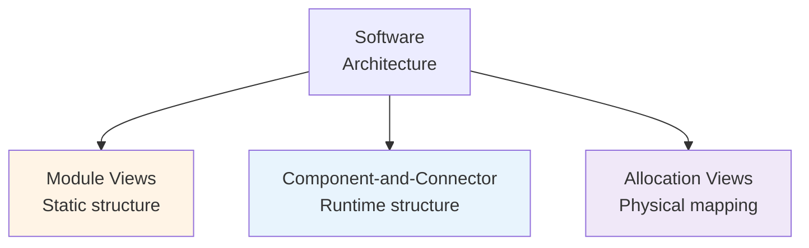

# 7.1 Tổng quan Cụm 7: Documenting Software Architecture

> **Tóm tắt một dòng**: Kiến trúc không được tài liệu hoá là kiến trúc chết - tồn tại trong đầu 1-2 người, evolve không kiểm soát, mất khi người đó rời team. Cụm này dạy framework chuẩn để document - 3 views (Module/C&C/Allocation), ADR, và diagram standards.

## Vì sao quan trọng

3 lý do hard-hitting:

### 1. Bus factor

"Bus factor" = số người trong team rời đi (hypothetically bị bus đụng) để hệ thống không ai biết. Bus factor = 1 nghĩa hệ thống chỉ 1 người hiểu. Đó là disaster waiting to happen.

Document tốt → bus factor ≥ 3. Team thay đổi, kiến trúc không bị lost.

### 2. Onboarding

New engineer join team. Không document → spend 2-3 tháng "figure out" hệ thống qua đọc code. Có document tốt → onboard 2 tuần.

Cost difference: ~3 tháng * salary mỗi engineer.

### 3. Architecture evolution

Quyết định cũ làm vì context cũ. Context thay đổi (vd: business model pivot) → cần revisit decision. Không document *vì sao* → không biết quyết định nào còn valid.

ADR (Architecture Decision Record) chính là giải pháp.

## Cụm 7 sẽ dạy

Bốn bài:

### 7.2: Module Views

View về *static structure* của code. Module/package/class hierarchy. Subtypes: decomposition, dependency, generalization, uses. C4 model (Context-Container-Component-Code).

### 7.3: Component-and-Connector Views

View về *runtime* structure. Component instances, connectors, data flow. Subtypes: process, concurrency, communication, deployment-time.

### 7.4: Allocation Views

View về *physical deployment*. Mapping software → hardware/network/people. Subtypes: deployment, implementation, work assignment.

Plus: ADR (Architecture Decision Records) lồng vào Bài 7.2.

## Framework chính: 3 views (Bass-Clements-Kazman)

SEI Carnegie Mellon trong *Software Architecture in Practice* định nghĩa 3 view fundamental:



Mỗi view answer câu hỏi khác:

- **Module**: Code organized ra sao? Module nào depend module nào?
- **C&C**: Runtime hệ chạy ra sao? Component nào communicate với component nào, khi nào?
- **Allocation**: Software chạy ở đâu? Mapping vào server/cloud/team?

Documenting đầy đủ ≥ 1 view mỗi loại. Big system có thể có nhiều view mỗi loại.

## Diagram standards

Đừng vẽ diagram ad-hoc. Dùng standard để team đọc được:

### C4 Model (Simon Brown)

4 mức zoom:

1. **System Context**: hệ trong landscape (user, external system).
2. **Container**: app, database, broker. Mỗi container = deployable unit.
3. **Component**: bên trong container, các component logic.
4. **Code**: class, function (rarely drawn, code is source of truth).

C4 đơn giản, phổ biến, free tool (c4-plantuml, structurizr).

### 4+1 View (Philippe Kruchten, 1995)

5 view:

- **Logical**: object-oriented design (UML class diagram).
- **Process**: runtime processes (UML sequence/activity).
- **Development**: code organization (UML package/component).
- **Physical**: deployment (UML deployment diagram).
- **Scenarios**: use cases tying everything together.

4+1 chi tiết hơn C4, more formal. Phù hợp enterprise documentation.

### UML

Universal Modeling Language. Set of diagram types. Vẫn dùng nhưng heavy. Modern team thường dùng C4 instead.

### Mermaid / PlantUML

Tools render diagram from text. Maintainable in git, version-controlled.

```
graph TD
    A[Web App] --> B[API Gateway]
    B --> C[Order Service]
```

Phù hợp markdown documentation.

## ADR, Architecture Decision Record

Đã giới thiệu Bài 3.3. Format:

```markdown
# ADR-N: Title

## Status
Proposed | Accepted | Deprecated | Superseded

## Context
What's the situation? Why do we need to decide?

## Decision
What did we decide?

## Consequences
Positive + negative consequences.

## Alternatives Considered
What else we considered, why rejected.
```

ADR file numbered, append-only (don't edit accepted ADRs; superseded by new ADR).

Vì sao ADR works:

- **Lightweight**: < 1 trang. Engineer chịu viết.
- **In git**: version-controlled với code. Diff over time.
- **Searchable**: future engineer find why decision was made.

Tools: adr-tools (CLI), Markdown ADR convention.

## Practices documentation

### Living documentation

Doc evolve cùng code. CI verify (vd: link checker, snippet test).

### Audience-aware

Different doc cho different audience:

- **Architect / Lead**: full diagram + ADR.
- **Engineer**: code-level doc, API spec.
- **Onboarding**: tutorial, walk-through.
- **Stakeholder / PM**: high-level diagram + narrative.

### Minimum viable doc

Đừng over-document. Default:

- 1 System Context diagram.
- 1 Container diagram (C4).
- Module/C&C view cho khu phức tạp.
- ADRs cho important decisions.
- README per repo: setup, build, contribute.

Không cần full UML mọi class.

## Cách đọc cụm

Tuần tự 7.2 → 7.3 → 7.4. Mỗi bài ~3000-4000 chữ.

Sau cụm, bạn nên:

- Vẽ được Module View + C&C View + Deployment View cho hệ mình đang làm.
- Viết được 5 ADR cho 5 quyết định gần nhất.
- Setup C4 diagram trong markdown của repo.

Bài tiếp: [Module Views](02-module-views.md).
