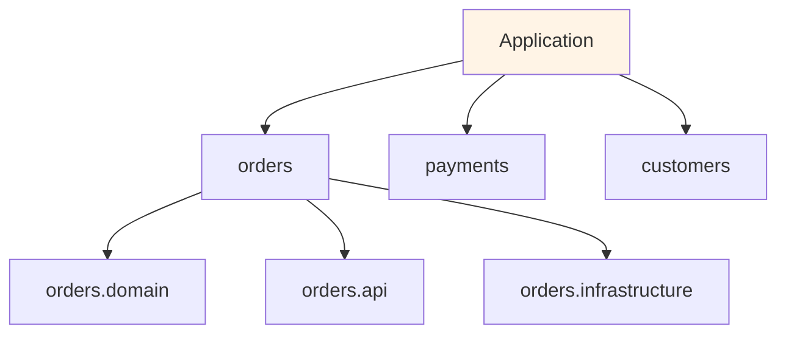
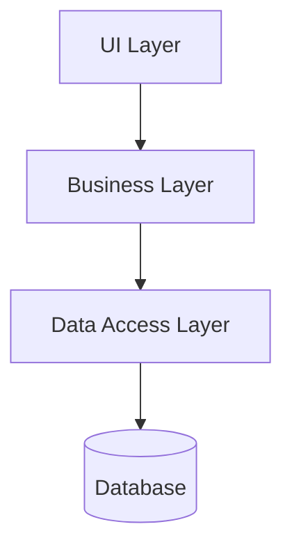
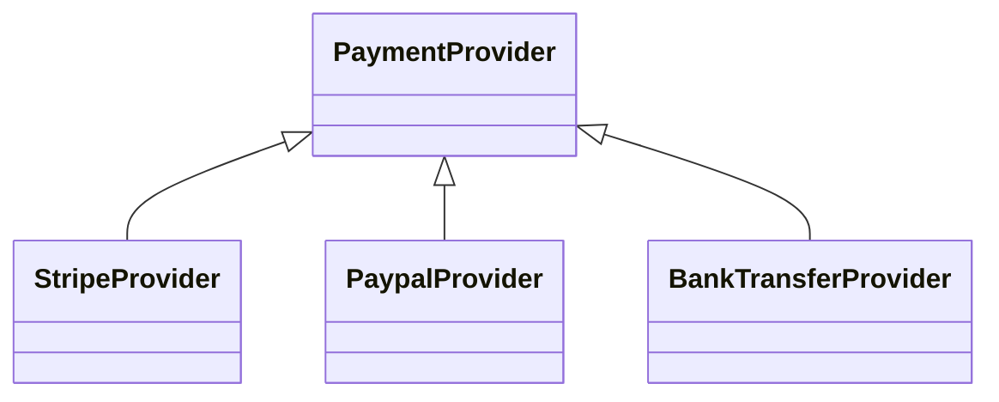
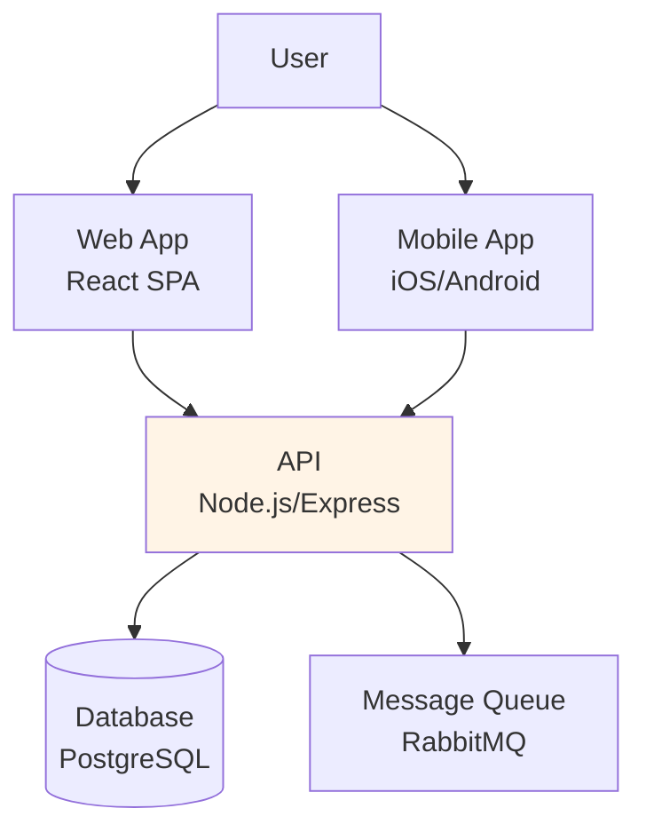
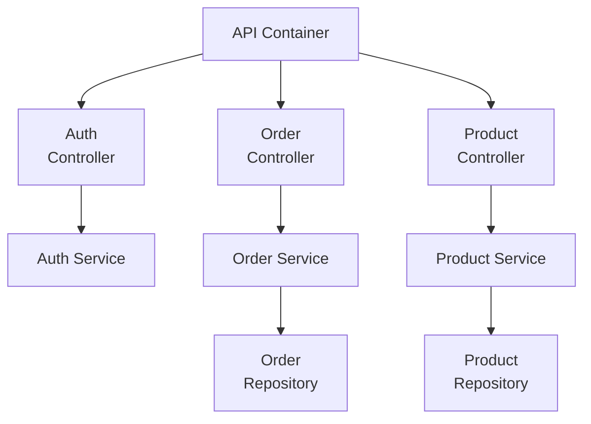

# 7.2 Module Views

> **Tóm tắt một dòng**: Module View show static structure của code - module nào tồn tại, depend module nào. Quan trọng cho developer hiểu codebase và cho architect verify modularity (Cụm 3.4).

## Module là gì trong context view này

Module = implementation unit. Có thể là:

- Package / namespace (Java package, Python module, C# namespace).
- Library / module (npm package, Maven module).
- Class (lớn).
- Subsystem.

Scale: bài này focus mức package/library, không quá fine-grained (không vẽ mọi class).

## 4 subtypes của Module View

### Subtype 1: Decomposition View

Hiển thị hierarchy "module này chứa các sub-module nào".



Purpose: navigation. Developer mới hiểu "code organize ở đâu".

### Subtype 2: Dependency View

Show "module nào depend module nào".



Purpose: verify modularity. Architect check: có cycle không? Direction có đúng không?

Tools: `madge` (JS), `pydeps` (Python), `jdeps` (Java) generate auto.

### Subtype 3: Generalization View

Show inheritance / interface hierarchy.



Purpose: design review. Verify OCP/LSP applied correctly.

### Subtype 4: Uses View

Show "module này uses module nào" (richer than dependency). Ai gọi ai ở mức operation.

Purpose: impact analysis. "Nếu sửa module X, module nào có thể bị ảnh hưởng?".

## C4 Model deep dive

C4 (Simon Brown) là chuẩn modern phổ biến nhất. 4 mức:

### Level 1: System Context

Show hệ ở giữa, surrounded by users + external systems.

```mermaid
graph TD
    U[User]
    S[Our E-commerce<br/>System]
    E1[Stripe<br/>Payment]
    E2[Inventory<br/>System (legacy)]
    E3[Email Service]
    
    U -->|browses, orders| S
    S -->|charge| E1
    S -->|check stock| E2
    S -->|send confirmation| E3
    
    style S fill:#fff4e6
```

Audience: stakeholder, PM. Mục đích: "bigger picture".

### Level 2: Container

Zoom vào System box → show containers. Container = deployable unit (web app, mobile app, database, message broker).



Audience: architect, dev lead. Mục đích: hiểu tech stack + deployment.

### Level 3: Component

Zoom vào 1 container → show components bên trong.



Audience: developer. Mục đích: hiểu code structure trong container.

### Level 4: Code (optional)

UML class diagram. Hiếm khi vẽ — code là source of truth.

### Tools cho C4

- **Structurizr DSL** (Simon Brown): text-based, render mọi level.
- **PlantUML + c4-plantuml**: include macro để vẽ C4.
- **Mermaid**: như example trên, dễ render trong markdown.
- **Draw.io**: GUI, nhưng không version-control friendly.

Recommendation: Structurizr DSL hoặc Mermaid + PlantUML.

## ADR — Architecture Decision Record

ADR doc dạng:

```markdown
# ADR-007: Use PostgreSQL for primary data store

## Status
Accepted (2026-01-15)

## Context

We need to select a primary database for the e-commerce platform. Expected scale:
- 50k users in year 1, target 500k by year 3.
- Complex queries (joins for product search, analytics).
- ACID required for orders and payments.
- Team experience: strong in SQL, basic in NoSQL.

## Decision

Use PostgreSQL 16 as primary data store. Use Redis for caching layer.

## Alternatives Considered

### MongoDB
- Pros: easier schema evolution, native JSON.
- Cons: weak ACID for cross-doc transactions, team less experienced.
- Rejected: ACID critical for payments; team expertise.

### MySQL
- Pros: similar SQL, mature.
- Cons: weaker JSON support, less feature-rich than Postgres.
- Rejected: Postgres has better JSONB, better extensions.

### DynamoDB
- Pros: managed, scalable.
- Cons: complex query model, vendor lock.
- Rejected: requires schema redesign around access patterns.

## Consequences

### Positive
- Strong ACID for orders/payments.
- Rich query support for analytics.
- Team productive immediately.

### Negative
- Scaling beyond ~1M users may require sharding (vs DynamoDB auto-scale).
- Operations overhead (backup, replication, tuning).

## Mitigation
- Use managed Postgres (AWS RDS or Aurora) to reduce ops burden.
- Plan for read replica at 100k users.
- Plan for sharding strategy at 500k users.
```

### ADR best practices

1. **Number sequentially**: ADR-001, ADR-002, ... never reuse numbers.
2. **Append-only**: Don't edit accepted ADRs. Supersede with new ADR.
3. **Short**: ≤ 1 page. Engineers won't read longer.
4. **Decision-focused**: 1 ADR = 1 decision, not analysis paper.
5. **Linked from code**: vd: PR mention ADR-007.
6. **Searchable**: keep in repo `docs/adr/`, in markdown.

### Tools

- **adr-tools** (CLI): `adr new "Use PostgreSQL"`.
- **GitHub markdown**: render natively.
- **MADR template** (markdown ADR): widely-used template.

## Practical: Documenting một service

Mức minimum cho 1 microservice:

1. **README.md**: setup, build, contribute.
2. **docs/architecture.md**: 1 page với:
   - System Context (where this service fits).
   - Container (deployment).
   - Key data models (top 5 entities).
   - Key flows (top 3-5 sequence).
3. **docs/adr/**: ADR file cho important decisions.
4. **API spec**: OpenAPI/protobuf in repo.
5. **runbook.md** (cho on-call): common ops procedures.

Tổng < 2 hours setup, value cho team rất cao.

## Anti-patterns

### Anti-pattern 1: Big upfront design

Write 200-page architecture document, then build. By time build done, doc outdated. No one reads.

Fix: living doc. Update with code changes. Use ADR for decisions.

### Anti-pattern 2: Diagram-only doc

Doc chỉ diagram, không có narrative. Audience không hiểu context.

Fix: combine diagram + paragraph. "Đây là hệ X, làm Y, ở high level chia thành Z. [diagram]. Chi tiết: ...".

### Anti-pattern 3: No audience awareness

Same doc cho mọi audience. Quá technical cho stakeholder, quá high-level cho dev.

Fix: layered doc. Stakeholder doc (C4 Context), Architect doc (C4 Container + ADR), Dev doc (C4 Component + code).

### Anti-pattern 4: Doc rot

Doc viết 1 lần rồi không update. Sau 1 năm, doc ≠ code. Worse than no doc.

Fix: doc trong git. Code review verify doc updated. CI link checker.

## Tóm tắt

- **Module Views**: static code structure. 4 subtypes.
- **C4 Model**: 4 mức zoom (Context-Container-Component-Code).
- **ADR**: 1-page decision record, append-only, in git.
- **Practical minimum**: README + architecture.md + ADR + API spec + runbook.
- **Tránh**: big upfront, diagram-only, no audience awareness, doc rot.

Bài tiếp: [C&C Views](03-component-connector-views.md) — runtime structure.
