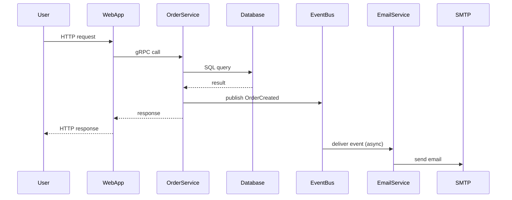
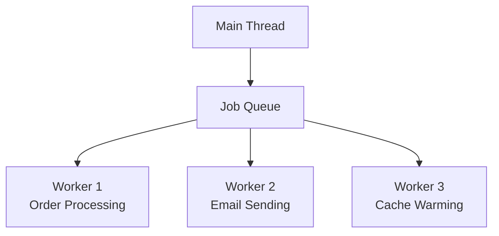
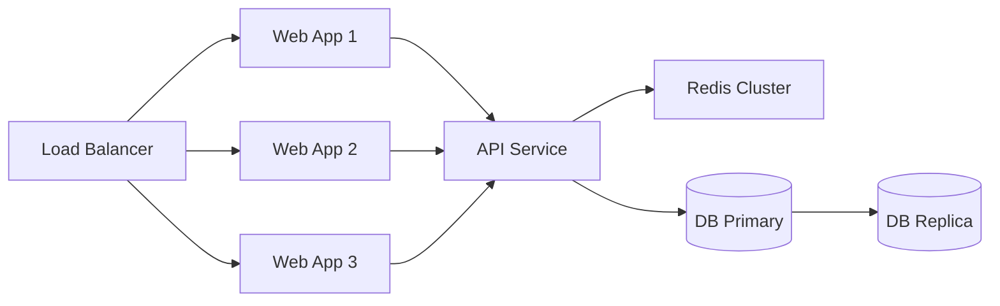
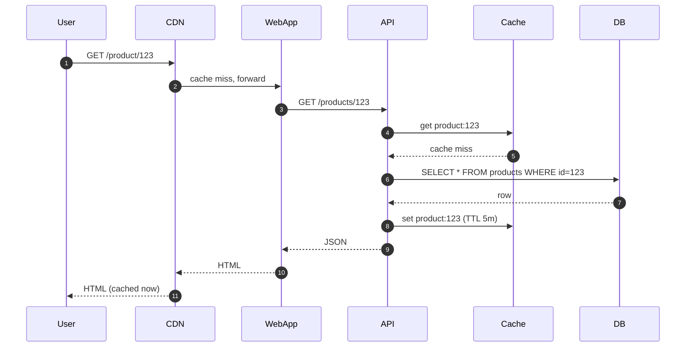
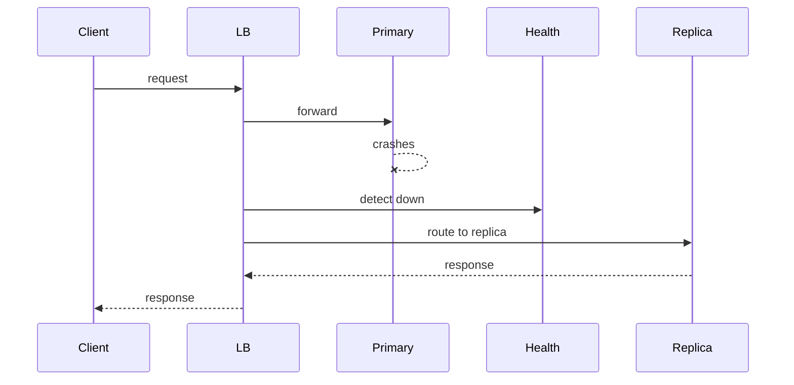
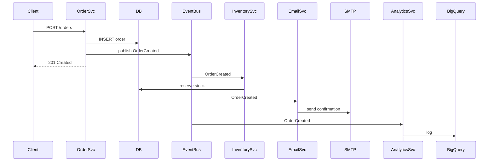

# 7.3 Component-and-Connector Views

> **Tóm tắt một dòng**: C&C View show *runtime* structure - khi hệ chạy, component instances nào tồn tại, communicate với connector nào, data flow ra sao. Khác Module View ở chỗ Module = static, C&C = dynamic.

## Nếu bạn đến từ Data Science

C&C View rất hữu ích để vẽ online inference. Một request đi từ client vào API, API gọi feature store, load model runtime, trả prediction, ghi prediction log, đẩy metric sang monitoring. Sequence này chính là nơi latency, failure và observability xuất hiện.

Nếu chỉ nhìn code training, bạn sẽ bỏ lỡ runtime behavior. C&C View giúp bạn thấy model không chạy một mình. Nó nằm trong chuỗi connector: HTTP, database query, cache lookup, message queue, logging pipeline.

## Module vs C&C

| Aspect | Module View | C&C View |
|---|---|---|
| Element | Module (class, package) | Component instance, connector |
| Relation | Depend, contain, inherit | Communicate at runtime |
| Time | Static (code) | Dynamic (runtime) |
| Example | Order package depends Payment package | OrderService instance calls PaymentService via HTTP |
| Tool | C4 Component diagram, UML class | Sequence diagram, runtime topology |

Cùng hệ có thể có Module và C&C view *khác nhau*. Vd:

- Module: 1 `payment` module exist.
- C&C: 3 instance PaymentService chạy parallel (replicated for HA).

## Subtypes của C&C

### Subtype 1: Process View

Show processes/threads chạy ở runtime + sync/communication.



Purpose: hiểu request flow, latency contributors.

### Subtype 2: Concurrency View

Show concurrent execution + synchronization.

Vd:



Purpose: identify race condition, deadlock risk, sync points.

### Subtype 3: Communication View

Show topology của component instances + communication links.



Purpose: visualize HA, scalability, single points of failure.

### Subtype 4: Deployment-time

Same as Allocation View (Bài 7.4). Where component instances run physically.

## Khi nào dùng C&C View

- **Debug performance**: trace request flow.
- **Identify bottleneck**: where data flows slow.
- **Design HA**: show replication, failover paths.
- **Onboard SRE**: where data flows through stack.
- **Capacity planning**: scale point identification.

## Diagram types

### Sequence Diagram (UML)

Time vs participant. Show message exchange.

Pros: rất intuitive cho dynamic behavior.

Cons: only 1 scenario per diagram. Many scenarios = many diagrams.

Tools: Mermaid, PlantUML, draw.io.

### Activity Diagram (UML)

Flow chart cho process. Decision, loop, parallel.

Pros: tốt cho business workflow.

Cons: less precise for technical detail.

### Communication Diagram (UML)

Component + numbered messages.

Pros: emphasize structure.

Cons: less popular than sequence.

### Runtime Topology Diagram

Boxes + connectors, custom notation.

Pros: flexible.

Cons: không standard, learning curve cho reader.

C4 Container diagram cũng là dạng C&C View ở mức container.

## Connector types

Connector = mechanism component giao tiếp:

- **Method call** (in-process).
- **HTTP/REST**: sync, request/response.
- **gRPC**: sync, binary protocol.
- **Message queue**: async (Kafka, RabbitMQ).
- **Event bus**: async pub/sub (EDA).
- **Database call**: query.
- **File system**: read/write file.
- **Shared memory**: in-process or IPC.

C&C diagram nên *label* connector với type:

```
[OrderService] --HTTP--> [PaymentService]
[OrderService] --Kafka--> [EmailService]
[WebApp] --gRPC--> [API]
```

Label giúp reader hiểu communication semantics (sync vs async, latency tier).

## Documenting common runtime patterns

### Pattern 1: Request flow

Trace 1 user request qua stack:



Use case: explain to new dev, debug latency issue.

### Pattern 2: Failover



Use case: explain HA strategy to architect review.

### Pattern 3: Saga (distributed transaction)

Đã show ở Bài 6.4.

### Pattern 4: Async event flow



Use case: explain decoupling of producer from consumers.

## Sai lầm thường gặp

### Sai lầm 1: Vẽ mọi sequence

100 sequence diagrams cho 100 endpoints. Maintain nightmare.

Fix: chỉ vẽ top 5-10 critical/complex flows. Đơn giản flows = doc trong API spec.

### Sai lầm 2: Quên label connector

"A → B" không biết HTTP hay async event. Reader misunderstand.

Fix: always label arrow type.

### Sai lầm 3: Mixed level of abstraction

Một diagram show high-level (services) lẫn low-level (function call). Confusing.

Fix: each diagram one level. C4 model là nguyên tắc tốt.

### Sai lầm 4: No legend

Diagram phức tạp với colors/shapes mà không có legend. Reader guess meaning.

Fix: legend mọi non-standard notation.

### Sai lầm 5: Outdated runtime

Code thay đổi, diagram không update. Worse than no diagram.

Fix: include diagram update in PR template for major changes.

## Tóm tắt

- **C&C View**: runtime structure (vs Module = static).
- **4 subtypes**: Process, Concurrency, Communication, Deployment.
- **Diagram types**: sequence (most popular), communication, runtime topology.
- **Always label connectors** với type (HTTP/Kafka/gRPC/...).
- **Tránh**: vẽ mọi sequence, mixed abstraction, outdated.

Bài tiếp: [Allocation Views](04-allocation-views.md), physical deployment.
