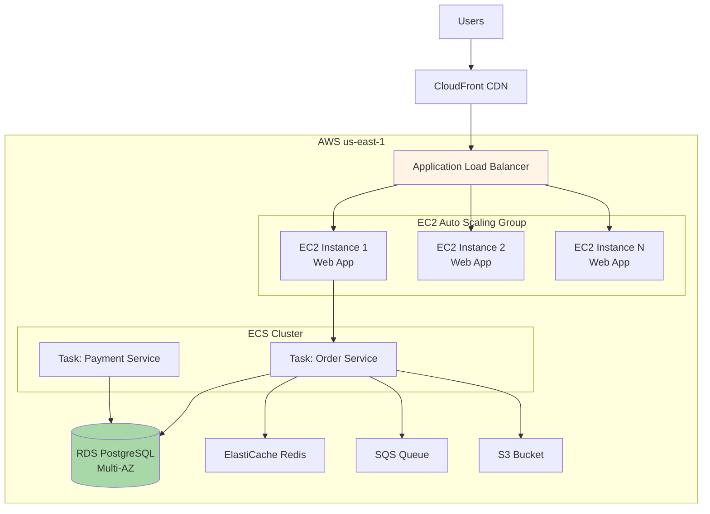
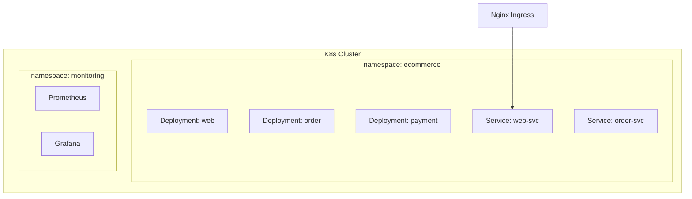
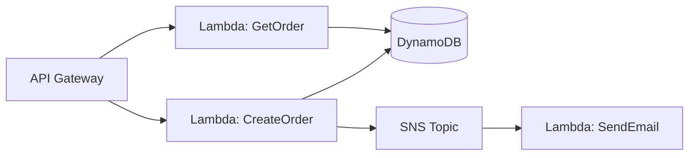

# 7.4 Allocation Views

> **Tóm tắt một dòng**: Allocation View show *physical* mapping của software lên: hardware/cloud (deployment), file system (implementation), team (work assignment). Trả lời "code này chạy ở đâu, ai own nó".

## 3 subtypes

### Subtype 1: Deployment View

Mapping software → hardware/cloud infrastructure.



Audience: SRE, DevOps, architect.

Purpose:

- Capacity planning.
- Cost estimation.
- Failure scenario analysis.
- Migration planning.

### Subtype 2: Implementation View

Mapping software → file system / repository structure.

```
e-commerce-platform/
├── apps/
│   ├── web/                    # React SPA
│   ├── mobile/                 # React Native
│   └── admin/                  # Admin UI
├── services/
│   ├── order-service/          # Go service
│   ├── payment-service/        # Java service
│   ├── inventory-service/      # Python service
│   └── notification-service/   # Node.js service
├── shared/
│   ├── proto/                  # gRPC schemas
│   ├── events/                 # Event schemas
│   └── libs/                   # Shared libraries
├── infra/
│   ├── terraform/              # Infrastructure as Code
│   ├── helm/                   # K8s charts
│   └── monitoring/             # Grafana, Prometheus config
├── docs/
│   ├── architecture/           # ADRs, diagrams
│   └── runbooks/               # Ops runbooks
└── README.md
```

Audience: developer, new joiner.

Purpose:

- Navigation: "find code".
- Mono vs multi repo decision documentation.

### Subtype 3: Work Assignment View

Mapping software → team ownership.

| Team | Owns |
|---|---|
| Order team (5 engineers) | order-service, order-events, order admin UI |
| Payment team (4 engineers) | payment-service, payment integrations |
| Inventory team (3 engineers) | inventory-service, warehouse interface |
| Platform team (6 engineers) | shared libs, monitoring, CI/CD |
| Web team (4 engineers) | web SPA, mobile, design system |

Audience: Engineering Manager, Director, new joiner.

Purpose:

- On-call rotation.
- Code review routing.
- Hiring plan.
- Conway's law analysis.

## Cloud topology patterns

Common patterns trong deployment view:

### Pattern 1: Single region, multi-AZ

Hệ chạy ở 1 region (us-east-1), span 3 availability zones cho HA.

Use case: hầu hết app medium scale, không cần multi-region.

Cost: medium. Failover: AZ-level (region down = total down).

### Pattern 2: Multi-region active-passive

Primary region serves traffic. Secondary region standby, can take over within minutes.

Use case: critical app cần disaster recovery.

Cost: high (secondary region underutilized).

### Pattern 3: Multi-region active-active

Both regions serve traffic. Replication bidirectional.

Use case: global app, low latency cho global users.

Cost: highest. Complexity: high (data sync).

### Pattern 4: Multi-cloud

Spread across AWS, GCP, Azure.

Use case: avoid vendor lock-in, regulatory.

Cost: very high. Operational complexity: very high.

### Pattern 5: Edge + Cloud

Static assets ở CDN edge (CloudFront, Fastly). Dynamic logic ở core cloud.

Use case: any web app. Standard practice.

## Container orchestration

Modern deployment thường dùng container orchestration:

### Kubernetes (K8s)

Standard cho large-scale container deployment. Show as:



Audience: SRE, K8s admin.

### Managed services

Cloud-native: AWS App Runner, GCP Cloud Run, Fly.io. Simpler ops, less control.

Use khi: team không có K8s expertise.

### Serverless

AWS Lambda, GCP Cloud Functions. No server management.

Show as:



Use case: event-driven, low-medium traffic, cost-sensitive.

## Conway's Law

Melvin Conway (1968):

> "Organizations which design systems are constrained to produce designs which are copies of the communication structures of these organizations."

Diễn đạt: architecture của hệ phản ánh org chart của team build.

### Examples

- 3-team org (frontend, backend, mobile) → 3-tier architecture với boundary tại tech layer.
- Bounded context per team → microservices boundary follow team.
- Centralized DBA team → shared database (DBA gatekeeper).

### Implications

- **Architecture decision = org decision**. Đổi từ monolith → microservices ≈ đổi org từ functional → domain team.
- **Inverse Conway maneuver**: tổ chức org theo mong muốn architecture, để Conway force tự nhiên tạo ra architecture đó.

### Visualization

Work Assignment View chính là Conway's law trong tài liệu. Show team-component mapping → architect predict architecture evolution.

## Documenting cloud cost

Allocation View nên include cost (estimate):

| Component | Instance | Cost/month |
|---|---|---|
| Web App (3x EC2 t3.medium) | EC2 | $90 |
| Order Service (ECS Fargate, 2 task) | ECS | $120 |
| Database (RDS PostgreSQL, m5.large) | RDS | $250 |
| Redis (ElastiCache cache.t3.small) | ElastiCache | $25 |
| Load Balancer | ALB | $20 |
| Data transfer (1TB out) | Network | $90 |
| **Total** | | **~$595/month** |

Cost transparency helps:

- Architect cân nhắc cost trong decision (Bài 3.3 trade-off).
- Engineering Manager budget planning.
- Identify waste (under-utilized resources).

Tools: AWS Cost Explorer, Cloud Custodian, custom dashboard.

## Sai lầm thường gặp

### Sai lầm 1: Outdated deployment diagram

Infra thay đổi (added Redis, swapped DB), diagram không update.

Fix: infra-as-code (Terraform) is source of truth. Diagram auto-generate from IaC nếu possible.

### Sai lầm 2: No cost annotation

Diagram show topology mà không cost. Decision purely technical, ignore $$.

Fix: annotate cost per component (rough estimate OK).

### Sai lầm 3: Quên failure scenario

Diagram show happy path. Không show "DB down thì sao", "AZ down thì sao".

Fix: separate diagram cho failure scenarios. Annotate SLA.

### Sai lầm 4: Work Assignment không up-to-date

Org chart thay đổi (team merge, split), document outdated.

Fix: review work assignment view quarterly. Update on org change.

### Sai lầm 5: Quên Conway's law

Đổi architecture mà không đổi team. Distributed monolith result.

Fix: align team boundary với architecture boundary. Inverse Conway.

## Tóm tắt

- **Allocation Views**: software → physical/team mapping.
- **3 subtypes**: Deployment (hardware), Implementation (file system), Work Assignment (team).
- **Cloud patterns**: single/multi region, active-active, multi-cloud, edge+cloud.
- **Conway's law**: architecture follows org chart. Inverse Conway = design org for desired architecture.
- **Include cost** trong deployment view.

## Tổng kết Cụm 7

3 view chính từ SEI:

| View | Câu hỏi | Audience |
|---|---|---|
| Module | Code organize ra sao? Depend ra sao? | Developer |
| C&C | Runtime ra sao? Communicate ra sao? | Architect, SRE |
| Allocation | Chạy ở đâu? Ai own? | DevOps, EM, Stakeholder |

Plus ADR cho decision history.

Practical minimum: System Context (C4) + Container (C4) + 2-3 sequence diagrams cho critical flows + ADR cho important decisions.

Cụm tiếp: [Cụm 8 - Case Studies](../08-case-studies/01-overview.md) — apply tất cả vào case thực.
