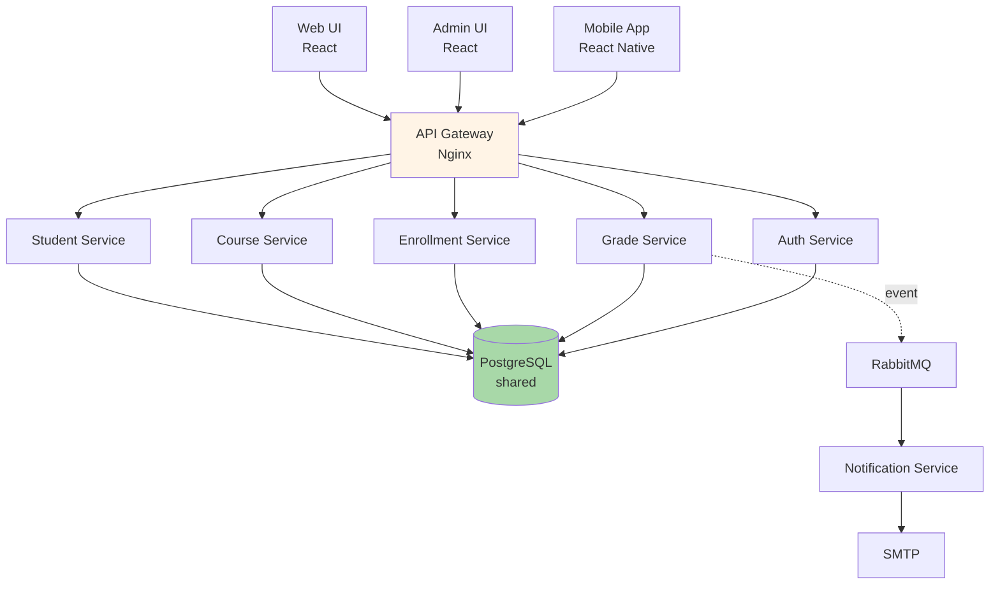
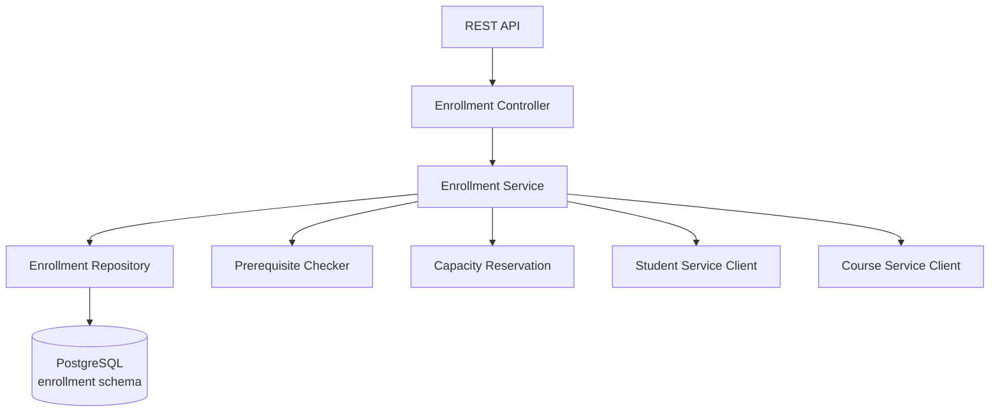
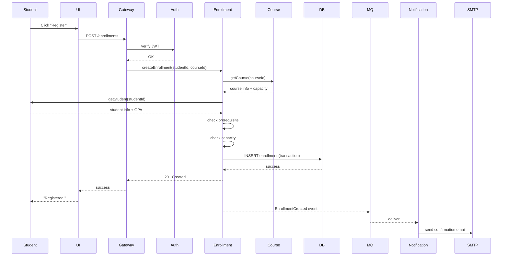

# 8.2 UAMS, University Academic Management System

> **Tóm tắt một dòng**: Case study lập luận end-to-end cho hệ academic management. Conclusion - Service-based architecture với 6 services, shared PostgreSQL với schema-per-service, sync HTTP cho internal call, sync API + sync admin UI. Tổng cost dự kiến $1500/tháng cho 50k students.

## 1. Domain và Functional Requirements

### Tổ chức bối cảnh

Một trường đại học chạy đa chương trình (undergraduate, postgraduate). Quyết định xây dựng centralized Academic Management System để chuẩn hoá operations và đảm bảo compliance regulatory.

### Core features

- **Student enrollment** + profile management.
- **Course + curriculum management**.
- **Semester registration** (sinh viên đăng ký môn).
- **Grade submission** + GPA calculation.
- **Role-based access control** (student, instructor, registrar, admin).

### Users

- **Students** (peak 50k, average 30k active).
- **Instructors** (~2000).
- **Registrars** (~50 staff).
- **Admins** (~10).

### Usage patterns

- **Regular**: spread throughout semester, modest load (100-500 req/min).
- **Registration week**: 10x normal. 50k student đăng ký môn trong 2-3 ngày.
- **Grade submission week**: bursty từ instructor side.

## 2. Identify Quality Attributes

Workshop với stakeholder (Registrar Director, IT Director, Dean of Studies):

### Top 7 QA

| Priority | QA | Target |
|---|---|---|
| Must | Data integrity | 100% (registration không có double-booking, grade chính xác) |
| Must | Security | Compliance regulatory (FERPA equivalent). Audit log mọi grade change |
| Must | Availability | 99.5% (4 hours downtime/month acceptable, except registration week) |
| Must | Auditability | Full trace của ai sửa grade/enrollment khi nào |
| Should | Scalability | Handle 10x load in registration week |
| Should | Maintainability | New feature ship trong 1-2 sprint |
| Should | Cost | < $3000/month infrastructure cho 50k students |

### Implicit characteristics

- Privacy (data sinh viên).
- Performance acceptable (page load < 2s).
- Onboard new staff < 1 week (admin UI usable).

### Operationalize

| QA | Metric | Tool |
|---|---|---|
| Data integrity | 0 inconsistency in audit (quarterly) | DB constraint, automated reconciliation |
| Security | OWASP Top 10 quarterly pen-test | External pen-test |
| Availability | Uptime % from monitoring | Datadog/UptimeRobot |
| Auditability | 100% grade changes have audit log | DB trigger + audit table |
| Scalability | Handle 50k concurrent registration | Load test pre-registration week |
| Maintainability | Mean PR-to-prod time < 1 week | Git analytics |
| Cost | Monthly cloud bill | Cloud billing dashboard |

## 3. Monolithic vs Distributed

### Considerations

- **Team size**: ~15 engineers (internal IT). Not huge.
- **Domain**: Medium complexity (~6 bounded contexts).
- **Scale**: 50k users peak. Significant but not enormous.
- **Regulatory**: separate audit log easier in microservices, but monolithic with proper modules also OK.

### Decision

**Service-based** (4-12 coarse services, shared DB per domain). Reasons:

- Team ≈ 15 → not enough for full microservices (need 50+).
- 6 bounded contexts → service-based natural fit.
- 10x scaling spike → service-based scales OK (better than monolith, less complex than microservices).
- Operational team không có K8s expertise → microservices nặng.

Justify cost-benefit:

- Service-based ops cost ~$1500/month vs monolith $500/month vs microservices $5000/month.
- Microservices không justify ROI cho team 15 + scale này.

## 4. Architecture Style Selection

### Style choice: Service-based + selective async

- **Sync HTTP (REST)** for internal service calls.
- **Async event** (RabbitMQ) for cross-context notifications (vd: grade submitted → notify student email).
- **Shared PostgreSQL** with schema-per-service.



### Bounded contexts → services

| Service | Bounded Context | Owns Entities |
|---|---|---|
| Student Service | Student domain | Student profile, enrollment history |
| Course Service | Catalog | Course, Curriculum, Section |
| Enrollment Service | Registration | Registration, Schedule |
| Grade Service | Assessment | Grade, GPA calculation |
| Auth Service | Identity | User, Role, Permission |
| Notification Service | Communication | Email/SMS queue |

6 services, total 15-engineer team (2-3 engineers per service).

## 5. Component Decomposition

### Inside Enrollment Service (example)



Components inside service follow layered (Bài 5.3).

## 6. Documenting Key Decisions (ADRs)

### ADR-001: Use Service-based over Microservices

```markdown
## Context
Team 15 engineers, 6 bounded contexts, 50k user peak, ops team không có K8s.

## Decision
Service-based với 6 coarse services + shared PostgreSQL.

## Alternatives Considered
- Monolith: pain với deploy bottleneck dự kiến trong 2 năm.
- Microservices: cost ops 3-5x, team không ready.

## Consequences
- Lợi: team velocity, deploy independent, manageable ops.
- Hại: chưa có full team independence như microservices.
```

### ADR-002: Shared PostgreSQL với schema-per-service

```markdown
## Decision
Single PostgreSQL instance, schema-per-service (student_svc, course_svc, ...).

## Rationale
- Cost: 1 DB instance vs 6 instances.
- Cross-service query: support khi cần (vd: report tổng hợp).
- Compliance audit: single DB easier để audit.
- Trade-off: phải discipline schema migration coordination.
```

### ADR-003: Sync HTTP for inter-service

```markdown
## Decision
Sync HTTP (REST) for service-to-service calls, async RabbitMQ for notifications.

## Rationale
- Sync: simple, debug dễ, fit cho most user-facing flows.
- Async: notification không cần real-time, decoupling email service.

## Consequences
- Cascade failure risk if service down: mitigate by circuit breaker (Resilience4j).
- Latency: 3-5 hops max for any user request, sub-1s achievable.
```

### ADR-004: Audit log via DB trigger

```markdown
## Decision
PostgreSQL trigger on grade/enrollment tables → write to audit_log table.

## Rationale
- Compliance: full trace required.
- DB-level capture: cannot bypass via app bug.
- Trade-off: DB trigger complexity, performance overhead ~5%.

## Alternatives Considered
- Application-level logging: rejected (can be bypassed).
- CDC (Change Data Capture): rejected (extra infrastructure complexity).
```

### ADR-005: Auto-scale Enrollment Service for registration week

```markdown
## Decision
Auto-scale Enrollment Service (3 → 30 instances) during registration week.
Other services stay 2-3 instances.

## Rationale
- 10x load only on Enrollment during registration.
- Cost optimization: scale only what's needed.
```

## 7. Critical Flows

### Flow 1: Student registers for course



### Flow 2: Instructor submits grade

(similar pattern, brief)

## 8. QA Scorecard

| QA | Target | How achieved |
|---|---|---|
| Data integrity | 100% | DB constraints, transaction, automated reconciliation job |
| Security | OWASP compliant | Auth service, RBAC, prepared statements (SQL injection), HTTPS, secret in Vault |
| Availability | 99.5% | Multi-AZ, RDS HA, service replicas, circuit breakers |
| Auditability | 100% grade changes | DB trigger + audit_log table |
| Scalability | Handle 50k peak | Auto-scale Enrollment, read replicas during peak |
| Maintainability | PR-to-prod < 1 week | CI/CD per service, contract tests |
| Cost | < $3000/month | $1500 baseline + $1000 during peak weeks = $1500-2500/month average |

All targets met.

## 9. Trade-off Reflection

**Hy sinh**:

- **Full microservices independence**: 6 services share DB, không thể database-per-service migrate hoàn toàn isolated.
- **Polyglot tech stack**: all services Java/Spring (team uniform). Không thể chọn Python cho ML service nếu cần sau này (would require refactor).
- **Sub-100ms latency**: sync calls accumulate. p99 200-500ms typical, acceptable cho academic use.

**Đạt**:

- **Pragmatic ops**: 1 ops engineer can handle 6 services + 1 DB.
- **Team velocity**: each team owns 1-2 services, deploy independently.
- **Compliance**: audit + RBAC built into architecture.
- **Cost-effective**: $1500-2500/month for 50k students.

## 10. What we'd do differently

Honest reflection:

1. **Add event sourcing for Grade**: Audit log good but reconstructing historical grade state hard. Event sourcing for grade entity would simplify.

2. **API versioning từ ngày 1**: Currently API not versioned. When mobile app released, breaking changes painful.

3. **Async cho slow operations**: Bulk grade upload by instructor → sync HTTP timeout. Should be async with progress tracking from start.

4. **Multi-region for DR**: Single region acceptable for academic, but disaster recovery plan thiếu. Should have replica in second region.

## Tóm tắt

UAMS case demonstrates:

- **Service-based** chosen over monolith (team velocity) vs microservices (ops cost).
- **Shared DB schema-per-service** balance isolation + cost.
- **Sync HTTP** for user flows, **async event** for notifications.
- **Audit via DB trigger** for compliance.
- **Auto-scale** specific service for predictable load spike.

Pragmatic, not perfect. Apt for context.

Bài tiếp: [Smart City Traffic Detection](03-smart-city-traffic.md), context completely different.
