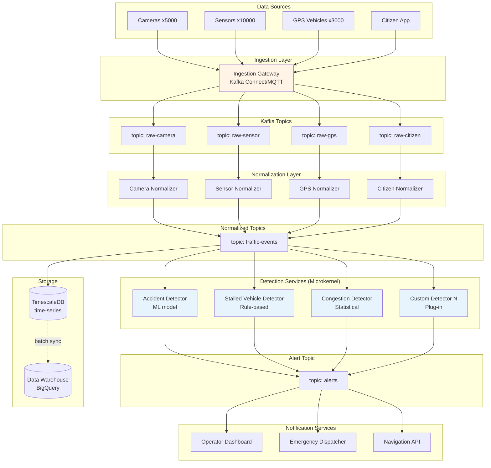
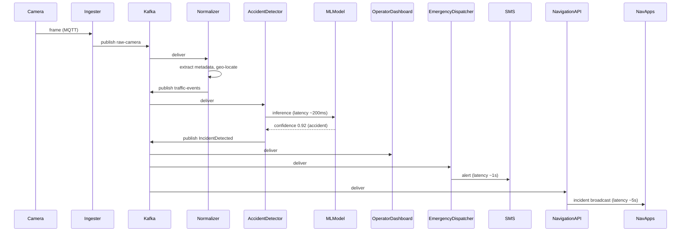

# 8.3 Smart City Traffic Incident Detection

> **Tóm tắt một dòng**: Case study lập luận cho hệ phát hiện sự cố giao thông real-time. Conclusion - Event-Driven Architecture với Kafka pipeline, microservices style cho detection logic, time-series DB cho historical analytics. Khác hoàn toàn UAMS vì context khác.

## 1. Domain và Functional Requirements

### Background

City government deploy Smart Traffic Incident Detection System để cải thiện an toàn đường + giảm congestion.

### Data sources (heterogeneous)

- **Roadside cameras** (~5000 cameras, 1 frame/giây mỗi camera).
- **Traffic sensors** (~10,000 sensors đo speed + volume, update mỗi 5 giây).
- **GPS data** từ public buses + taxis (~3000 vehicles, ping mỗi 10 giây).
- **Citizen reports** (mobile app, sporadic, ~100 reports/giờ).

### Functional requirements

- Ingest data heterogeneous, high-volume.
- Clean + normalize.
- Detect incidents real-time: accidents, stalled vehicles, congestion (rule-based + AI/ML).
- Generate alerts với severity levels.
- Store data cho historical analysis (~7 years).
- Notify traffic operators, emergency services, navigation systems.

### Scale calculation

- Cameras: 5000 × 1 frame/s = 5000 events/s.
- Sensors: 10000 × 1 update / 5s = 2000 events/s.
- GPS: 3000 × 1 ping / 10s = 300 events/s.
- Citizen: ~0.03 events/s.

Total: **~7300 events/s** sustained, peak 15-20k events/s.

Per day: ~700 million events. Per year: ~250 billion. Storage massive.


### Góc nhìn Data Scientist

Nếu bạn đến từ Data Science, case này nên được đọc như một production ML system hơn là một bài backend thông thường. Model phát hiện tai nạn chỉ là một component ở giữa pipeline. Trước model có ingestion, validation, normalization, feature construction. Sau model có alerting, audit log, dashboard, storage nóng/lạnh và monitoring.

Điểm quan trọng là model không tự quyết định kiến trúc. Kiến trúc bị chi phối bởi các Quality Attributes:

- **Freshness**: dữ liệu camera/sensor/GPS phải đến detector đủ nhanh.
- **Latency**: incident cần được detect trong vài chục giây.
- **Throughput**: hệ phải xử lý hàng nghìn event mỗi giây.
- **Reliability**: không được mất event quan trọng.
- **Auditability**: khi có alert sai, phải truy lại input, model version, feature version.
- **Evolvability**: thêm detector mới mà không dừng toàn hệ thống.

Vì vậy lựa chọn Event-Driven + Pipeline + Microkernel không phải vì "hiện đại", mà vì nó match với QA của bài toán. Đây là cách bạn nên đọc mọi architecture decision trong case.

## 2. Identify Quality Attributes

### Top 7 QA

| Priority | QA | Target |
|---|---|---|
| Must | Scalability | Handle 20k events/s sustained, scale to 50k events/s |
| Must | Low latency (detection) | Incident detected within 30s of event |
| Must | Low latency (alert) | Alert delivered within 10s of detection |
| Must | Availability | 99.9% (detection must not miss critical incidents) |
| Must | Extensibility | Add new detection algorithm without redeploy core |
| Should | Reliability | No data loss in pipeline |
| Should | Cost | < $20k/month for current scale |

### Operationalize

| QA | Metric | Tool |
|---|---|---|
| Scalability | Events/s throughput, lag | Kafka metrics, Datadog |
| Detection latency | Time from event to detection | Distributed tracing |
| Alert latency | Time from detection to notification | Logs |
| Availability | Uptime % | Multi-region health check |
| Extensibility | Time to deploy new algorithm | Git analytics |
| Reliability | Message loss rate | Kafka offset monitoring |
| Cost | Monthly cloud bill | Cloud billing |

## 3. Monolithic vs Distributed

### Considerations

- **Scale**: 7-20k events/s, monolithic single instance không feasible.
- **Heterogeneous sources**: different ingestion logic, parallel.
- **Real-time detection**: cần stream processing.
- **Extensibility**: add detection algo dễ → plug-in style.

### Decision

**Distributed, Event-Driven Architecture** (Cụm 6.4) overlay với **Microservices** (Cụm 6.3) cho detection services.

Justify:

- Scale + throughput requirements → distributed required.
- Async detection chain → event-driven natural.
- Extensibility for new algorithm → microservices + Microkernel pattern.

## 4. Architecture Style



### Style mix

- **Event-Driven (Cụm 6.4)**: backbone với Kafka.
- **Microservices (Cụm 6.3)**: fine-grained detection services.
- **Microkernel (Cụm 5.5)**: detection services là plug-ins to a "detection core", easy add new algorithm.
- **Pipeline (Cụm 5.4)**: ingest → normalize → detect là pipeline.

Multiple styles compose. Architect chọn fit-for-purpose per layer.

## 5. Component Decomposition

### Ingestion services (1 per source type)

- Camera Ingester: MQTT broker → Kafka.
- Sensor Ingester: HTTP POST endpoint → Kafka.
- GPS Ingester: TCP socket (NMEA protocol) → Kafka.
- Citizen Ingester: HTTPS REST API → Kafka.

### Normalizer services

Mỗi normalizer:

- Consume raw Kafka topic.
- Validate, clean, normalize to common schema.
- Publish to `traffic-events` topic.

Common schema:

```json
{
  "event_id": "uuid",
  "timestamp": "ISO 8601",
  "source_type": "camera|sensor|gps|citizen",
  "source_id": "string",
  "location": {"lat": ..., "lon": ..., "road_id": "..."},
  "data": {...source-specific...},
  "metadata": {...}
}
```

### Detection services (microkernel plug-ins)

Mỗi detector:

- Subscribes `traffic-events` topic (filter by location/source).
- Apply detection logic (rule, statistical, ML).
- Publish `IncidentDetected` event to `alerts` topic.

New detector = new microservice subscribing topic. Core không thay đổi.

### Storage

- **TimescaleDB**: hot data, last 30 days, real-time query.
- **BigQuery**: cold data, 7 years, analytics.

Pipeline batch sync TimescaleDB → BigQuery daily.

## 6. Key ADRs

### ADR-001: Kafka as event backbone

```markdown
## Decision
Apache Kafka as event broker for entire pipeline.

## Rationale
- Throughput: handles 20k+ events/s easily.
- Replay: critical for ML model retraining and debugging.
- Schema registry support.
- Industry standard for streaming.

## Alternatives
- RabbitMQ: not designed for stream replay, lower throughput.
- AWS Kinesis: vendor lock, similar capability.
- Pulsar: newer, less ecosystem.

## Consequences
- Ops complexity (Kafka cluster management), invest in tooling.
- Need schema registry (Confluent or Apicurio).
```

### ADR-002: Microkernel for detection services

```markdown
## Decision
Detection logic implemented as plug-in microservices that subscribe to traffic-events topic.

## Rationale
- New detection algorithms common (city evolves rules).
- Each algorithm runs independently, fault isolation.
- Can be deployed by different teams.

## Consequences
- Plug-in API (Kafka schema) must be stable.
- Discovery: each algorithm registers its capabilities.
```

### ADR-003: TimescaleDB + BigQuery split

```markdown
## Decision
TimescaleDB (PostgreSQL extension) for hot 30 days. BigQuery for 7-year history.

## Rationale
- Real-time dashboards query last 30 days → need low-latency time-series DB.
- 7-year analytics → batch jobs OK → BigQuery cost-effective for cold data.
- Cost: TimescaleDB ~$1500/month for 30 days. BigQuery storage cheap, query pay-per-use.

## Consequences
- Two systems to manage.
- Sync job complexity.
- Cross-DB query not possible (acceptable).
```

### ADR-004: At-least-once delivery with idempotent consumers

```markdown
## Decision
Kafka at-least-once delivery. Detectors implement idempotency by event_id.

## Rationale
- Exactly-once expensive and complex.
- Most detection logic naturally idempotent (same event, same detection).
- Alert deduplication at notification layer.

## Consequences
- All detectors must implement idempotency. Code review enforce.
```

### ADR-005: Geo-sharded Kafka topics

```markdown
## Decision
Kafka topics partitioned by geographic region (vd: district 1-12).

## Rationale
- Locality: detection algorithms can subscribe to specific districts.
- Scale: parallelize processing by partition.
- Future: regional clusters if needed.

## Consequences
- Routing logic in ingester (which partition).
- Re-shard rare but complex.
```

## 7. Critical Flow

### Detection of accident from camera frame



End-to-end: camera frame to alert ~15-20s. Within target.

## 8. QA Scorecard

| QA | Target | How achieved |
|---|---|---|
| Scalability | 20k events/s | Kafka partition, horizontal scale detector |
| Detection latency | 30s | Streaming pipeline (vs batch) |
| Alert latency | 10s | Kafka consumer group with low-latency config |
| Availability | 99.9% | Multi-AZ Kafka, replica consumers, multi-region failover |
| Extensibility | New algorithm in days | Microkernel pattern, well-defined event schema |
| Reliability | No data loss | At-least-once + idempotent consumers |
| Cost | < $20k/month | Auto-scale, BigQuery for cold data |

## 9. Trade-off Reflection

**Hy sinh**:

- **Strong consistency**: events arrive out of order across partition (per-partition ordered). Detection algorithms handle.
- **Operational complexity**: Kafka cluster + many microservices + 2 storage systems = need experienced SRE team.
- **Cost**: $15-20k/month higher than UAMS but justify by scale.

**Đạt**:

- **Scalable to 50k+ events/s** with horizontal scaling.
- **Sub-30s detection** real-time.
- **Plug-in extensibility** for new algorithms.
- **7-year audit** via BigQuery.

## 10. So sánh UAMS vs Smart City

| Aspect | UAMS | Smart City |
|---|---|---|
| Style | Service-based | Event-Driven + Microservices + Microkernel |
| DB | Shared PostgreSQL | TimescaleDB + BigQuery |
| Communication | Sync HTTP + async event | Async event chỉ |
| Scale | 50k peak users | 20k events/s sustained |
| Latency target | < 2s page load | < 30s detection, < 10s alert |
| Cost | $1500-2500/month | $15-20k/month |
| Team needed | 15 engineers | 25-30 engineers + 5 ML + 3 SRE |

Architecture khác hoàn toàn vì *context khác*. Cùng một bộ nguyên tắc, nhưng áp dụng khác nhau khi Quality Attributes thay đổi.

## Tóm tắt

Smart City case demonstrates:

- **EDA + Microservices + Microkernel** compose cho high-scale real-time.
- **Kafka** as backbone for streaming.
- **Pipeline pattern** in ingest → normalize → detect.
- **Microkernel** for extensibility (add algorithms).
- **TimescaleDB + BigQuery** for hot/cold data split.

Both UAMS và Smart City đều "correct", vì serve different contexts. Skill: chọn đúng combination.

Bài tiếp: [Production ML Feature Store](05-production-ml-feature-store.md), case study sát với MLOps và Data Scientist hơn.
