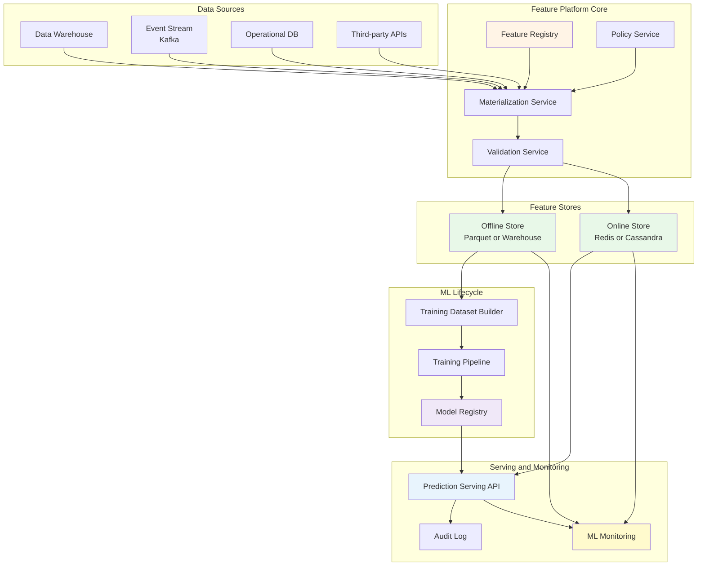
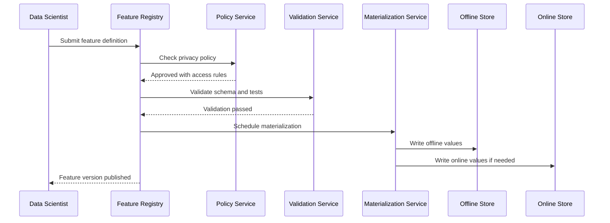
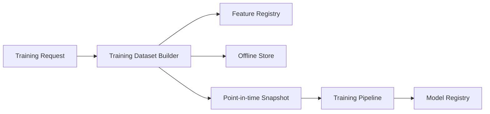
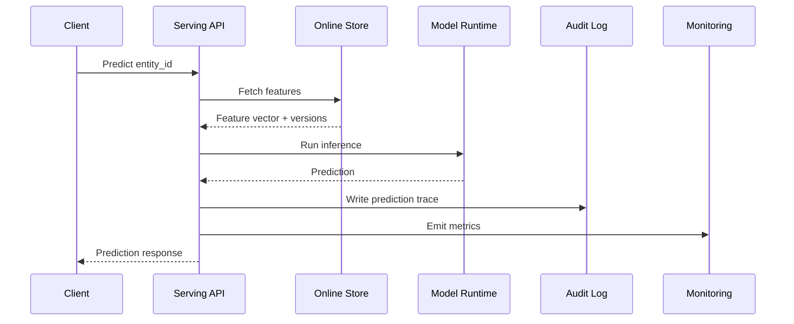
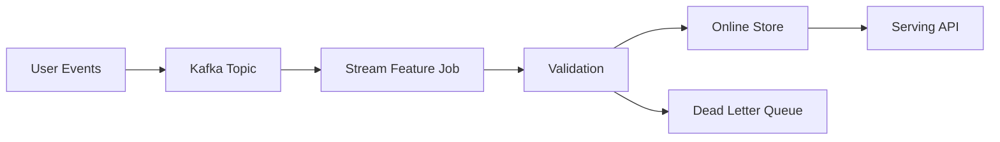
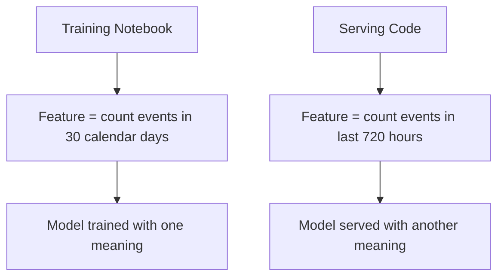

# 8.4 Production ML Feature Store

> **Tóm tắt một dòng**: Case study này thiết kế một nền tảng production ML cho nhiều team Data Science. Kết luận - Service-based core cho Feature Registry, Model Registry, Serving và Monitoring, kết hợp Pipeline Architecture cho batch features, Event-Driven Architecture cho streaming features và dual store offline/online để giảm training-serving skew.

## 1. Vì sao case này quan trọng?

Nếu bạn là Data Scientist, đây có lẽ là case study gần công việc thật nhất trong toàn bộ khoá. Rất nhiều team bắt đầu bằng notebook tốt, model tốt, metric tốt. Nhưng khi số lượng model tăng lên, vấn đề không còn là "train model nào" nữa. Vấn đề trở thành:

- Feature bị tính lại ở nhiều nơi, mỗi nơi hơi khác một chút.
- Training dùng logic feature khác serving, gây training-serving skew.
- Model chạy trong production nhưng không ai biết chính xác dùng data version nào.
- Online inference chậm vì mỗi request phải query warehouse.
- Data drift xảy ra nhưng không có dashboard cảnh báo.
- Prediction log thiếu model version, nên không audit được.
- Feature chứa PII bị log ra ngoài vì thiếu data contract.

Nói cách khác, vấn đề đã chuyển từ Data Science thuần sang Software Architecture. Case này giúp bạn thấy cách biến một hệ ML rời rạc thành một nền tảng có boundary, contract, quality attributes và evolution path rõ ràng.

## 2. Domain và bối cảnh

Một công ty SaaS B2B có 10 team Data Science. Mỗi team xây model cho một use case:

- Churn prediction.
- Lead scoring.
- Fraud detection.
- Recommendation.
- Customer health score.
- Pricing optimization.
- Support ticket priority.

Ban đầu mỗi team tự quản lý pipeline riêng. Sau 18 tháng, công ty gặp vấn đề:

- Có hơn 200 features, nhưng nhiều feature trùng logic.
- Một feature như `active_days_last_30d` được tính 5 kiểu khác nhau.
- Offline training lấy data từ warehouse, online serving tự query database operational.
- Deploy model mới mất 1-2 tuần vì cần backend team viết endpoint riêng.
- Khi business hỏi "vì sao customer này bị score thấp", không ai truy lại đủ lineage.

Công ty quyết định xây **Production ML Platform** với feature store, model registry, serving API và monitoring.

## 3. Functional Requirements

### Feature management

- Data Scientist đăng ký feature definition.
- Feature có owner, description, schema, source, freshness tier và privacy level.
- Feature được materialize ra offline store cho training.
- Feature quan trọng được materialize ra online store cho serving.
- Feature definition có versioning.

### Training support

- Tạo training dataset theo point-in-time correctness.
- Lấy feature version đúng với model version.
- Ghi lại data snapshot, feature list, code version và experiment metadata.
- Đẩy model artifact vào model registry.

### Serving support

- Online API nhận entity ID và trả prediction.
- Serving API lookup online features trong latency thấp.
- API log request, feature version, model version, prediction và latency.
- Có canary release và rollback model.

### Monitoring and governance

- Theo dõi feature freshness, null rate, drift và schema changes.
- Theo dõi model latency, error rate, prediction distribution và business metric.
- Audit được prediction cụ thể dùng model nào, feature nào, data version nào.
- Enforce policy cho PII và sensitive features.

## 4. Constraints và scale

| Dimension | Estimate |
|---|---:|
| DS/ML teams | 10 teams |
| Models in production | 40 models |
| Registered features | 200 features, grow to 1000 |
| Daily batch records | 50M entities |
| Event stream | 5k events/s average, 20k peak |
| Online prediction traffic | 2k RPS average, 15k RPS peak |
| Feature lookup target | p95 < 20ms |
| Prediction target | p95 < 120ms |
| Batch feature freshness | 24h acceptable |
| Near-realtime freshness | < 5 minutes |
| Critical realtime freshness | < 10 seconds |

Team constraint cũng quan trọng:

- Platform team có 8 engineers.
- Mỗi DS team có 3-6 người.
- Chưa có SRE riêng cho ML platform.
- Công ty dùng cloud warehouse, object storage, Kubernetes nhẹ, CI/CD cơ bản.

## 5. Identify Quality Attributes

### Top QA

| Priority | QA | Target |
|---|---|---|
| Must | Training-serving consistency | 100% online features có cùng definition với offline training |
| Must | Online latency | p95 feature lookup < 20ms, p95 prediction < 120ms |
| Must | Freshness tiering | Batch 24h, near-realtime 5m, realtime 10s |
| Must | Auditability | 100% predictions trace được model version + feature versions |
| Must | Privacy | 0 PII leak trong logs, policy enforced ở feature level |
| Should | Reusability | 70% features dùng lại bởi ít nhất 2 models sau 12 tháng |
| Should | Deployability | Rollback model trong < 10 phút |
| Should | Cost control | Serving cost < $0.20 / 1000 predictions |
| Should | Observability | Dashboard cho freshness, drift, latency, null rate |

### Operationalize

| QA | Metric | Tooling |
|---|---|---|
| Consistency | Feature definition hash match giữa training và serving | Feature Registry |
| Latency | p50, p95, p99 per endpoint | Tracing + API metrics |
| Freshness | Age của feature value theo entity | Online store metadata |
| Auditability | Prediction log completeness | Audit query + data lake |
| Privacy | PII scan logs, policy check | DLP scanner + access control |
| Reusability | Feature reuse count | Registry analytics |
| Rollback | Time from rollback trigger to stable old version | Deployment metrics |
| Drift | PSI, KS test, null rate, range violations | Monitoring jobs |

## 6. Architecture style decision

### Options considered

| Option | Lợi ích | Chi phí |
|---|---|---|
| Mỗi team tự build pipeline | Tự do cao, không cần platform ban đầu | Duplicate logic, skew, audit kém, cost tăng |
| Modular monolith ML platform | Đơn giản, dễ build MVP | Khó scale team ownership khi platform lớn |
| Service-based platform | Boundary rõ, ops cost vừa phải | Cần API contracts và service ownership |
| Full microservices | Independence cao | Ops cost quá cao cho team 8 người |

### Decision

Chọn **Service-based Architecture** cho core platform, overlay **Pipeline Architecture** và **Event-Driven Architecture** cho data flow.

Lý do:

- Team platform 8 người không đủ để vận hành full microservices.
- Domain có 5-7 bounded contexts rõ: Feature Registry, Materialization, Offline Store, Online Store, Model Registry, Serving, Monitoring.
- Data flow bản chất là pipeline, đặc biệt cho batch feature và training dataset.
- Streaming features cần event-driven, nhưng không phải mọi feature đều cần streaming.
- Service-based cho phép deploy độc lập ở mức coarse-grained mà không tạo 30 service nhỏ khó vận hành.

## 7. High-level Architecture



Điểm quan trọng: đây không phải một style duy nhất. Hệ thực tế thường là **style mix**:

- Service-based cho boundary giữa platform services.
- Pipeline cho materialization và training.
- Event-driven cho streaming feature updates và prediction logs.
- Layered bên trong từng service.
- Microkernel nhẹ cho plugin feature transformations hoặc custom metrics.

## 8. Component decomposition

| Component | Responsibility | Owner | State |
|---|---|---|---|
| Feature Registry | Feature metadata, schema, owner, version | Platform team | Metadata DB |
| Policy Service | Privacy level, access control, PII rules | Security + Platform | Policy DB |
| Materialization Service | Run batch/stream jobs to compute features | Data Platform | Job metadata |
| Validation Service | Schema, null rate, range, freshness checks | Platform team | Validation results |
| Offline Store | Historical feature values for training | Data Platform | Warehouse/Object storage |
| Online Store | Low-latency feature values for serving | Platform team | Redis/Cassandra |
| Training Dataset Builder | Point-in-time join for training | ML Platform | Dataset metadata |
| Model Registry | Model artifact, version, metrics, lifecycle | ML Platform | Registry DB/Object storage |
| Serving API | Prediction endpoint, feature lookup, model runtime | ML Platform | Runtime cache |
| Monitoring | Drift, freshness, latency, business KPIs | ML Platform | Metrics DB |
| Audit Log | Immutable prediction trace | Platform + Compliance | Data lake |

## 9. Key runtime flows

### Flow A: Register a feature



Architecture insight: feature registration is not just a form. It is a governance workflow. Privacy, schema, freshness and ownership must be enforced before feature becomes reusable.

### Flow B: Build training dataset



Point-in-time correctness là điểm rất dễ bị bỏ qua. Nếu bạn train churn model cho ngày 1/5, bạn không được dùng feature được tính bằng dữ liệu sau ngày 1/5. Nếu không, model có data leakage và validation metric sẽ ảo.

### Flow C: Online prediction



Latency budget ví dụ:

| Step | Target |
|---|---:|
| API auth + validation | 10ms |
| Feature lookup | 20ms |
| Model inference | 50ms |
| Logging async enqueue | 5ms |
| Network + serialization | 20ms |
| Buffer | 15ms |
| Total p95 | 120ms |

Nếu feature lookup query warehouse trực tiếp, target 20ms gần như bất khả thi. Đây là lý do online store tồn tại.

### Flow D: Streaming feature update



Streaming chỉ dùng cho feature thật sự cần freshness thấp. Những feature dùng cho churn campaign daily không cần đi qua flow này. Architecture tốt không biến mọi thứ thành realtime.

## 10. Data contracts

Feature definition cần đủ rõ để cả training và serving dùng chung.

Ví dụ metadata:

```yaml
name: active_days_last_30d
version: 3
owner: growth_ml_team
entity: account_id
description: Number of active product usage days in the last 30 days
source: product_events
freshness_tier: daily
privacy_level: internal
value_type: integer
nullable: false
range:
  min: 0
  max: 30
offline_store: warehouse.features_account_daily
online_store: redis.account_features
created_by: growth_ml_team
```

Điểm quan trọng không phải YAML đẹp. Điểm quan trọng là contract này trở thành source of truth. Training không tự viết lại logic. Serving không tự suy diễn schema. Monitoring biết range đúng để detect anomaly.

## 11. Training-serving skew

Training-serving skew là lỗi trung tâm mà feature store muốn giảm.

### Skew scenario



Hai định nghĩa nghe gần giống nhau, nhưng kết quả có thể khác. Model validation tốt nhưng production tệ. Debug rất khó vì không có exception nào xảy ra.

### Architecture fix

- Feature definition sống trong Feature Registry.
- Offline và online materialization dùng cùng transformation source.
- Model registry lưu feature list + feature versions.
- Serving API check feature version compatibility trước khi load model.
- Monitoring so sánh offline distribution và online distribution.

## 12. Privacy and governance

Feature store rất dễ trở thành nơi tập trung dữ liệu nhạy cảm. Vì vậy privacy không thể là phần thêm sau.

### Policy examples

| Feature type | Policy |
|---|---|
| PII raw email, phone | Không serve trực tiếp cho model nếu không có approval |
| Financial data | Encrypt at rest, restrict access, audit read |
| Behavioral events | Aggregate before online serving nếu có thể |
| Sensitive demographic | Cần fairness review trước khi dùng |
| Free text notes | Không log raw text trong prediction trace |

### Design implication

Policy Service phải nằm trong path feature registration và feature access. Nếu chỉ dựa vào convention, sớm muộn sẽ có team log nhầm hoặc train nhầm feature nhạy cảm.

## 13. Observability design

Production ML monitoring không chỉ là CPU và memory.

| Layer | Metrics |
|---|---|
| Data ingestion | event lag, dropped events, schema changes |
| Feature materialization | job duration, freshness, null rate, range violation |
| Online store | lookup latency, hit rate, stale values, error rate |
| Serving API | p95 latency, RPS, model error, timeout, rollback count |
| Model quality | prediction distribution, drift, calibration, delayed labels |
| Business | churn intervention success, fraud false positives, revenue lift |

Một dashboard tốt phải giúp trả lời: lỗi nằm ở data, feature, model, serving hay business feedback loop?

## 14. Failure modes and mitigations

| Failure | Symptom | Mitigation |
|---|---|---|
| Schema drift | Feature job fail hoặc null tăng | Schema validation + alert |
| Stale online feature | Prediction dùng data cũ | Freshness metadata + fallback |
| Duplicate event | Feature count bị inflate | Idempotency key + dedup window |
| Online store down | Prediction timeout | Graceful degradation, cached defaults, circuit breaker |
| Bad model release | Business metric giảm | Canary + shadow deployment + rollback |
| PII leak in logs | Compliance incident | Log redaction + DLP scan |
| Training-serving skew | Offline tốt, online tệ | Shared feature definition + compatibility check |
| Label delay | Monitoring quality chậm | Proxy metrics + delayed evaluation job |

## 15. ADR examples

### ADR 1: Use dual offline and online feature stores

**Context**: Training cần historical features và point-in-time join. Online serving cần lookup thấp hơn 20ms.

**Decision**: Dùng offline store cho training và online store cho serving. Feature Registry quản lý cùng definition và versions cho cả hai.

**Consequences**:

- Giảm training-serving skew.
- Tăng complexity vì cần materialization hai đích.
- Cần consistency check giữa offline và online values.

### ADR 2: Support freshness tiers instead of realtime for all features

**Context**: Một số use case cần realtime, nhưng churn và health score chỉ cần daily.

**Decision**: Mỗi feature khai báo freshness tier: daily, hourly, near-realtime, realtime.

**Consequences**:

- Giảm cost đáng kể.
- Platform phức tạp hơn vì có nhiều execution mode.
- DS phải hiểu freshness requirement khi đăng ký feature.

### ADR 3: Choose service-based core, not full microservices

**Context**: Platform team có 8 engineers, domain chưa đủ lớn để justify 30 services.

**Decision**: Dùng 6-8 coarse-grained services, shared metadata DB có schema boundary rõ.

**Consequences**:

- Ops cost vừa phải.
- Boundary đủ rõ cho team ownership.
- Khi platform lớn hơn, có thể tách dần bằng Strangler Fig.

## 16. Cost model rough estimate

| Component | Monthly cost estimate |
|---|---:|
| Metadata DB | $300-800 |
| Offline store storage + query | $3000-8000 |
| Online store | $2000-6000 |
| Batch compute | $3000-10000 |
| Streaming compute | $2000-8000 |
| Serving API compute | $2000-7000 |
| Monitoring/log storage | $1000-4000 |
| Total | $13k-44k/month |

Cost range lớn vì phụ thuộc số feature, freshness tier và traffic. Bài học kiến trúc: freshness và latency là hai driver cost lớn nhất. Đừng realtime hoá feature nếu business không cần.

## 17. Evolution roadmap

### Phase 1: Batch-first feature platform

- Feature Registry.
- Offline Store.
- Batch materialization.
- Training Dataset Builder.
- Model Registry cơ bản.

Dùng khi use case chủ yếu là churn, lead scoring, campaign, reporting. Đây là phase rẻ và ít rủi ro.

### Phase 2: Online serving

- Online Store.
- Serving API.
- Prediction log.
- Rollback model.
- Basic monitoring.

Dùng khi cần prediction trong app hoặc API, nhưng chưa cần streaming features phức tạp.

### Phase 3: Streaming and governance

- Kafka/Flink streaming feature jobs.
- Freshness monitoring.
- Drift dashboard.
- Policy Service cho PII.
- Canary/shadow deployment.

Dùng khi fraud detection, realtime recommendation hoặc personalization thật sự cần freshness thấp.

## 18. What a Data Scientist should learn from this case

Nếu bạn đến từ Data Science, đừng chỉ nhìn feature store như một tool. Hãy nhìn nó như một architecture boundary.

Feature store trả lời các câu hỏi kiến trúc:

- Feature definition sống ở đâu?
- Ai own feature đó?
- Training và serving có dùng cùng logic không?
- Feature có freshness SLA nào?
- Feature có chứa dữ liệu nhạy cảm không?
- Model version nào dùng feature version nào?
- Khi prediction sai, truy lại input thế nào?

Khi bạn trả lời được các câu hỏi này, bạn không chỉ là người train model. Bạn đang thiết kế một phần của production system.

## 19. Self-check

1. Với model bạn từng làm, 5 features quan trọng nhất có owner và version rõ không?
2. Training và serving có dùng cùng feature transformation không?
3. Nếu một prediction bị khiếu nại, bạn truy lại được model version và feature values không?
4. Feature nào thật sự cần realtime, feature nào chỉ cần daily?
5. Nếu online store down, hệ thống fail đóng, fail mở hay dùng fallback?
6. Có feature nào chứa PII nhưng đang bị log ra prediction trace không?
7. Nếu thêm model mới, bạn cần sửa Serving API hay chỉ đăng ký model artifact mới?

## 20. Tóm tắt

- Production ML Platform là bài toán Software Architecture, không chỉ là bài toán modelling.
- Feature Store giảm training-serving skew bằng cách centralize feature definition, version và materialization.
- Offline store phục vụ training, online store phục vụ low-latency serving.
- Không phải feature nào cũng cần realtime. Freshness tiers giúp cân bằng cost và value.
- Service-based core phù hợp hơn full microservices khi platform team còn nhỏ.
- Pipeline Architecture phù hợp batch feature và training dataset.
- Event-Driven Architecture phù hợp streaming feature, prediction logs và monitoring.
- Auditability, privacy, observability và rollback phải được thiết kế từ đầu.

Bài tiếp: [Bài tập tổng hợp](04-exercise-set.md), nơi bạn tự thiết kế architecture cho nhiều bối cảnh khác nhau.
