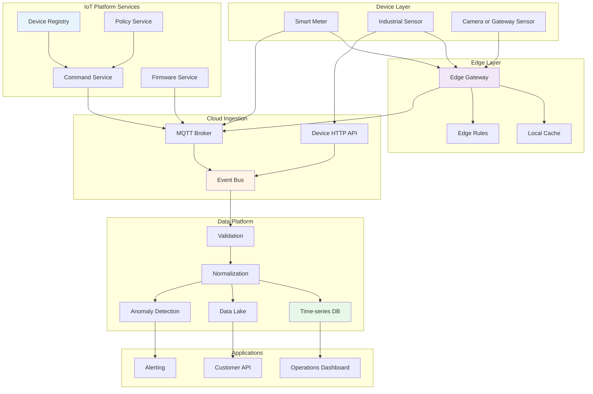
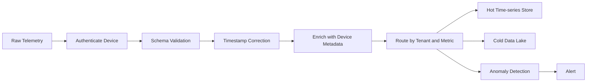
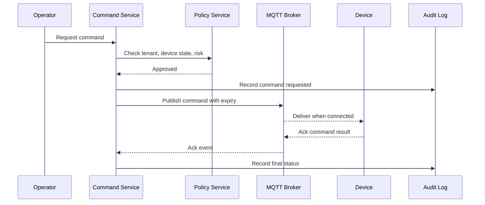

# 9.2 Software Architecture for IoT

> **Tóm tắt một dòng**: IoT architecture là bài toán phân chia trách nhiệm giữa device, edge và cloud trong điều kiện network không ổn định, device resource hạn chế, security khó, telemetry rất lớn và command phải an toàn.

## 1. Domain context

Một công ty năng lượng muốn xây nền tảng quản lý **smart meters** và **industrial sensors** cho nhiều khách hàng doanh nghiệp. Hệ thống cần thu thập telemetry, phát hiện bất thường, gửi command cấu hình, cập nhật firmware và cung cấp dashboard vận hành.

Scale ban đầu:

- 200k devices trong năm đầu.
- Tăng lên 2M devices trong 3 năm.
- Mỗi device gửi telemetry mỗi 10 giây.
- Một số site có edge gateway.
- Network không ổn định, đặc biệt ở nhà máy hoặc khu vực xa.
- Device có vòng đời 5-10 năm, khó thay thế nhanh.

Điểm khác biệt của IoT so với web app thông thường: client không phải browser đáng tin cậy. Client là device ngoài thực địa, có thể offline, bị capture, chạy firmware cũ, mất điện, mất network hoặc gửi data sai.

## 2. Functional requirements

### Device onboarding

- Đăng ký device mới.
- Gán device vào tenant/customer/site.
- Cấp certificate hoặc credential.
- Kiểm tra firmware version và hardware model.

### Telemetry ingestion

- Nhận metric định kỳ: voltage, temperature, power usage, vibration.
- Validate schema và timestamp.
- Store raw telemetry cho audit.
- Aggregate data cho dashboard.
- Detect anomaly near-realtime.

### Command and control

- Gửi command đổi cấu hình.
- Gửi command restart hoặc calibrate sensor.
- Theo dõi trạng thái command: pending, delivered, acked, failed, expired.
- Không gửi command nguy hiểm nếu device không đúng trạng thái.

### Firmware update

- Rollout firmware theo batch.
- Canary theo site hoặc hardware model.
- Rollback nếu error rate tăng.
- Verify firmware signature.

### Operations

- Dashboard health theo device, site, tenant.
- Alert khi device offline, telemetry stale, anomaly tăng.
- Audit trail cho command và firmware update.

## 3. Quality Attributes

| Priority | QA | Target |
|---|---|---|
| Must | Reliability | Không mất telemetry quan trọng khi network chập chờn |
| Must | Scalability | 2M devices, 200k events/s peak |
| Must | Security | Mutual auth, credential rotation, signed firmware |
| Must | Observability | Biết device nào stale, gateway nào lag, topic nào backlog |
| Must | Safety | Command nguy hiểm phải có guardrail và audit |
| Should | Latency | Telemetry dashboard p95 < 5s, critical alert < 30s |
| Should | Cost | Storage tiering để raw telemetry không phá budget |
| Should | Evolvability | Thêm protocol/device model không rewrite core |

## 4. Architecture style mix

IoT platform hiếm khi dùng một style duy nhất.

| Concern | Style phù hợp | Lý do |
|---|---|---|
| Telemetry ingestion | Event-Driven | Device gửi event bất đồng bộ, consumer scale độc lập |
| Data processing | Pipeline | Validate, normalize, enrich, aggregate, detect |
| Device management | Service-based | Device Registry, Command Service, Firmware Service |
| Protocol adapters | Microkernel | Thêm MQTT, CoAP, HTTP, LoRaWAN adapter như plugin |
| Dashboard/Admin | Layered hoặc service-based | CRUD, workflow, RBAC |
| Edge gateway | Mini pipeline + local cache | Chạy gần device, chịu offline |

Decision tổng: **Event-Driven core + Pipeline telemetry + Service-based control plane + Edge gateway**.

## 5. High-level architecture

## 6. Edge-cloud split

Một quyết định trung tâm trong IoT là đặt logic ở đâu.

| Logic | Device | Edge | Cloud |
|---|---|---|---|
| Sensor reading | Có | Không | Không |
| Basic validation | Có | Có | Có |
| Local safety rule | Có nếu critical | Có | Không nên phụ thuộc |
| Aggregation | Ít | Có | Có |
| ML anomaly detection | Nhỏ nếu cần | Có thể | Có |
| Long-term storage | Không | Cache tạm | Có |
| Fleet analytics | Không | Không | Có |
| Firmware orchestration | Không | Relay | Có |

Heuristic:

- Nếu quyết định cần phản ứng khi mất mạng, đưa xuống device hoặc edge.
- Nếu quyết định cần global view, để cloud.
- Nếu data volume quá lớn, aggregate ở edge trước khi gửi cloud.
- Nếu logic thay đổi thường xuyên, tránh nhúng sâu vào firmware trừ khi bắt buộc.

## 7. Telemetry pipeline

Pipeline này phải xử lý backpressure. Nếu dashboard chậm, ingestion không được chết. Nếu anomaly detector fail, raw telemetry vẫn cần được lưu. Đây là lý do tách consumer theo event-driven thay vì gọi sync chain dài.

## 8. Command delivery flow

Command không giống request HTTP thông thường. Device có thể offline 3 giờ. Vì vậy command cần trạng thái rõ ràng:

- Created.
- Authorized.
- Queued.
- Delivered.
- Acked.
- Failed.
- Expired.
- Cancelled.

## 9. Device identity and security

IoT security khó vì device nằm ngoài vùng kiểm soát vật lý.

### Design principles

- Mỗi device có identity riêng, không dùng shared secret toàn fleet.
- Mutual TLS hoặc certificate-based authentication cho device quan trọng.
- Firmware phải signed.
- Credential rotation phải có kế hoạch trước khi deploy hàng triệu device.
- Device bị compromise phải revoke được.
- Command nguy hiểm cần authorization theo tenant, role, site và device state.

### Security boundaries

| Boundary | Risk | Mitigation |
|---|---|---|
| Device to broker | Fake device gửi telemetry | Mutual auth, certificate pinning |
| Gateway to cloud | Gateway bị chiếm | Per-gateway identity, scoped permissions |
| Command API | Operator gửi nhầm command | RBAC, approval, audit |
| Firmware update | Malicious firmware | Signature verification |
| Tenant data | Cross-tenant leak | Tenant isolation in topic and storage |

## 10. Data strategy

Telemetry có volume lớn. Nếu lưu tất cả vào database nóng, cost sẽ nổ.

| Data type | Store | Retention |
|---|---|---|
| Raw telemetry | Data lake/object storage | 1-7 năm |
| Recent telemetry | Time-series DB | 7-30 ngày |
| Aggregates | Warehouse | 1-5 năm |
| Device metadata | Relational DB | Full lifecycle |
| Command audit | Append-only log | 7 năm hoặc theo compliance |
| Firmware artifacts | Object storage | Theo version policy |

Hot path và cold path phải tách nhau. Dashboard cần recent data nhanh. Audit và analytics dài hạn cần data lake rẻ hơn.

## 11. Failure modes

| Failure | Symptom | Mitigation |
|---|---|---|
| Network partition | Device offline hàng giờ | Local cache, retry, command expiry |
| Broker overload | Event lag tăng | Partition by tenant/site, autoscale consumer |
| Device clock drift | Timestamp sai | Server receive time, correction logic |
| Duplicate telemetry | Count sai | Idempotency key, dedup window |
| Bad firmware rollout | Device lỗi hàng loạt | Canary, staged rollout, rollback |
| Certificate expiry | Device không kết nối được | Rotation workflow, expiry dashboard |
| Hot store cost spike | Cloud bill tăng | Retention policy, downsampling |
| Command sent to wrong device | Safety incident | Policy guard, approval, audit |

## 12. ADR examples

### ADR 1: Use MQTT broker and event bus for telemetry

**Context**: Device gửi telemetry liên tục, network không ổn định, consumers cần scale độc lập.

**Decision**: Device dùng MQTT/HTTP vào ingestion layer. Cloud chuyển telemetry vào event bus để validation, storage, alerting và analytics consume độc lập.

**Consequences**:

- Tăng resilience và decoupling.
- Cần vận hành broker và event bus.
- Debug flow khó hơn sync API, cần tracing theo message id.

### ADR 2: Put safety-critical rules at edge

**Context**: Một số rule phải chạy ngay cả khi mất cloud connection.

**Decision**: Edge gateway chạy local rules cho safety-critical scenarios, cloud chỉ cấu hình policy và nhận telemetry.

**Consequences**:

- Tăng safety khi offline.
- Gateway phức tạp hơn.
- Cần versioning và rollout cho edge rules.

### ADR 3: Use tiered storage for telemetry

**Context**: Telemetry volume lớn, dashboard cần recent data nhanh nhưng audit cần raw data lâu dài.

**Decision**: Recent data vào time-series DB, raw data vào data lake, aggregates vào warehouse.

**Consequences**:

- Cost kiểm soát tốt hơn.
- Query model phức tạp hơn.
- Cần data catalog và retention policy rõ.

## 13. What to document

Một architecture doc IoT tối thiểu nên có:

- Device lifecycle diagram.
- Telemetry C&C view.
- Command sequence diagram.
- Allocation view: device, edge, broker, cloud, data stores.
- Topic naming convention.
- Device identity model.
- Firmware rollout ADR.
- Storage retention table.
- Failure mode table.

## 14. Self-check

1. Nếu device offline 6 giờ, telemetry và command xử lý thế nào?
2. Command có expiry và audit không?
3. Device identity là per-device hay shared secret?
4. Data nào cần hot store, data nào nên cold store?
5. Nếu anomaly detector fail, ingestion có tiếp tục không?
6. Firmware rollout có canary không?
7. Edge gateway có chạy logic nào không, hay chỉ relay?
8. Làm sao biết topic hoặc tenant nào đang gây backlog?

## 15. Tóm tắt

- IoT architecture bị drive bởi reliability, scalability, security, observability và safety.
- Event-driven là core vì device communication tự nhiên là async.
- Pipeline phù hợp cho telemetry validation, enrichment, storage và anomaly detection.
- Edge-cloud split là quyết định kiến trúc quan trọng nhất.
- Command delivery cần state machine, không nên coi như HTTP request đơn giản.
- Device identity, firmware signing và credential rotation phải thiết kế từ đầu.
- Storage tiering là bắt buộc nếu telemetry volume lớn.

Bài tiếp: [9.3 Software Architecture for Web3](03-software-architecture-for-web3.md).
