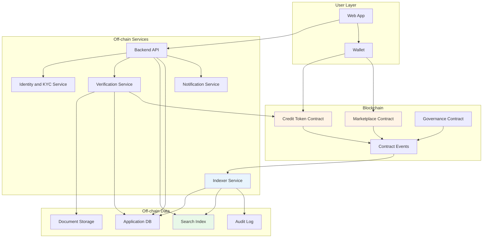
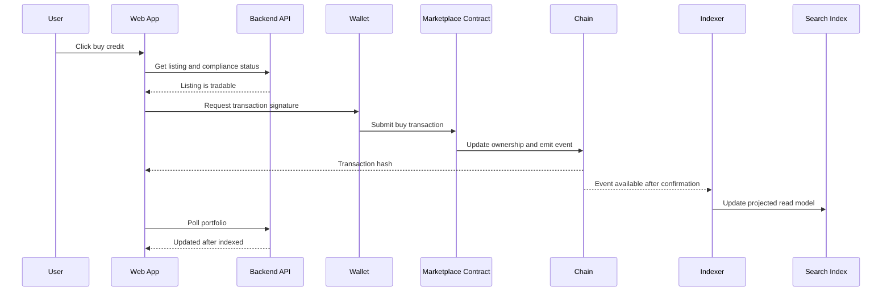
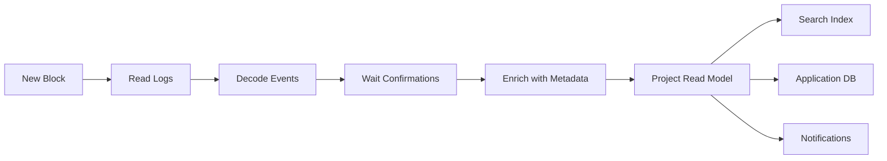

# 9.3 Software Architecture for Web3

> **Tóm tắt một dòng**: Web3 architecture là bài toán chia hệ thống thành on-chain và off-chain components, nơi on-chain tối ưu trust và transparency nhưng hy sinh latency, cost, privacy và khả năng sửa lỗi.

## 1. Domain context

Một công ty muốn xây nền tảng **decentralized carbon credit marketplace**. Doanh nghiệp có thể mua carbon credits, project owner có thể mint credits sau khi được verify, auditor xác nhận chất lượng project, và người dùng có thể xem lịch sử ownership minh bạch.

Yêu cầu business nghe giống marketplace thông thường, nhưng Web3 thêm constraint đặc biệt:

- Một phần state nằm trên blockchain.
- Smart contract gần như immutable sau khi deploy.
- Transaction có gas fee.
- User ký giao dịch bằng wallet.
- Finality không tức thì.
- Public chain làm dữ liệu minh bạch nhưng privacy khó hơn.
- Backend không còn là authority tuyệt đối.

Architecture challenge: quyết định cái gì đưa on-chain, cái gì giữ off-chain.

## 2. Functional requirements

### Marketplace

- List carbon credits.
- Buy/sell/transfer credits.
- Retire credits khi doanh nghiệp claim offset.
- Xem ownership history.

### Verification

- Project owner submit project documents.
- Auditor review documents.
- Approved project được mint credits.
- Reject hoặc request changes.

### Wallet and identity

- User connect wallet.
- Link wallet với organization account.
- Role-based permissions cho organization admin, trader, auditor.

### Indexing and search

- Search credits theo project type, country, vintage, status.
- Show transaction history nhanh.
- Show portfolio dashboard.

### Compliance

- Audit trail cho approval và retirement.
- KYC/KYB cho organizations.
- Report export.

## 3. On-chain vs off-chain decision

Đây là quyết định kiến trúc trung tâm.

| Concern | On-chain? | Lý do |
|---|---|---|
| Credit token ownership | Có | Cần transparency và trustless transfer |
| Mint/retire rules | Có | Cần enforce công khai, tránh double spend |
| Project documents | Không | Dữ liệu lớn, private, thay đổi được |
| Document hash | Có | Chứng minh document không bị sửa |
| Search index | Không | Query blockchain trực tiếp chậm và đắt |
| User profile | Không | Privacy, KYC, mutable data |
| Audit approval workflow | Hybrid | Decision hash on-chain, workflow off-chain |
| Pricing/order book | Tuỳ | Nếu cần trustless matching thì on-chain, nếu cần UX tốt thì off-chain |

Rule of thumb:

- Put on-chain những gì cần shared trust, settlement, ownership hoặc public verification.
- Keep off-chain những gì cần privacy, high throughput, low latency, rich query hoặc frequent change.

## 4. Quality Attributes

| Priority | QA | Target |
|---|---|---|
| Must | Security | Không mất token, không bypass mint/retire rule |
| Must | Integrity | Ownership và retirement không double count |
| Must | Auditability | Trace được lifecycle của credit |
| Must | Correctness | Smart contract invariant được test và verified |
| Should | Usability | User không bị kẹt vì pending transaction khó hiểu |
| Should | Performance | Dashboard p95 < 2s dù chain query chậm |
| Should | Evolvability | Upgrade path rõ cho contract và backend |
| Should | Cost | Gas cost predictable, batch khi phù hợp |
| Should | Privacy | KYC và sensitive docs không public |

## 5. Architecture style mix

| Concern | Style | Lý do |
|---|---|---|
| Smart contracts | Layered domain core on-chain | Contract chứa invariant quan trọng |
| Blockchain events | Event-Driven | Contract emit events, backend index async |
| Off-chain backend | Service-based | Marketplace, Identity, Verification, Indexer, Notification |
| Indexing pipeline | Pipeline | Read event, decode, enrich, persist, project views |
| Frontend | Layered | Wallet adapter, API client, UI state |
| Governance modules | Microkernel-like | Add policy module hoặc auditor plugin |

Decision tổng: **Hybrid on-chain/off-chain architecture with event-driven indexer**.

## 6. High-level architecture

## 7. Critical flow: buying a credit

Điểm UX quan trọng: transaction submitted không có nghĩa là business state đã final. UI cần phân biệt:

- Signed.
- Submitted.
- Pending confirmation.
- Confirmed on-chain.
- Indexed off-chain.
- Failed or reverted.

## 8. Indexer pipeline

Blockchain không phải database query tốt cho UI. Indexer tạo read model.

Indexer phải handle:

- Chain reorg.
- Duplicate events.
- Missed blocks.
- Contract version changes.
- Backfill từ block cũ.
- Idempotent projection.

Nếu indexer sai, UI sai dù chain đúng. Vì vậy indexer là component critical, không phải background script phụ.

## 9. Smart contract as architectural boundary

Smart contract là boundary cứng hơn API thông thường vì:

- Deploy rồi khó sửa.
- Bug có thể mất tiền thật.
- State public.
- Execution cost tính bằng gas.
- External caller không luôn đáng tin.

### Contract invariants

| Invariant | Ví dụ |
|---|---|
| No double retirement | Một credit retired thì không transfer được nữa |
| Mint only approved project | Chỉ role/minter hợp lệ mint được |
| Conservation | Tổng credits không tự tăng ngoài mint rule |
| Ownership | Chỉ owner hoặc approved operator transfer được |
| Pause safety | Có thể pause marketplace khi incident |

Những invariant này phải được test mạnh hơn backend logic thông thường: unit test, property-based test, audit, formal verification nếu value lớn.

## 10. Upgrade strategy

Smart contract immutable không có nghĩa là hệ không evolve. Nhưng upgrade phải được thiết kế.

| Strategy | Lợi | Giá phải trả |
|---|---|---|
| No upgrade | Trust cao, đơn giản | Bug khó sửa |
| Proxy upgrade | Có thể sửa logic | Governance risk, complexity |
| Versioned contracts | Rõ ràng, an toàn hơn proxy | Fragmented liquidity/state |
| Pause and migrate | Có emergency path | UX phức tạp |

Với marketplace có value cao, thường dùng versioned contracts hoặc proxy có governance chặt:

- Timelock.
- Multisig.
- Public proposal.
- Emergency pause.
- Audit trước upgrade.

## 11. Security model

Web3 security là security architecture, không chỉ smart contract audit.

| Layer | Threat | Mitigation |
|---|---|---|
| Smart contract | Reentrancy, access control bug | Audit, tests, battle-tested libraries |
| Wallet UX | User ký nhầm transaction | Human-readable signing, simulation |
| Backend API | Fake compliance status | Backend cannot bypass contract invariant |
| Indexer | Wrong projected state | Reconciliation against chain |
| Admin key | Key compromise | Multisig, hardware wallet, timelock |
| Frontend | DNS or script injection | CSP, integrity, deployment controls |
| Oracle/auditor | False verification | Multi-party approval, audit trail |

Nguyên tắc: backend có thể hỗ trợ UX, nhưng không được là single point làm sai ownership invariant.

## 12. Privacy and data placement

Public blockchain làm transparency tốt hơn, nhưng privacy khó hơn.

Không nên đưa lên chain:

- KYC documents.
- Legal contracts raw.
- Personal identity.
- Sensitive business volume nếu không cần public.
- Internal approval notes.

Có thể đưa lên chain:

- Hash của document.
- Token ID.
- Project ID public.
- Retirement certificate hash.
- Ownership event.

## 13. Failure modes

| Failure | Symptom | Mitigation |
|---|---|---|
| Contract bug | Asset stuck hoặc lost | Audit, pause, limited scope, bug bounty |
| Chain congestion | Transaction pending lâu | Gas strategy, UX state, retry guidance |
| Indexer lag | UI stale | Lag dashboard, fallback chain read for critical state |
| Chain reorg | Event bị revert | Confirmation depth, idempotent projection |
| Wallet phishing | User mất asset | Signing clarity, education, allowlist |
| Admin key compromise | Malicious upgrade | Multisig, timelock, separation of duties |
| Backend outage | UI không search được | Chain state vẫn source of truth, cache read model |
| Oracle fraud | Mint fake credits | Multi-auditor workflow, stake/slashing nếu phù hợp |

## 14. ADR examples

### ADR 1: Store token ownership on-chain, documents off-chain

**Context**: Ownership cần trustless verification, nhưng project documents lớn và private.

**Decision**: Token ownership và retirement state nằm on-chain. Documents nằm off-chain, chỉ hash đưa on-chain.

**Consequences**:

- Ownership minh bạch.
- Privacy tốt hơn.
- Cần document storage bền vững và hash verification.

### ADR 2: Build an indexer instead of querying chain directly from UI

**Context**: UI cần search/filter nhanh, blockchain query chậm và không phù hợp với dashboard.

**Decision**: Indexer consume contract events, project read model vào search index và application DB.

**Consequences**:

- UX nhanh hơn.
- Có eventual consistency giữa chain và UI.
- Cần handle reorg và reconciliation.

### ADR 3: Use multisig and timelock for contract upgrades

**Context**: Contract có thể cần upgrade, nhưng admin key là risk lớn.

**Decision**: Upgrade qua multisig + timelock + public announcement.

**Consequences**:

- Giảm risk key compromise.
- Upgrade chậm hơn.
- Emergency response cần pause mechanism riêng.

## 15. What to document

Một architecture doc Web3 tối thiểu nên có:

- On-chain/off-chain responsibility table.
- Contract invariant list.
- Contract upgrade policy.
- Event indexing flow.
- Finality and reorg policy.
- Wallet transaction UX states.
- Admin key governance.
- Threat model.
- Data privacy placement.
- Incident response playbook.

## 16. Self-check

1. State nào thật sự cần on-chain?
2. Nếu smart contract bug, rollback path là gì?
3. UI lấy data từ chain trực tiếp hay indexer?
4. Indexer handle reorg thế nào?
5. User biết transaction đang pending hay confirmed không?
6. Admin key được bảo vệ bằng gì?
7. Dữ liệu private có bị đưa lên public chain không?
8. Backend có thể gian lận ownership không, hay contract chặn được?

## 17. Tóm tắt

- Web3 không thay backend, mà thêm một trust layer on-chain.
- On-chain tối ưu trust, transparency và settlement, nhưng hy sinh latency, cost, privacy và evolvability.
- Off-chain services vẫn cần cho identity, search, indexing, documents, notifications và UX.
- Indexer là event-driven projection từ chain sang read model.
- Smart contract là architectural boundary cứng, cần invariant, audit và upgrade strategy.
- Governance và key management là phần của architecture, không phải chi tiết vận hành nhỏ.

Bài tiếp: [9.4 Software Architecture for MLOps](04-software-architecture-for-mlops.md).
