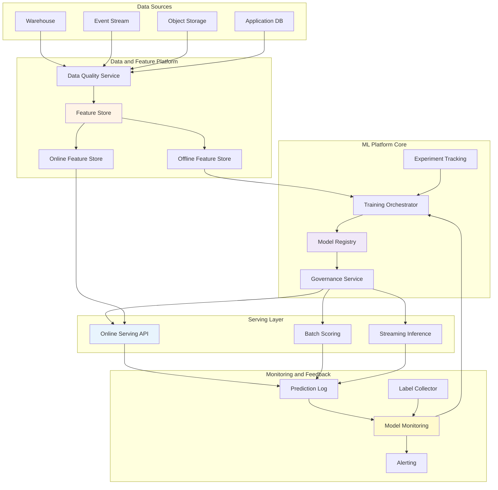
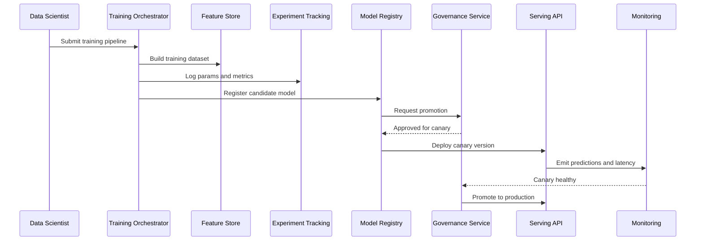
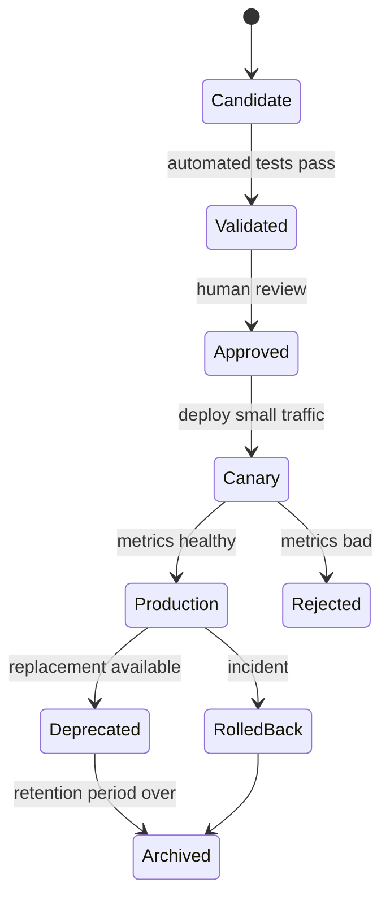

# 9.4 Software Architecture for MLOps

> **Tóm tắt một dòng**: MLOps architecture là cách tổ chức toàn bộ vòng đời ML thành một production system có data contracts, reproducibility, deployment, monitoring, rollback và governance, không chỉ là train model trong notebook.

## 1. Domain context

Một công ty thương mại điện tử có 15 Data Scientists, 8 ML Engineers và 6 Data Engineers. Công ty đang vận hành nhiều use cases:

- Search ranking.
- Product recommendation.
- Fraud detection.
- Demand forecasting.
- Churn prediction.
- Dynamic pricing.
- Customer support automation.

Ban đầu mỗi team tự tạo pipeline riêng. Sau một thời gian, các vấn đề xuất hiện:

- Notebook khó reproduce.
- Feature logic duplicate.
- Model deploy thủ công.
- Không có rollback chuẩn.
- Drift không được detect sớm.
- Training data và serving data khác nhau.
- Không truy được prediction dùng model version nào.
- Compliance hỏi lineage nhưng team không trả lời đủ.

MLOps platform ra đời để biến ML từ craft cá nhân thành engineering system.

## 2. Functional requirements

### Data and feature

- Ingest data từ warehouse, event stream, object storage.
- Validate data schema và quality.
- Quản lý feature definitions.
- Build training dataset point-in-time correct.
- Materialize online features cho low-latency serving.

### Experiment and training

- Track experiment parameters, metrics, artifacts.
- Run training pipeline reproducible.
- Support CPU/GPU jobs.
- Store model artifact và metadata.
- Compare models trước khi promote.

### Deployment and serving

- Deploy model as batch job, online API hoặc streaming consumer.
- Canary, shadow và A/B test.
- Rollback nhanh.
- Serve multiple model versions.
- Log prediction với feature versions.

### Monitoring and feedback

- Monitor model latency, error, throughput.
- Monitor feature drift, prediction drift, data quality.
- Collect delayed labels.
- Trigger retraining hoặc review.
- Dashboard cho DS, ML Engineer và business owner.

### Governance

- Approval workflow cho model production.
- Model card, risk level, owner.
- PII policy và access control.
- Audit lineage end-to-end.

## 3. Quality Attributes

| Priority | QA | Target |
|---|---|---|
| Must | Reproducibility | Rebuild được model từ code, data, feature, config version |
| Must | Observability | Drift, latency, error, prediction distribution có dashboard |
| Must | Deployability | Promote/rollback model trong < 15 phút |
| Must | Auditability | 100% production predictions có model and feature lineage |
| Must | Data quality | Schema/null/range checks trước training và serving |
| Should | Scalability | Training jobs và serving scale độc lập |
| Should | Cost control | GPU usage tracked per team/model |
| Should | Security | PII policy enforced ở feature và logs |
| Should | Extensibility | Thêm framework/model type không rewrite platform |

## 4. Architecture style mix

| Concern | Style | Lý do |
|---|---|---|
| Training pipeline | Pipeline | Data prep, feature, train, evaluate, register |
| Event feedback | Event-Driven | Prediction logs, labels, drift alerts, retrain triggers |
| Platform core | Service-based | Feature, registry, training, serving, monitoring services |
| Model serving | Microkernel-like | Runtime adapters for sklearn, PyTorch, XGBoost, LLM |
| UI/API | Layered | Portal, API, business logic, persistence |
| Multi-team platform | Modular monolith or service-based first | Avoid premature microservices |

Decision tổng: **Service-based MLOps platform with pipeline orchestration and event-driven feedback loops**.

## 5. High-level architecture

## 6. Core platform boundaries

| Service | Responsibility | Owns |
|---|---|---|
| Data Quality Service | Schema, null, range, anomaly checks | Data quality rules and results |
| Feature Store | Feature definitions, versions, materialization metadata | Feature metadata |
| Experiment Tracking | Runs, params, metrics, artifacts | Experiment records |
| Training Orchestrator | Pipeline execution and compute scheduling | Training jobs |
| Model Registry | Model artifacts, versions, lifecycle states | Model metadata and artifacts |
| Governance Service | Approval, risk level, policy gates | Promotion workflow |
| Serving API | Online inference and model runtime | Runtime config |
| Monitoring Service | Drift, latency, error, business feedback | Monitoring metrics |

Boundary tốt giúp DS không cần tự build deployment path, và platform team không cần hiểu chi tiết từng model để enforce policy.

## 7. Training-to-serving lifecycle

Pipeline này biến model deployment thành workflow có state rõ ràng, không phải copy artifact thủ công.

## 8. Deployment modes

| Mode | Use case | Architecture implication |
|---|---|---|
| Batch scoring | Churn, demand forecast | Schedule, warehouse output, lower latency pressure |
| Online serving | Recommendation, pricing | Low latency, online feature store, autoscaling |
| Streaming inference | Fraud, realtime personalization | Event bus, stateful stream processing, exactly-once concerns |
| Edge inference | Mobile/IoT | Model compression, offline update, device allocation view |

Một MLOps platform tốt không ép mọi model vào cùng một serving mode. Nó cung cấp common lifecycle nhưng cho phép deployment topology khác nhau.

## 9. Model registry lifecycle

Registry không chỉ là nơi lưu file model. Nó là state machine quản lý model lifecycle.

## 10. Monitoring design

Production ML monitoring có nhiều lớp.

| Layer | Metrics |
|---|---|
| Data quality | schema changes, null rate, out-of-range, freshness |
| Feature | drift, skew, online/offline mismatch, missing value |
| Serving | latency, throughput, error rate, timeout, resource usage |
| Prediction | distribution shift, confidence shift, class balance |
| Label feedback | delayed accuracy, precision, recall, business metric |
| Business | revenue, fraud loss, churn reduction, user engagement |

Điểm khó: label thường đến muộn. Vì vậy cần proxy metrics để phát hiện sớm, rồi delayed evaluation để xác nhận.

## 11. Governance gates

Không phải model nào cũng cần cùng mức review. Dùng risk tier.

| Risk tier | Example | Required gate |
|---|---|---|
| Low | Internal report ranking | Automated tests + owner approval |
| Medium | Recommendation | Canary + monitoring + rollback |
| High | Fraud blocking, credit decision | Human review, fairness check, explainability, audit |
| Critical | Safety system | Formal validation, staged rollout, manual override |

Governance là kiến trúc vì nó ảnh hưởng deployment flow, metadata, audit log và ownership.

## 12. Failure modes

| Failure | Symptom | Mitigation |
|---|---|---|
| Data schema change | Training or serving fail | Data contracts, schema registry, quality gates |
| Training-serving skew | Offline metric tốt, online metric tệ | Shared feature definitions, feature version check |
| Bad model deployed | Business metric giảm | Canary, shadow, rollback |
| Drift | Prediction distribution thay đổi | Drift monitoring, retraining trigger |
| Label delay | Không biết model tệ ngay | Proxy metrics, delayed evaluation |
| GPU cost spike | Cloud bill tăng | Quota, chargeback, job scheduling |
| PII leakage | Compliance incident | Feature policy, log redaction, access control |
| Pipeline not reproducible | Không rebuild được model | Code/data/config/artifact versioning |

## 13. ADR examples

### ADR 1: Use model registry as lifecycle authority

**Context**: Models are deployed manually and production status is unclear.

**Decision**: Model Registry is the source of truth for model artifact, version, stage and promotion state.

**Consequences**:

- Deployment becomes auditable.
- Serving must integrate with registry.
- Teams must follow promotion workflow.

### ADR 2: Support multiple serving modes

**Context**: Fraud needs streaming inference, churn needs batch, recommendation needs online.

**Decision**: Platform provides batch, online and streaming serving adapters under one registry/governance lifecycle.

**Consequences**:

- Better fit for diverse ML use cases.
- Platform complexity increases.
- Monitoring must normalize metrics across modes.

### ADR 3: Enforce feature version compatibility at serving load time

**Context**: Training-serving skew caused incidents.

**Decision**: Serving API checks model's required feature versions against online feature store metadata before loading model.

**Consequences**:

- Prevents many silent correctness bugs.
- Deployment can fail earlier if feature materialization lags.
- Requires feature registry maturity.

## 14. Documentation checklist

Một architecture doc MLOps tối thiểu nên có:

- Model lifecycle state diagram.
- Training pipeline C&C view.
- Serving flow sequence diagram.
- Feature store boundary.
- Monitoring metrics table.
- Governance gates.
- Rollback playbook.
- Allocation view for CPU/GPU and online serving.
- Data lineage model.
- Cost ownership model.

## 15. Self-check

1. Model version nào đang production, ai approved?
2. Prediction log có model version và feature versions không?
3. Nếu data schema đổi, pipeline fail ở đâu?
4. Rollback model mất bao lâu?
5. Drift được detect bằng metric nào?
6. Batch, online và streaming inference có cùng lifecycle không?
7. Training dataset có point-in-time correctness không?
8. GPU cost có owner không?
9. PII có bị log trong prediction trace không?
10. DS có thể reproduce model sau 6 tháng không?

## 16. Tóm tắt

- MLOps là Software Architecture cho vòng đời ML.
- Model registry, feature store, training orchestrator, serving và monitoring là platform boundaries.
- Pipeline Architecture phù hợp training và data preparation.
- Event-Driven Architecture phù hợp prediction logs, labels, drift alerts và retraining.
- Service-based core phù hợp team platform vừa và lớn.
- Reproducibility, deployability, auditability và observability quan trọng không kém accuracy.
- Governance là một phần của architecture, không phải thủ tục giấy tờ.

Bài tiếp: [9.5 Software Architecture for Digital Twin](05-software-architecture-for-digital-twin.md).
