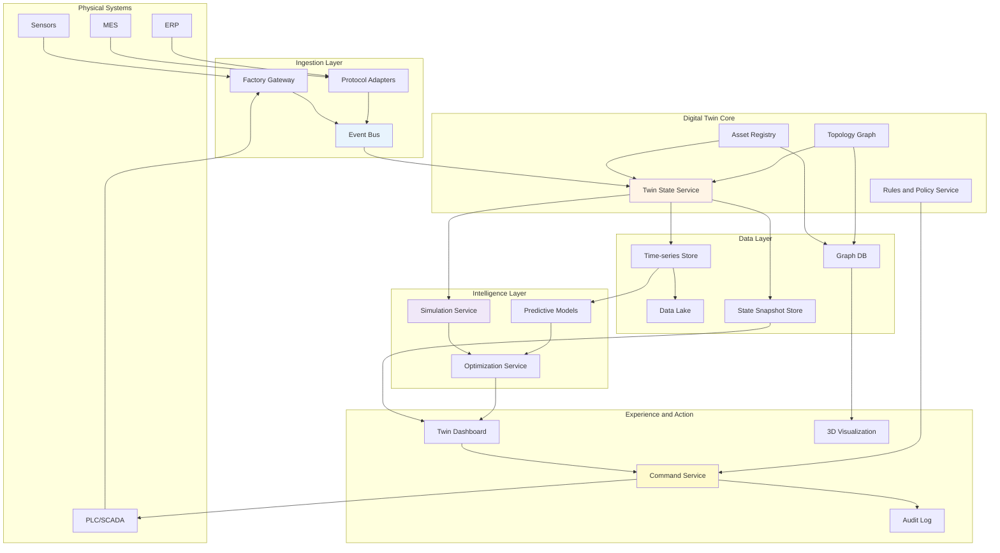
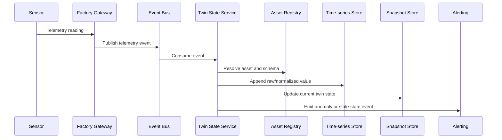
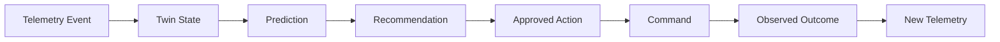
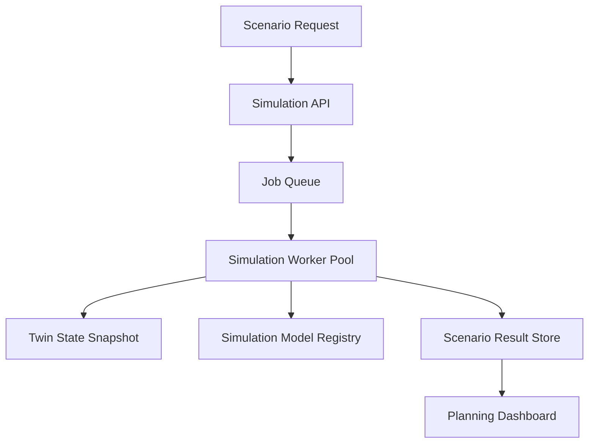

# 9.5 Software Architecture for Digital Twin

> **Tóm tắt một dòng**: Digital Twin architecture là bài toán giữ một mô hình số đủ đồng bộ với physical system để quan sát, mô phỏng, dự đoán và đôi khi điều khiển thế giới thật một cách an toàn.

## 1. Domain context

Một tập đoàn sản xuất muốn xây **Digital Twin Platform** cho 20 nhà máy. Mục tiêu là tạo bản sao số của dây chuyền sản xuất, máy móc và luồng vận hành để:

- Theo dõi trạng thái real-time.
- Mô phỏng bottleneck.
- Dự đoán hỏng hóc.
- Tối ưu lịch bảo trì.
- Thử kịch bản thay đổi production plan.
- Gửi recommendation hoặc command về hệ thống điều khiển.

Digital Twin không chỉ là dashboard IoT đẹp hơn. Nó là hệ thống có model của physical world: asset hierarchy, state, behavior, constraints và simulation.

## 2. Physical twin vs digital twin

| Physical world | Digital representation |
|---|---|
| Machine | Asset entity |
| Sensor reading | Telemetry event |
| Production line | Topology graph |
| Machine state | Twin state |
| Maintenance action | Event and workflow |
| Control command | Actuation request |
| Physics/process rule | Simulation model |
| Failure prediction | ML model output |

Điểm khó: digital twin luôn trễ hoặc không đầy đủ so với physical world. Architecture phải quyết định độ trễ chấp nhận được và cách xử lý uncertainty.

## 3. Functional requirements

### Twin modeling

- Quản lý asset hierarchy: factory, line, machine, component.
- Quản lý relationship giữa assets.
- Quản lý twin type: pump, motor, conveyor, robot arm.
- Gắn schema telemetry và state variables cho mỗi type.

### Real-time sync

- Ingest telemetry từ sensors, PLC, SCADA, MES.
- Update twin state gần real-time.
- Detect stale state.
- Store time-series history.

### Analytics and simulation

- Run anomaly detection.
- Predict failure risk.
- Simulate production throughput.
- Compare what-if scenarios.
- Recommend maintenance action.

### Visualization

- 2D/3D view factory.
- Timeline playback.
- Alert dashboard.
- Drill-down từ factory tới component.

### Closed-loop action

- Send recommendation to operator.
- Optionally send command to control system.
- Require approval for risky action.
- Audit all decisions and commands.

## 4. Quality Attributes

| Priority | QA | Target |
|---|---|---|
| Must | State freshness | Critical assets updated < 5s |
| Must | Reliability | Telemetry loss visible and recoverable |
| Must | Safety | No unsafe command without policy and approval |
| Must | Traceability | Every twin state derived from source events |
| Must | Scalability | 20 factories, 1M assets, 100k events/s peak |
| Should | Simulation performance | What-if scenario result < 2 minutes for planning use case |
| Should | Evolvability | Add new asset type without rewriting platform |
| Should | Observability | Lag, stale state, model error, command status visible |
| Should | Interoperability | Integrate SCADA, MES, ERP, IoT protocols |

## 5. Architecture style mix

| Concern | Style | Lý do |
|---|---|---|
| Telemetry sync | Event-Driven | Physical events update twin asynchronously |
| State update pipeline | Pipeline | Validate, map, enrich, update, alert |
| Twin model platform | Service-based | Asset, topology, state, simulation, command services |
| Asset type extensions | Microkernel | Plugin for new machine types or simulation models |
| Visualization app | Layered | UI, API, query model |
| Simulation workloads | Distributed batch/compute | Heavy scenario runs need isolated compute |

Decision tổng: **Event-driven digital thread with service-based twin core and simulation plugins**.

## 6. High-level architecture

## 7. Twin state update flow

State update phải idempotent. Telemetry có thể duplicate hoặc arrive out of order. Twin state service cần version, event timestamp và source timestamp để xử lý.

## 8. Digital thread

Digital Twin tốt cần **digital thread**: khả năng nối từ event thô tới state, prediction, recommendation và action.

Nếu thiếu thread này, dashboard có thể đẹp nhưng không audit được quyết định. Khi recommendation sai, bạn không biết input nào, model nào, simulation nào dẫn tới action đó.

## 9. Simulation architecture

Simulation có nhiều loại:

| Simulation type | Latency need | Example |
|---|---|---|
| Real-time state estimation | Seconds | Estimate hidden machine state |
| What-if planning | Minutes | Change production schedule |
| Physics-based simulation | Minutes to hours | Thermal or fluid model |
| Discrete event simulation | Minutes | Factory throughput bottleneck |
| ML surrogate model | Milliseconds to seconds | Fast approximation for optimization |

Không nên ép mọi simulation vào real-time path. Critical dashboard dùng current state và lightweight model. Planning simulation có thể chạy async job.

## 10. Open-loop vs closed-loop control

Digital Twin có thể chỉ observe, recommend hoặc control.

| Mode | Description | Risk |
|---|---|---|
| Observe | Chỉ hiển thị state | Thấp |
| Alert | Cảnh báo operator | Thấp-vừa |
| Recommend | Đề xuất hành động | Vừa |
| Human-approved command | Operator approve rồi gửi command | Cao |
| Autonomous control | System tự điều khiển | Rất cao |

Architecture nên tiến hoá theo maturity. Đừng nhảy thẳng tới autonomous control nếu observability và audit còn yếu.

## 11. Safety and command policy

Command về physical system cần guardrail.

| Guardrail | Example |
|---|---|
| State precondition | Chỉ restart máy nếu không ở trạng thái active production |
| Role approval | Maintenance lead phải approve |
| Time window | Không update trong giờ cao điểm |
| Rate limit | Không gửi quá N commands/site/hour |
| Simulation check | Command phải pass what-if safety rule |
| Manual override | Operator có thể stop command |
| Audit | Ghi lại recommendation, approver, command, outcome |

Command Service không nên nói chuyện trực tiếp với PLC nếu chưa qua Policy Service.

## 12. Data modeling

Digital Twin cần cả graph, time-series và document/object storage.

| Data | Store | Reason |
|---|---|---|
| Asset hierarchy | Graph DB hoặc relational with hierarchy | Query relationship |
| Current state | Snapshot store | Fast dashboard |
| Telemetry history | Time-series DB | Time-window query |
| Raw events | Data lake | Audit, replay, training |
| Simulation model | Model registry/object storage | Versioned model artifacts |
| Scenario result | Object/document store | Large result payload |
| Command audit | Append-only log | Compliance and safety |

Không có một database duy nhất fit mọi loại query. Đây là polyglot persistence có lý do, không phải chạy theo trend.

## 13. Consistency and freshness

Twin state luôn là approximation. Cần hiển thị freshness rõ ràng.

| State | Meaning | UI behavior |
|---|---|---|
| Fresh | Updated within SLA | Normal |
| Stale | No update beyond SLA | Yellow warning |
| Unknown | No reliable data | Grey or unavailable |
| Conflicting | Sources disagree | Red warning and require investigation |
| Simulated | Not observed, estimated | Label clearly |

Nếu UI hiển thị state stale như state fresh, người vận hành có thể quyết định sai.

## 14. Failure modes

| Failure | Symptom | Mitigation |
|---|---|---|
| Telemetry lag | Twin state stale | Lag metric, stale status, alert |
| Out-of-order events | State đi ngược | Event time handling, versioning |
| Wrong asset mapping | Sensor update nhầm machine | Asset registry validation, commissioning workflow |
| Simulation model wrong | Recommendation sai | Model validation, confidence, human review |
| Command unsafe | Physical incident | Policy gates, approval, manual override |
| Graph inconsistency | Dashboard topology sai | Graph validation, change workflow |
| Data lake missing events | Cannot replay | Ingestion audit, dead letter queue |
| Visualization hides uncertainty | Operator overtrust | Freshness and confidence display |

## 15. ADR examples

### ADR 1: Use event-driven state synchronization

**Context**: Physical systems produce continuous telemetry and integration sources vary by factory.

**Decision**: All telemetry and operational changes enter through event bus and update twin state asynchronously.

**Consequences**:

- Decouples ingestion from consumers.
- Supports replay and new analytics consumers.
- Twin state is eventually consistent, so freshness must be visible.

### ADR 2: Use graph model for asset topology

**Context**: Factory assets have nested and network relationships: line, machine, component, sensor, dependency.

**Decision**: Store topology in graph-oriented model, expose query API for dashboards and simulation.

**Consequences**:

- Relationship queries easier.
- Need governance for topology changes.
- Team must learn graph query and validation.

### ADR 3: Require human approval for high-risk commands

**Context**: Optimization service can recommend actions affecting physical production.

**Decision**: High-risk commands require policy check and human approval before execution.

**Consequences**:

- Safety improves.
- Automation benefit is lower initially.
- Audit workflow becomes mandatory.

## 16. What to document

Một architecture doc Digital Twin tối thiểu nên có:

- Asset model and topology diagram.
- Telemetry ingestion C&C view.
- Twin state update sequence.
- Simulation job architecture.
- Command and approval flow.
- Freshness and consistency semantics.
- Data store mapping.
- Safety policy.
- Replay and audit strategy.
- Allocation view across factory edge and cloud.

## 17. Self-check

1. Twin state fresh, stale, unknown được phân biệt thế nào?
2. Sensor event map vào asset bằng rule nào?
3. Có replay được raw events để rebuild twin state không?
4. Simulation chạy sync hay async?
5. Command nào cần human approval?
6. Nếu model prediction sai, truy được input và model version không?
7. Topology graph thay đổi qua workflow nào?
8. Edge gateway có thể tiếp tục hoạt động khi mất cloud không?
9. Dashboard có hiển thị uncertainty không?
10. Digital Twin chỉ observe, recommend hay control?

## 18. Tóm tắt

- Digital Twin là sự kết hợp của IoT, event streaming, state management, simulation, analytics và command governance.
- Twin state luôn có độ trễ và uncertainty, nên freshness phải là first-class concept.
- Event-driven sync giúp decouple ingestion và support replay.
- Graph model phù hợp asset topology.
- Simulation nên tách real-time path và planning path.
- Closed-loop control cần safety policy, human approval và audit.
- Digital thread giúp truy từ telemetry tới state, prediction, recommendation, command và outcome.

Kết thúc phần seminar. Hãy quay lại [Bản đồ phụ thuộc](../resources/cross-reference.md) để nối các seminar này với foundation concepts.
