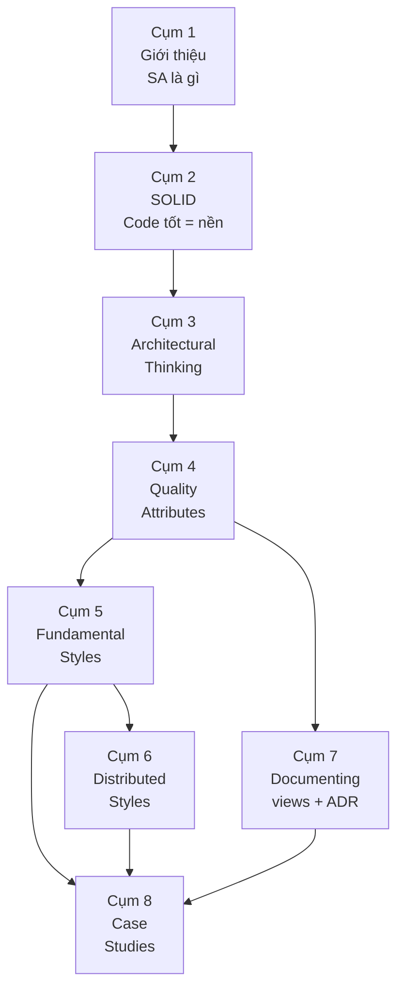

# Tóm tắt toàn khoá Software Architecture Foundation

> **Tóm tắt một dòng**: Software Architecture là tập hợp các quyết định khó-sửa-nhất, được quyết dựa trên trade-off giữa quality attributes, tổ chức thành component qua một architecture style phù hợp, và documented qua views chuẩn (Module, C&C, Allocation) + ADR.

## Map toàn khoá

## Cụm 1: Giới thiệu

### Định nghĩa SA

3 tiêu chí (Bài 1.2):

1. **Bao trùm toàn hệ thống** (system-wide).
2. **Ảnh hưởng quality attributes** (không chỉ functional).
3. **Chi phí thay đổi cao**.

Quyết định nào thoả cả 3 = architectural. Còn lại = design hoặc implementation detail.

### Mục tiêu khoá (Bài 1.3)

10 Learning Outcomes (LO1-LO10), từ "định nghĩa SA" tới "thiết kế end-to-end kiến trúc cho hệ cỡ trung".

### Lộ trình (Bài 1.4)

3 paths: Chuyên sâu (30-40h), Ôn thi (5-8h), Tra cứu (on-demand). 4 shortcuts theo focus.

## Cụm 2: SOLID

### Cohesion-Coupling (Bài 2.2)

Mục tiêu vĩnh cửu: **high cohesion + low coupling**. Cohesion = phần tử trong module tập trung 1 mục đích. Coupling = ràng buộc giữa module.

### 5 nguyên lý SOLID

| Principle | Tóm tắt | Scale architecture |
|---|---|---|
| **SRP** (2.3) | Mỗi module 1 actor | Microservice = 1 bounded context |
| **OCP** (2.4) | Open extension, closed modification | Plug-in / Microkernel |
| **LSP** (2.5) | Subtype substitutable | API versioning, schema migration |
| **ISP** (2.6) | Client không depend method không dùng | BFF, CQRS |
| **DIP** (2.7) | Depend abstraction, không concretion | Hexagonal/Clean architecture |

## Cụm 3: Architectural Thinking

### Architecture vs Design (Bài 3.2)

Ranh giới mềm theo context. Levels of Knowledge: architect cần *breadth* (vùng "know you don't know"), không cần master mọi thứ.

### Trade-off (Bài 3.3)

Mọi quyết định có cost. ATAM-lite: list options → map QA → identify trade-off → match priority → document ADR. Architect code 20-40% thời gian.

### Modularity (Bài 3.4)

**Vertical slicing (theo domain) > Horizontal slicing (theo layer)** cho team trung-lớn. Anti-pattern: Big Ball of Mud, Distributed Monolith, Death Star. Heuristics: two-pizza team, change rate, data ownership, bounded context.

## Cụm 4: Quality Attributes

### FR vs NFR (Bài 4.2)

**Architecture driven bởi NFR**, không FR. Architecture Characteristic (Richards): non-domain + structural + critical.

### Identifying (Bài 4.3)

**Top 5-7 QA**. Pipeline: read requirement → stakeholder interview → identify implicit → priority workshop → operationalize. Hierarchy: Operational + Structural + Cross-cutting.

### Component thinking (Bài 4.4)

Cohesion principles: REP (Reuse), CCP (Common Closure), CRP (Common Reuse). Coupling: ADP (Acyclic), SDP (Stable Dependencies), SAP (Stable Abstractions). Main Sequence: balance.

## Cụm 5: Fundamental Styles

### Monolithic vs Distributed (Bài 5.2)

**Monolithic là default**. Distributed chỉ khi lý do mạnh. 8 fallacies (network reliable, latency zero, ...). Modular monolith là middle ground. Strangler Fig để migrate.

### Layered (Bài 5.3)

Tầng UI/Business/Persistence. Default cho monolith đơn giản. Anti: Sinkhole.

### Pipeline (Bài 5.4)

Filter + Pipe. Unix philosophy. Use: ETL, compiler, image processing.

### Microkernel (Bài 5.5)

Core + Plug-ins. OCP at scale. Use: IDE, browser, CMS.

## Cụm 6: Distributed Styles

### Service-based (Bài 6.2)

4-12 coarse services + shared/per-domain DB. **Default distributed**. Middle ground monolith vs microservices.

### Microservices (Bài 6.3)

20+ fine-grained, DB per service, async event heavily. **Cần điều kiện**: team 50+, complex domain, DevOps mature. Cost ops 5-10x monolith. Saga pattern cho distributed transaction.

### Event-Driven (Bài 6.4)

Async messaging, decoupling cực mạnh. Topologies: Mediator (orchestration) vs Broker (choreography). Brokers: Kafka (gold), RabbitMQ, cloud-managed. CAP: thường AP.

### Space-Based (Bài 6.5)

In-memory grid + async DB. Extreme load (Black Friday). Niche.

## Cụm 7: Documenting

### 3 Views (Bass-Clements-Kazman)

| View | Question | Tools |
|---|---|---|
| **Module** (7.2) | Code organize ra sao? | C4, UML class |
| **C&C** (7.3) | Runtime ra sao? | Sequence diagram, C4 component |
| **Allocation** (7.4) | Chạy ở đâu? Ai own? | Deployment, K8s topology, org chart |

### ADR (7.2)

Architecture Decision Record. 1-page, append-only, in git. Format: Context-Decision-Alternatives-Consequences.

### C4 Model (Simon Brown)

4 mức zoom: System Context → Container → Component → Code.

### Conway's Law

Architecture follows org chart. Inverse Conway: design org for desired architecture.

## Cụm 8: Case Studies

### UAMS (8.2)

Academic Management. **Service-based** với 6 services, shared PostgreSQL schema-per-service. Sync HTTP + async event (notification). Audit via DB trigger. Cost ~$1500-2500/month.

### Smart City Traffic (8.3)

Real-time incident detection. **Event-Driven + Microservices + Microkernel** mix. Kafka backbone, TimescaleDB + BigQuery. Cost ~$15-20k/month. 7300 events/s sustained.

### Exercise Set (8.4)

5 bài tự practice: Food Delivery, Property Management SaaS, Stock Trading, IoT Manufacturing, Multi-region E-commerce migration.

## Key takeaways

### 1. Architecture = trade-off

Không có "best architecture". Chỉ có "best given priorities". Cụm 3.3 là core skill.

### 2. NFR drives architecture

Cùng functional → vô số architecture khả thi. NFR quyết định cái nào fit. Cụm 4 là cốt lõi.

### 3. Style mix

Hệ thực thường mix nhiều style. UAMS = service-based. Smart City = EDA + microservices + microkernel + pipeline. Lập luận từng layer.

### 4. SOLID = foundation

Code không tuân SOLID → architecture không cứu được. Cụm 2 là tiền đề.

### 5. Document hoặc chết

Kiến trúc trong đầu = bus factor 1. Cụm 7 không phải optional.

### 6. Match team size

Architecture should match team size + 1 stage (Bài 3.3). Đừng over-engineer.

## Bảng cheat sheet 1 trang

| Vấn đề | Cụm | Insight chính |
|---|---|---|
| SA là gì | 1.2 | 3 tiêu chí: bao trùm + QA + đắt |
| Code tốt | 2 | Cohesion cao + Coupling thấp + SOLID |
| Quyết định nào quan trọng | 3.2 | Apply 3 tiêu chí |
| Cân nhắc | 3.3 | List options + map QA + match priority |
| Chia module | 3.4 | Vertical > Horizontal |
| Cái cần tối ưu | 4.3 | Top 5-7 QA, measurable |
| Choose style | 5-6 | Match QA priority, team size |
| Document | 7 | C4 + 3 views + ADR |
| Apply | 8 | UAMS, Smart City patterns |

## Khi nào hỏi câu nào

- "Hệ này tốt không?" → check 3 view + key decisions vs Cụm 4 QA.
- "Sai ở đâu?" → Cụm 3.4 anti-pattern (BBoM, distributed monolith, sinkhole).
- "Nên upgrade gì?" → identify pain (Cụm 4 missed QA) → migrate path (Cụm 5.2 Strangler Fig).
- "Justify decision?" → write ADR (Cụm 7).

## Reading list cho sâu

| Topic | Recommended book |
|---|---|
| Foundation | *Fundamentals of Software Architecture* — Mark Richards, Neal Ford |
| Comprehensive | *Software Architecture in Practice* (4th ed) — Bass, Clements, Kazman |
| Distributed | *Designing Data-Intensive Applications* — Martin Kleppmann |
| Microservices | *Microservices Patterns* — Chris Richardson |
| Clean code | *Clean Architecture* — Robert C. Martin |
| Organizational | *Team Topologies* — Skelton, Pais |
| Role | *The Software Architect Elevator* — Gregor Hohpe |

## Final advice

Software Architecture là kỹ năng *cộng dồn*. Đọc khoá này 1 lần không đủ. Practice trên 3-5 dự án thực + đọc 3 sách trong list trên + làm 5 exercise bài 8.4 → 1-2 năm sau bạn sẽ là senior architect.

Không có shortcut. Chỉ có *practice* + *reflection* + *feedback*.

Good luck.
