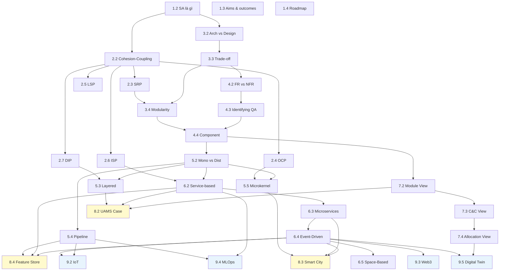

# Bản đồ phụ thuộc

> Khi gặp một concept, biết nó được build trên cái gì (back-reference) và áp dụng ở đâu (forward-reference).

## Dependency graph toàn khoá

## Concept dùng ở đâu

### SOLID principles

| Principle | Use ở Cụm | Cách dùng |
|---|---|---|
| SRP | 3.4 | Modularity: 1 module 1 actor |
| SRP | 6.3 | Microservice = 1 bounded context |
| OCP | 5.5 | Microkernel = OCP at scale |
| OCP | 6.4 | EDA: add consumer without modify producer |
| LSP | 6.3 | API versioning: v2 substitutable for v1 |
| ISP | 2.6 → 6.2 | BFF pattern, API Gateway |
| ISP | 6.4 | CQRS: separate read/write API |
| DIP | 2.7 → 5.3 | Layered + hexagonal |
| DIP | 6.3 | Microservice depend abstraction |

### Cohesion-Coupling

| Cluster | Application |
|---|---|
| 2.2 | Class/module level |
| 3.4 | Module/service level (vertical slicing) |
| 4.4 | Component level (REP/CCP/CRP/ADP/SDP/SAP) |
| 6.3 | Service boundary in microservices |

### Quality Attributes

| Cluster | Application |
|---|---|
| 4.2-4.4 | Define + identify + map to component |
| 3.3 | Trade-off analysis ATAM-lite |
| 5-6 | Mỗi style optimize/sacrifice các QA |
| 8.2-8.4 | Case study: justify decision by QA |
| 9.2-9.5 | Advanced domains: IoT, Web3, MLOps, Digital Twin |

### Trade-off

| Cluster | Application |
|---|---|
| 3.3 | Framework chính |
| 5.2 | Monolith vs Distributed |
| 5.3-5.5 | Mỗi style: pros/cons |
| 6.2-6.5 | Mỗi distributed style |
| 8.2-8.4 | Case study reflection |
| 9.2-9.5 | Advanced seminar trade-off under domain constraints |

### Bounded Context (DDD)

| Cluster | Application |
|---|---|
| 3.4 | Identify module boundary |
| 4.4 | Component decomposition |
| 6.2 | Service-based boundary |
| 6.3 | Microservices = 1 bounded context per service |

## Shortcut paths theo focus

### Focus: "Tôi muốn master SOLID + clean code"

Path: 1.2 → 2.2 → 2.3 → 2.4 → 2.5 → 2.6 → 2.7 → 3.4 → exercises

Time: ~10 giờ

### Focus: "Tôi cần choose architecture style cho dự án"

Path: 1.2 → 4.1 → 4.2 → 4.3 → 5.1 → 5.2 → (5.3 OR 6.2 OR 6.3 OR 6.4 tuỳ context) → 8.2 → 8.3 → 9.x nếu domain cần

Time: ~12 giờ

### Focus: "Tôi muốn document architecture cho team"

Path: 1.2 → 7.1 → 7.2 → 7.3 → 7.4 → practice viết ADR

Time: ~6 giờ

### Focus: "Tôi chuẩn bị Senior Engineer interview"

Path: 1.2 → 2 (all) → 3.2 → 3.3 → 4.2 → 4.3 → 5.2 → 5.3 → 6.2 → 6.3 → 6.4 → 7.2 → 8 (all) → course-summary → exam-checklist

Time: ~25 giờ

### Focus: "Tôi muốn migrate monolith sang microservices"

Path: 5.2 → 3.4 → 6.2 → 6.3 → 8.2 (counter-example: don't go full microservices) → 5.2 again (Strangler Fig)

Time: ~8 giờ

## Shortcut path cho Data Scientist

Nếu mục tiêu của bạn là đưa model/data pipeline vào production, đi theo path này:

1. [SA là gì](../01-introduction/02-what-is-software-architecture.md): hiểu decision nào thật sự là architecture.
2. [Trade-off Analysis](../03-architectural-thinking/03-tradeoffs-analysis.md): cân accuracy, latency, freshness, cost.
3. [Quality Attributes](../04-quality-attributes/01-overview.md): chuyển từ model metric sang system metric.
4. [Pipeline Architecture](../05-fundamental-styles/04-pipeline-architecture.md): production hoá ETL/training/scoring.
5. [Event-Driven](../06-distributed-styles/04-event-driven.md): hiểu streaming feature và realtime detection.
6. [C&C Views](../07-documenting/03-component-connector-views.md): vẽ online inference runtime flow.
7. [Smart City case](../08-case-studies/03-smart-city-traffic.md): xem một hệ data/ML realtime end-to-end.
8. [Production ML Feature Store](../08-case-studies/05-production-ml-feature-store.md): xem feature store, model serving và monitoring production.
9. [MLOps seminar](../09-seminar-advanced-topics/04-software-architecture-for-mlops.md): xem ML lifecycle như một platform architecture.
10. [Digital Twin seminar](../09-seminar-advanced-topics/05-software-architecture-for-digital-twin.md): xem ML trong cyber-physical system.
11. [Lộ trình cho Data Scientist](data-scientist-learning-path.md): checklist và bài tập riêng.

## Khái niệm dễ confused

### Architecture vs Design

| Aspect | Architecture | Design |
|---|---|---|
| Scope | System-wide | Module-scope |
| Cost-to-change | High (months) | Low (hours) |
| Reference | Bài 1.2, 3.2 |

### Style vs Pattern

| Aspect | Architecture Style | Architecture Pattern |
|---|---|---|
| Scope | Toàn hệ | Bài toán con |
| Example | Microservices, Layered | Saga, Circuit Breaker, CQRS |
| Số có thể dùng cùng lúc | 1 chính (có thể mix) | Nhiều |
| Reference | Bài 5.1 |

### Module vs Component

| Aspect | Module | Component |
|---|---|---|
| Unit | Code organization (package) | Deployment (JAR, service) |
| Scope | Smaller | Larger |
| Reference | Bài 2.2 vs 4.4 |

### Cohesion vs Coupling

| Aspect | Cohesion | Coupling |
|---|---|---|
| Within or between | Within module | Between modules |
| Target | High | Low |
| Reference | Bài 2.2 |

### Mediator vs Broker (EDA)

| Aspect | Mediator | Broker |
|---|---|---|
| Coordinator | Central | None |
| Flow visibility | High | Low |
| Coupling | Higher (mediator coupled to all) | Loose |
| Reference | Bài 6.4 |

### Service-based vs Microservices

| Aspect | Service-based | Microservices |
|---|---|---|
| Số services | 4-12 | 20-100+ |
| DB | Shared / per-domain | Per service |
| Reference | Bài 6.2 vs 6.3 |

## Cross-cutting concerns

Một số concept xuất hiện ở nhiều cụm vì cross-cutting:

### Conway's Law

- 3.4: align team với module
- 5.2: org structure dictate monolith/distributed choice
- 6.3: team size requirement cho microservices
- 7.4: Work Assignment View

### Observability

- 5.2: required cho distributed
- 6.3: distributed tracing critical for microservices
- 7.3: documented qua C&C view
- 8.3: design from day 1 trong Smart City case

### Compliance

- 3.3: as QA in trade-off
- 4.3: explicit QA
- 8.2: audit log via DB trigger in UAMS
- 8.3: regulatory cho Smart City

## Sách tham khảo chính

| Topic | Book | Used in cluster |
|---|---|---|
| Foundation | *Fundamentals of Software Architecture* (Richards, Ford) | 1, 4, 5-6 |
| Comprehensive | *Software Architecture in Practice* (Bass et al.) | 4, 7 |
| SOLID | *Clean Architecture* (Martin) | 2 |
| DDD | *Domain-Driven Design Distilled* (Vernon) | 3.4, 4.4, 6.3 |
| Distributed | *Designing Data-Intensive Applications* (Kleppmann) | 5.2, 6 |
| Microservices | *Microservices Patterns* (Richardson) | 6.3, 6.4 |

Đọc thêm khi cần đào sâu một cụm cụ thể.
